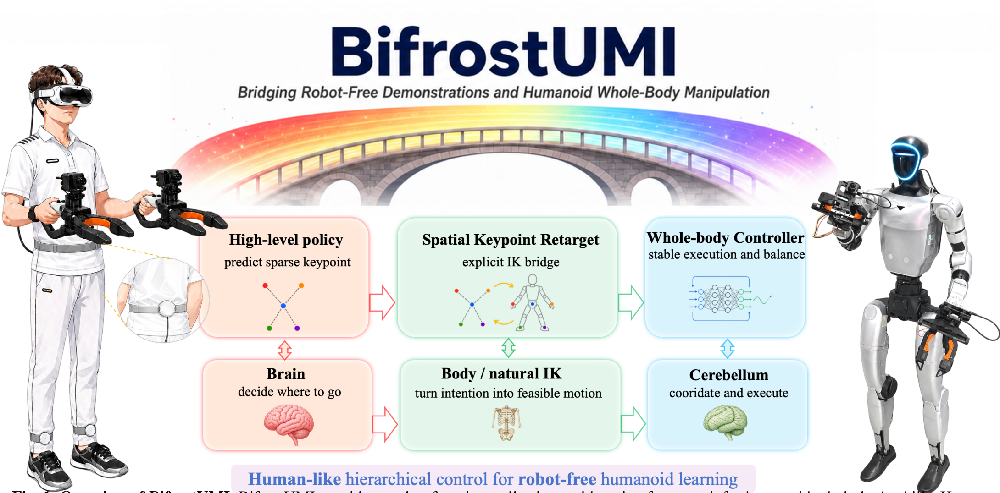

# BifrostUMI：连接机器人无关示范与人形全身操作

人形遥操作采集的问题不只是机器人贵。操作者需要同时保证平衡、视角、双手和步态，一次失误就可能中断数据；没有目标机器人时更无法开始采集。BifrostUMI把采集接口改成人直接使用的VR-UMI设备，记录腕部视觉、夹爪和少量全身关键点，再通过显式重定向桥把这些“机器人无关示范”变成Unitree G1可执行的全身参考。

> **主要方法图：** Figure 1，PDF第1页。左侧是无需目标机器人在场的VR-UMI采集，中间由高层关键点策略和Spatial Keypoint Retargeting连接，右侧全身控制器负责平衡与执行。来源：[原论文](https://arxiv.org/abs/2605.03452)。

## 采集的不是完整人体关节角

硬件由PICO 4身体追踪、腰部与脚部追踪器以及两只自研UMI夹爪组成。每只夹爪带鱼眼相机和磁编码器，系统同步记录左右腕部RGB、夹爪开度与SMPL格式人体状态。真正进入学习接口的是五个任务相关关键点：骨盆、左右夹爪TCP、左右脚；需要明显屈膝的任务再加入左右膝。

这套稀疏表示刻意不复制全部人体关节。骨盆和脚描述支撑与移动，TCP描述操作意图，机器人自己的关节如何排列交给后续重定向和控制器决定。采集期间系统也会在线运行重定向，用于检查示范是否能自然映射到机器人，并保存下肢关节状态作为高层策略的本体条件。

## 从示范到真机有三层接口

高层使用Diffusion Policy。观测是左右224×224腕部图像和三帧15维下肢本体历史；默认动作是五个关键点各自的3D平移与6D旋转，再加两维夹爪开度，共47维，并一次预测长度48的动作块。策略输出的是任务空间意图，不是G1关节命令。

Spatial Keypoint Retargeting（SKR）先把关键点变换到机器人坐标，仅对骨盆到腿部关键点的垂直距离做形态缩放，尽量保留双手、物体和身体之间的度量关系，再通过带关节限制的分层IK生成根位姿和29维关节参考。低层是MJLab训练的全身运动跟踪器，读取本体状态和短时参考块，输出关节位置目标并由PD执行。三层分别负责“想去哪里”“本体怎样摆”“怎样稳定执行”。

## 为什么归入人形训练数据构建

论文在G1上验证桌面抓放、双臂收集、动态投掷、弯腰把垃圾放入桌下和行走送咖啡，并比较了SKR、膝关键点和时延匹配的作用。真机结果说明采得的数据可以形成技能，但本库的主分类仍取其最稀缺产物：**不让目标机器人参与采集，也能持续得到与人形全身任务对齐的视觉和动作示范**。高层Diffusion与低层Mimic是把数据闭环验收到真机的消费者。

目前方法仍依赖专用VR-UMI夹爪、标定和时延匹配，稀疏关键点不能表达所有精细接触；五项任务也不足以证明对任意本体和开放世界任务都通用。官方项目页截至核验日仍标注代码`Coming Soon`，因此不能按已开源项目记录。

## 数据模态、同步与质量控制

一条原始示范至少包含左右腕部鱼眼RGB、两侧夹爪开度、PICO身体追踪得到的人体状态，以及后续策略使用的骨盆、双脚、双手TCP和可选双膝关键点；在线重定向还会产生G1下肢或全身参考。本体历史与视觉必须对齐到同一时钟，论文专门比较时延匹配，说明训练时把低延迟动作标签配给较旧图像会直接破坏闭环。数据落盘时应保存各传感器时间戳、标定版本、丢帧、重定向配置和策略执行延迟，而不只是最终动作数组。

质量检查至少分三层：采集层排除追踪器丢失、夹爪编码器异常和明显不可达示范；SKR层检查关节限位、足底接触、手物相对位姿和IK连续性；真机回放层检查低层tracker是否能在安全范围内执行。当前项目页没有发布完整代码和明确可再分发的数据许可证，因而这篇工作的“开放”证据是论文和项目演示，不等于采集软件、硬件设计与原始数据已经全部开放。

## 原文与项目

[论文原文](https://arxiv.org/abs/2605.03452) · [官方项目页](https://baai-aether.github.io/BifrostUMI/) · 代码状态：Coming Soon
