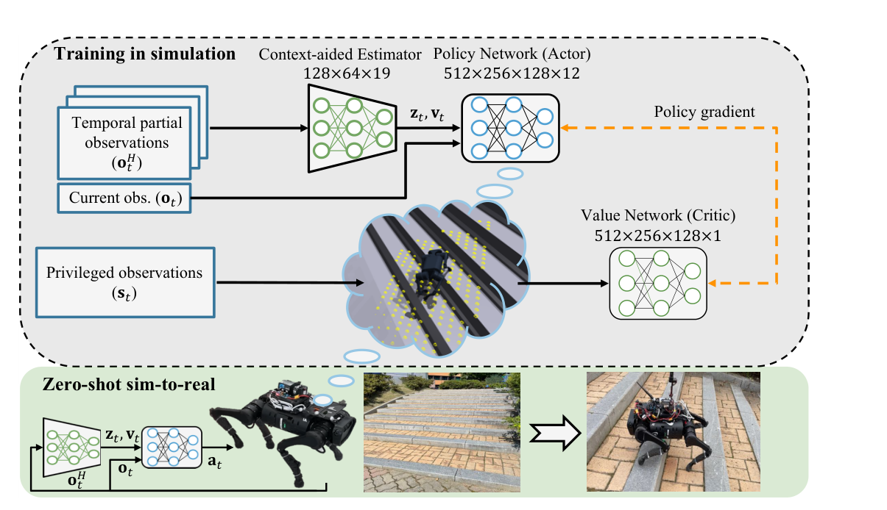

# DreamWaQ：基于隐式地形想象的鲁棒四足运动控制

DreamWaQ讨论的是一个很实际的取舍：相机和激光雷达能提前看到地形，却容易受遮挡、光照、天气和标定影响；IMU、编码器等本体传感更稳定，但机器人通常要踩到或撞到地形后才知道发生了什么。作者没有把“想象地形”做成一张显式重建的地图，而是让策略从短时本体历史中形成一个足以支持控制的环境隐变量。

## 论文框架：CENet状态估计与策略联合训练

> **论文框架图：** Figure 1，PDF第1页。上半部分是训练，下半部分是部署。最需要看清的是训练和部署可见信息不对称：critic在仿真中读取包含扰动力和周围高度图的特权状态，actor在真实机器人上只能读取当前本体观测、长度为5的本体历史，以及CENet估计的机体速度与环境上下文。特权信息帮助价值函数判断“当前状态究竟好不好”，但不会进入实机策略输入。来源：[原论文](https://arxiv.org/abs/2301.10602)。

当前观测包括机体角速度、重力方向、速度命令、关节角、关节速度和上一时刻动作。CENet用一套共享编码器从短时历史中同时输出机体线速度估计 `v_t` 和环境隐变量 `z_t`；其中一个头监督速度估计，另一个头用beta-VAE重建下一时刻观测。这样，`z_t`不需要对应可读的高度、摩擦或恢复系数，却必须保留能够预测身体下一步变化的环境信息。actor再把当前观测、`v_t`和`z_t`映射成12维关节角增量，由关节PD控制器执行。

这和常见的teacher-student顺序蒸馏不同。DreamWaQ用非对称actor-critic一次联合训练策略、价值网络和估计器，避免student只能模仿teacher已经探索到的动作。论文还加入AdaBoot：根据一批域随机化环境回报的变异系数调整是否用估计量替换真值。训练早期回报波动大时少做bootstrapping，防止估计噪声拖垮策略；策略稳定后再增加估计输入比例，让部署分布逐步进入训练。

## 奖励、地形与Sim2Real并不是配角

它仍然是PPO运动控制系统，不是只靠一个CENet就自然获得越野能力。奖励同时约束速度命令跟踪、姿态、机体高度、抬脚、关节加速度、动作变化和平滑性；作者还单独惩罚各电机功率分布的方差，目的是避免长距离爬坡时少数电机先过热。地形课程包含平地、粗糙面、离散障碍和楼梯，并逐步增加到22度；域随机化覆盖载荷、PD增益、电机强度、质心偏移、摩擦和系统延迟。

实机使用Unitree A1。actor与CENet在机载Intel NUC上以50 Hz同步运行，关节PD环以200 Hz跟踪目标角。论文报告两条430米和465米的户外路线，包含湿滑楼梯、泥地、草地、碎石和坡道；这比只展示几次跨台阶更能说明估计误差是否会在长时运行中积累。仿真推扰实验中，带AdaBoot版本也取得最高的生存率和可承受推扰速度。

## 该把它放在知识栈的哪里

DreamWaQ应放在“感知与复杂地形”，但这里的“感知”是从本体时序中推断接触后的地形与动力学上下文，不是相机或点云的前视感知。它也不是AMP：训练没有用动作数据判别器定义运动风格；更不是Mimic：策略没有逐帧接收参考动作。它的主要价值是说明，复杂地形控制可以把“状态估计、环境表征和策略学习”放在一个联合训练闭环里。

边界同样明确。论文自己指出，纯本体方案通常要先与障碍发生接触才能反应，无法像前视感知那样提前规划高台阶或复杂落脚点。因此DreamWaQ适合做可靠的反应式底座，不应被解读为视觉地形规划已经不再需要。截至核验日，作者论文入口未关联官方核心代码；本库列出的GitHub仓库是社区复现，不能当作作者发布版本。

## 社区实现辨析：Legged Lab DWAQ不是完整复现

Legged Lab在`dev/dwaq`分支提供了另一套可追踪到训练入口的第三方实现，当前`master`已经完整包含该分支。它保留了DreamWaQ最核心的工程思路：actor读取当前100维本体观测和5帧历史，历史经上下文VAE得到3维速度估计与16维潜变量；critic额外读取真实机体速度、足端接触、足端位置与速度、接触力和根高度。PPO更新与VAE更新在同一轮mini-batch中交替执行，VAE损失由速度监督、下一时刻本体观测重建和KL正则组成。

| 对比项 | DreamWaQ论文 | Legged Lab DWAQ代码 |
|---|---|---|
| 本体与动作 | Unitree A1，12维关节角增量 | Unitree G1 29自由度，29维默认姿态偏移 |
| actor输入 | 当前本体观测、5帧历史、速度估计与环境隐变量 | 当前100维观测、展平后的500维历史、3维速度估计与16维潜变量 |
| critic特权信息 | 含真实速度、扰动和周围地形高度 | 124维观测，含真实速度与足端接触量，但没有特权地形高度图 |
| 上下文学习 | CENet、beta-VAE、AdaBoot | beta-VAE式编码器和下一帧重建；没有AdaBoot |
| 地形与随机化 | 多类地形和较完整的Sim2Real随机化 | 程序化楼梯、坡面、粗糙面与离散障碍；摩擦固定，增益、电机强度和延迟随机化缺失 |
| 部署证据 | A1户外实机，策略50 Hz、PD 200 Hz | Isaac Sim训练与回放、TorchScript导出；仓库没有SDK、ROS2或实机通信入口 |

对应代码证据包括任务注册`g1/__init__.py:6-14`、观测配置`g1_dwaq_env_cfg.py:32-121`、上下文网络`context_vae.py:40-168`、PPO与辅助损失`dwaq_ppo.py:183-271`以及导出脚本`export_dwaq_policy.py:38-93`。因此本库把它记录为“DreamWaQ式实现”或“受DreamWaQ启发的G1盲走训练”，而不是原论文完整复现。它没有动作数据、判别器或运动风格奖励，也不能归为AMP行为先验项目。

[论文原文](https://arxiv.org/abs/2301.10602) · [作者项目页](https://sites.google.com/view/dreamwaq) · [社区实现](https://github.com/Manaro-Alpha/DreamWaQ)
