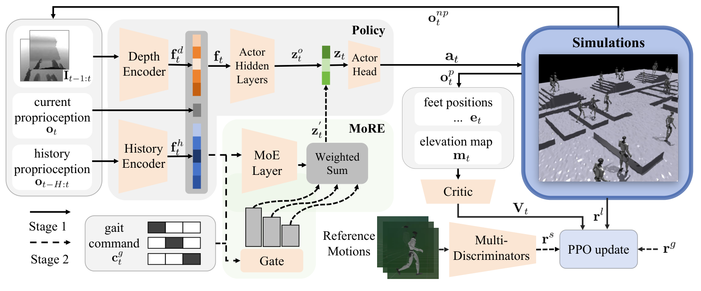

# MoRE：面向复杂地形拟人步态切换的残差专家混合策略

MoRE要补的是两类方法之间的空档：普通复杂地形策略能上台阶、跨沟，但步态往往只追求“不摔”；动作跟踪或AMP能让机器人走得像人，却通常只在平地使用本体感知。它希望一张策略同时保住复杂地形通过能力，又能根据命令切换走、跑、高抬腿和低姿行走。

> **主要方法图：** Figure 2，PDF第3页。图中实线是第一阶段的复杂地形底座，虚线是第二阶段加入的步态命令、残差专家和多判别器。来源：[原论文](https://arxiv.org/abs/2506.08840)。

## 先学会过地形，再讨论走得像不像人

第一阶段不使用动作先验。Actor接收当前与历史本体状态、速度命令和连续两帧头部深度图，深度编码器与历史编码器提取地形和时序特征，输出16个关节目标位置，再由PD控制器执行。Critic额外看到高程图、足端位置、真实线速度和随机化物理参数。这个非对称Actor-Critic先用PPO学会台阶、沟槽、高台、粗糙地面和坡面上的基本通行能力。

第二阶段才引入拟人步态。MoRE并不是在关节动作上直接叠加残差，而是在Actor最后一层之前加入latent residual。Gate根据步态命令和已有特征给多个专家分配权重，再把专家输出加到基础策略的latent上。这样即使残差模块训练初期还不稳定，预训练Actor Head仍能把输出限制在较合理的动作区域，比动作残差更不容易直接破坏平衡。

## 多判别器怎样变成可控步态

每种步态有自己的参考动作和判别器。判别器看的不是单帧，而是连续五步的受控关节轨迹；策略只接收当前步态命令对应判别器给出的style reward。参考数据来自重定向到Unitree G1的LaFAN1动作。作者还为高抬腿、低姿等行为加入膝高和机身高度奖励，因为判别器只能约束动作分布，不能保证参考数据中的高度正好满足工程需求。

训练地形使用自动课程，动力学随机化覆盖摩擦、质量、质心、电机强度、PD参数和动作延迟，深度侧还加入噪声、滤波、相机外参扰动和机器人自身遮挡。真机端输入仍是深度加本体状态，策略直接输出关节目标。论文在G1上展示了0.4米沟槽、0.3米高台、楼梯、组合地形、外力扰动和步态连续切换，属于有完整Sim2Real证据的工作。

## 在路线图中的位置

MoRE的主产物是“复杂地形上的可控自然Locomotion”，所以放在“感知与复杂地形”；AMP、多判别器和MoE是方法标签。它不是Mimic，因为部署时没有一条逐帧参考轨迹要追。它也没有解决开放式技能生成：步态集合、参考动作和专用高度奖励仍由人定义，增加新步态通常要补数据、奖励并重新训练。

## 观测、命令和奖励怎样分层

部署actor接收速度、步态命令、当前与历史本体状态以及连续深度帧，输出16维关节位置目标；critic只在训练中使用高程、足端、真实速度和随机化参数。任务奖励负责速度、姿态、地形通过和安全，步态专用奖励明确高抬腿或低姿的工程目标，多判别器奖励再约束短时关节轨迹是否落在对应人体动作分布。三者缺一时，分别会出现不通过、命令不可控或动作不自然的问题。

Gate与残差专家位于actor latent中，不能在部署日志里只看最终动作；至少应保存步态命令、专家权重、深度特征、基础latent和关节输出，才能诊断模式切换失败。真机评测还应把视觉噪声、地形类型、步态切换时刻、足端滑移和电机饱和联合统计，避免把某一种高奖励步态在少量场景中的成功写成通用自然运动。

[官方项目页](https://more-humanoid.github.io/) · [官方代码](https://github.com/TeleHuman/MoRE) · [论文原文](https://arxiv.org/abs/2506.08840)
