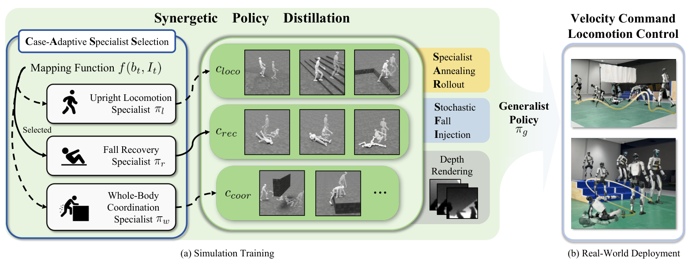

# X-Loco：基于协同策略蒸馏的视觉通用人形运动控制

X-Loco关心的不是再训练一个更强的单项步态，而是把直立移动、跌倒恢复和全身协调放进同一策略。三类技能的状态分布和动作目标冲突很大：直立策略尽量不倒，恢复策略必须主动经历倒地，跨障和全身协调又依赖视觉与大幅身体运动。直接多任务PPO很容易由高频、易学任务主导。

> **主要方法图：** Figure 2，PDF第3页。三个专家不是简单平均监督学生；系统会按场景选择教师，并在蒸馏rollout中主动注入跌倒状态和深度观测。来源：[原论文](https://arxiv.org/abs/2603.03733)。

## 三个专家怎样合成一个策略

作者先分别训练直立Locomotion专家、跌倒恢复专家和全身协调专家。三者共享23维关节位置目标动作空间和同一套PD参数，但状态、奖励和训练分布不同。协同蒸馏阶段的case-adaptive specialist selection根据当前身体状态与视觉条件选择更适合的专家，避免让不相关专家在同一状态上给出相互矛盾的动作标签。

蒸馏并不只回放专家成功轨迹。Specialist Annealing Rollout逐渐把rollout控制权从专家过渡给学生，使学生能看到自己的误差分布；Stochastic Fall Injection主动制造跌倒和异常姿态，让恢复技能不会因为直立样本占多数而被稀释。学生接收本体状态、速度命令和深度图，运行时不再需要参考动作，也不需要显式切换三个策略。

## 为什么放在感知Locomotion

X-Loco用速度命令统一调用站起、恢复、行走、跑步、跳跃、地形穿越和全身协调。它没有使用AMP，也不是逐帧Mimic；核心贡献是多专家知识如何进入单一视觉移动策略。论文在Unitree G1上展示连续跌倒恢复、平台穿越和外力扰动，说明策略的验收对象是现实中的通用移动底座，而不是仿真动作重放。

这套思路的价值在系统层：专长先分开学，再用状态选择、分布覆盖和rollout控制解决蒸馏冲突。不过它仍依赖人工定义专家集合，每新增一类动力学差异很大的技能，通常要先得到可靠专家；项目页截至核验日也没有提供训练代码。因此它证明了统一策略的可行性，但还不能被理解成一个可无限扩展的开放行为模型。

## 统一学生的部署合同

学生接收速度命令、深度观测、本体状态和历史，输出23维关节位置目标并由统一PD接口执行。直立、恢复和全身协调专家各自在不同初始状态、奖励与特权信息下训练；蒸馏时选择器只负责给当前状态找到合理教师，学生最终并不携带三个显式控制器或部署状态机。Stochastic Fall Injection补的是恢复状态覆盖，不能替代真机跌倒检测和安全保护。

评估统一策略时应与三个专家分别比较：正常行走是否退化、跌倒后恢复时间是否增加、视觉障碍通过是否保持，以及技能边界处是否出现教师切换抖动。深度帧率、动作频率、状态估计与策略历史必须对齐，尤其是跌倒阶段的姿态估计可能偏离正常工作区。论文展示了G1真机连续行为，但未公开训练代码和完整专家数据，不能从视频反推出奖励权重或蒸馏调度。

[官方项目页](https://x-loco-humanoid.github.io/) · [论文原文](https://arxiv.org/abs/2603.03733)
