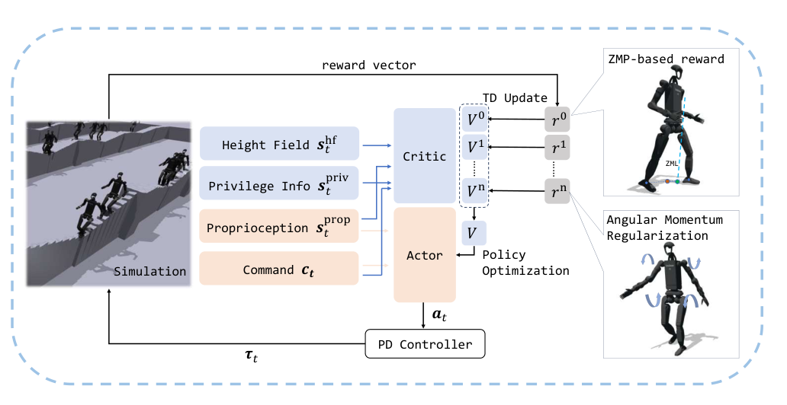

# DBHL：基于ZMP奖励的无外部感知窄地形全身运动

狭窄落脚、突然绊碰和负载扰动通常会被当成感知规划问题，但DBHL选择另一条路线：不使用相机或激光，不显式重建地形，只让策略从本体历史里形成快速平衡反应。它的重点不是提前看见每个障碍，而是在接触发生和支撑区域快速变化时，让全身角动量与足底支撑仍处于可恢复范围。

> **主要方法图：** Figure 2，PDF第3页。Actor只看本体历史和速度命令，Critic在训练期额外看到高度场与特权状态；ZMP奖励和角动量正则进入同一个PPO更新。来源：[原论文](https://arxiv.org/abs/2502.17219)。

## 把经典ZMP变成可并行计算的奖励

策略是目标速度条件下的非对称PPO。Actor输入速度命令以及角速度、重力方向、关节位置速度、上一动作等历史本体信息，输出关节目标位置并交给PD控制器。Critic额外得到仿真高度场和特权状态，但部署端不需要这些信号。

作者没有在不规则地面上实时求完整支撑多边形，而是用支撑足中心近似其几何中心，再计算该点到Zero Moment Line的水平距离。距离越小，ZMP形成的线越可能穿过当前支撑区域，于是把经典稳定性条件转成可以在大量并行环境中计算的连续奖励。角动量正则同时抑制上半身和摆臂失控，任务奖励再负责速度跟踪、抬脚和通过不同地形。训练还加入乘性动作噪声，让策略学会处理执行偏差而不是记住精确仿真轨迹。

## 它能说明什么，不能说明什么

真机使用全尺寸Unitree H1-2，展示25厘米窄路、坡面与楼梯、未知杆状障碍、负载搬运和外力推扰。证据支持“仅本体感知也能在接触后迅速恢复”，但不能推出外部感知没有价值：对于沟槽、悬崖或必须提前选落脚点的场景，接触后反应往往已经太晚。

本库把它放在“感知与复杂地形”，这里的感知包括由本体时序形成的隐式地形响应，不等于必须有视觉。它既不使用动作数据判别器，也不逐帧跟踪参考动作，所以不是AMP或Mimic方法。其可复用价值主要在奖励设计：把经典动力学指标转成RL中稳定、廉价、可规模化的训练信号。

## 本体历史能做什么，不能做什么

actor以速度命令、投影重力、角速度、关节位置速度和上一动作的历史为输入，输出全身关节位置目标；critic在训练时读取高度场与真实状态。ZMP距离、角动量、速度跟踪、抬脚、能耗和动作正则共同塑造平衡反应，乘性动作噪声模拟执行偏差。状态估计一旦给出错误重力方向或基座角速度，策略会把估计误差当成真实失稳，因此IMU标定和滤波仍是系统前提。

窄路与未知杆障的成功说明接触后的快速全身反应有效，但部署前不能省略足底接触、关节限位、电机饱和和跌倒保护。建议同时记录支撑足、ZMP近似距离、全身角动量、命令跟踪与足端滑移，检查奖励指标在真机是否仍与安全相关。遇到必须提前跳跃或绕行的地形，应由外感知与规划补充，而不是扩大本体历史后期待策略推断尚未接触的几何。

[官方项目页](https://whole-body-loco.github.io/) · [论文原文](https://arxiv.org/abs/2502.17219)
