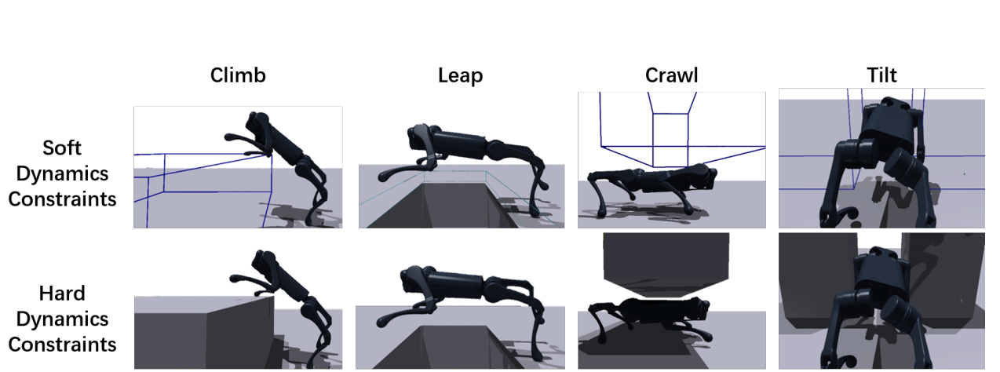

# Robot Parkour：基于软硬动力学约束课程的视觉跑酷学习

Robot Parkour解决的是一个探索难题：攀高台、跨大沟、钻低洞和侧身穿缝都需要短时间内做出极端动作，但如果障碍从训练开始就是不可穿透的，随机策略几乎拿不到前进奖励；为每项技能手写一套动作模板又很难扩展。作者用“先让障碍可穿透，再恢复真实碰撞”的课程替代参考动作。

> **核心训练机制图：** Figure 3，PDF第3页。原文没有统一网络架构总图；这张图直接解释五类技能怎样从可穿透的软约束过渡到真实硬碰撞，是方法中最关键的探索机制。来源：[原论文](https://arxiv.org/abs/2309.05665)。

## 软约束先把动作“长出来”

系统分别训练攀爬、跨沟、低姿穿越、侧身挤过和奔跑专家。第一阶段障碍允许穿透，碰撞点进入障碍的深度形成连续惩罚，策略即使还不会完整越障，也能从向前运动与较小穿透中获得梯度。课程逐渐提高障碍和穿透约束难度。第二阶段再换成不可穿透的硬碰撞环境细调，让动作满足真实接触动力学。整个过程只使用简单的前进、能耗和存活类奖励，没有动物参考动作，也没有AMP判别器。

专家训练时可以看到特权地形和物理状态，最后通过DAgger蒸馏成一个循环视觉策略。部署策略输入机载深度与本体历史，自动判断应当爬、跳、钻还是侧身，不需要外部技能切换器。作者还专门模拟深度缺失、噪声和延迟，并让视觉预处理尽量匹配真机相机。

## 从四足跑酷到Project Instinct

论文在A1和Go1两种低成本四足平台上验证，报告了0.4米攀高、0.6米跨沟、0.2米低障和0.28米窄缝等实机任务。它是后续Humanoid Parkour与Project Instinct感知跑酷路线的重要前序：先证明“技能生成加多专家蒸馏”可以在真实机器人上形成单一视觉策略。

边界同样明显。每个新技能仍要构造对应障碍、软碰撞表示和专家训练环境；深度图能判断几何，却不理解物体语义和可交互性。因此它属于感知Locomotion，不是通用环境理解，也不能因为动作看起来像动物就归为AMP。

## 从专家训练到单一视觉策略

各专家在训练时读取特权地形、本体状态和任务命令，输出关节位置目标；软碰撞穿透深度、前进进度、存活、能耗与动作平滑共同提供探索信号。硬碰撞细调后，DAgger让循环学生在自己访问的状态上模仿当前适用专家，学生只保留机载深度、本体历史和命令。它并没有显式输出落脚点或技能名称，技能选择体现在视觉历史到关节动作的闭环中。

复现应分别报告专家生成成功率、蒸馏后各技能保留率和未见障碍组合上的失败，而不能只给统一学生的平均值。深度空洞、曝光、相机外参、延迟和帧率会改变障碍边缘时刻；动作侧还要检查关节饱和、腹部/膝部碰撞和落地冲击。软约束只是训练探索工具，真机安全仍依赖真实碰撞模型、限位、急停和障碍尺寸边界。

[官方项目页](https://robot-parkour.github.io/) · [官方代码](https://github.com/ZiwenZhuang/parkour) · [论文原文](https://arxiv.org/abs/2309.05665)
