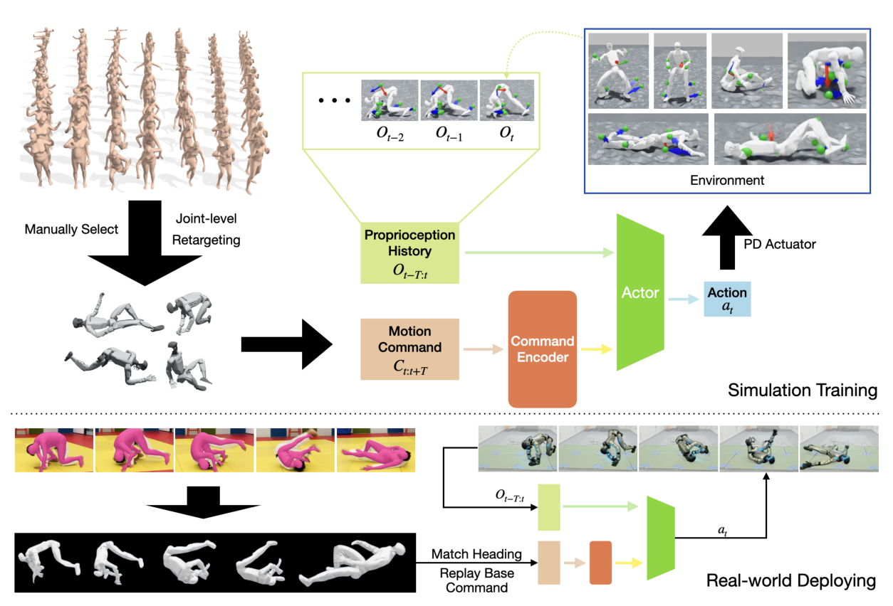

# Embrace Collisions：面向任意接触动作的可部署人形全身跟踪

很多全身跟踪器默认机器人只有脚和手接触环境，机身过低、翻倒或躯干碰地会立即终止。这个假设会直接排除坐地、翻滚、地面起身和大幅舞蹈。Embrace Collisions反过来把这些状态当作合法动作的一部分：控制器不预设接触顺序，只根据离散运动命令和身体状态决定下一步关节动作。

> **主要方法图：** Figure 2，PDF第5页。上半部分是AMASS与网络视频形成的极端动作命令和仿真策略，下半部分是同一命令接口在真机上的执行。来源：[原论文](https://arxiv.org/abs/2502.01465)。

## 命令接口比“当前目标姿态”更重要

作者从AMASS人工筛选地面动作，也用4D-Human从网络视频恢复人体运动，再做关节级重定向。策略不是只看当前参考帧，而是接收一串未来关键帧构成的motion command，其中包含基座姿态、关节或关键link目标、误差以及距离各目标的剩余时间。Transformer命令编码器可以处理可变长度目标序列，再与本体历史拼接，由Actor输出关节目标位置。

训练中的难点不在“允许碰撞”四个字，而在所有常规保护逻辑都要重写。躯干高度和基座朝向不能再作为统一终止条件，因为趴地和倒立本来就是目标；终止需要相对于当前目标动作判断。奖励既要跟踪关键姿态，又要保留关节限位、动作变化和安全正则。作者使用多个Critic分担不同奖励组，再混合优势，避免极端姿态下某一类稠密正则完全压住动作目标。

方法并不预先给一个固定接触表，也不把非足端碰撞一律惩罚掉。仿真接触求解器根据身体几何和地面产生反力，策略从本体历史中感知碰撞后的速度变化，再依据未来命令决定借地翻滚、用手支撑还是起身。这样可以覆盖训练动作中出现的随机接触，却不等于任何碰撞都安全：自碰撞、关节冲击和接触力峰值仍需单独限制，真实外壳能否承受也不由tracking reward保证。

## 真机接口与局限

Unitree G1端使用IMU对齐基座朝向和命令坐标，ONNX策略通过ROS2实时推理；目标基座平移不依赖外部MoCap或里程计。论文展示翻滚、地面起身、接触丰富地面动作和舞蹈，说明随机接触下的参考跟踪可以零样本迁移。

它仍是一条Mimic路线：高层必须给出运动命令，策略并不会自己决定何时翻滚或为何起身。网络视频恢复、人工筛选和人机形态差异也会限制命令质量。官方项目页截至核验日仍标注代码即将公开，因此现阶段适合研究接口和训练设计，不能把复现可用性写成“已开源”。

部署验收除了平均关键点误差，还应记录身体各部位接触次数、冲击峰值、保护触发、起身成功率和连续动作后的硬件温升。允许接触只是把合法动作空间扩大；若没有按身体部位配置材料、力矩和速度边界，策略可能把仿真中无代价的撞击带到真机。

[官方项目页](https://project-instinct.github.io/embrace-collisions/) · [论文原文](https://arxiv.org/abs/2502.01465)
