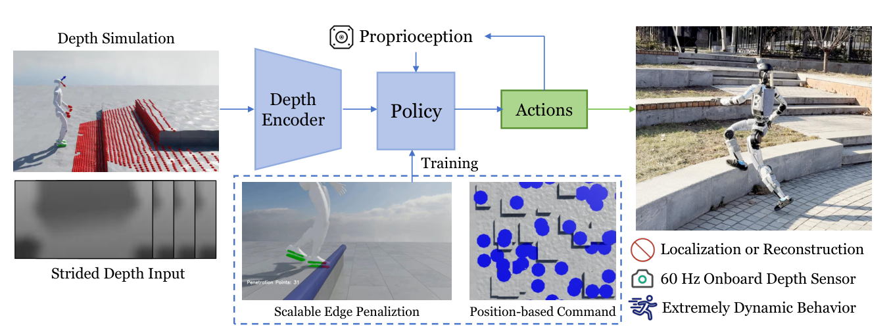

# Hiking in the Wild：面向真实复杂地形的可扩展感知跑酷

Hiking in the Wild把复杂地形问题压缩成一条端到端链路：头部深度和本体历史直接进入策略，输出29个关节目标，不依赖外部定位、高程图重建或独立落脚规划。论文真正有价值的部分不是“用了深度”，而是针对高速真机最容易失败的踩边、深度域差和目标采样漏洞设计了可规模化训练机制。

> **主要方法图：** Figure 2，PDF第3页。系统只保留深度编码、本体状态、策略和关节动作主链，训练侧再加入踩边惩罚与位置命令生成。来源：[原论文](https://arxiv.org/abs/2601.07718)。

## 两个机制分别堵住两类失败

Scalable Edge Penalization先从任意三角网格中自动提取地形边缘，再在足部体积内布置采样点。脚掌压到边缘附近时，穿透深度和足端速度共同形成惩罚，策略由此学会把完整足底放到稳定区域，而不是只要机器人整体向前就接受半脚悬空。这个机制不需要为台阶、沟槽和碎石逐类手写虚拟障碍。

Position-Based Command从可行平坦区域采样目标点，再转换成速度命令。它解决的是普通速度奖励常见的绕圈和贴边刷分：策略必须持续朝真实可达位置推进。训练Actor接收角速度、重力方向、速度命令、29维关节状态、上一动作以及多帧深度历史；Critic额外看到真实线速度。深度管线还显式模拟孔洞、噪声、模糊、延迟和相机差异，使60Hz真机深度输入与仿真分布更接近。

## AMP在这里负责步态，不负责看路

论文使用由MPC数据、MoCap和LaFAN动作经GMR重定向得到的参考，判别器给出AMP风格奖励，让高速通过地形时的动作仍保持合理步态。由于走和跑联合训练会出现模式坍缩，作者最终使用分开的步行与跑步策略。这说明AMP在系统里负责“运动像什么”，深度、踩边惩罚和位置命令才负责“地形怎么过”。

G1真机完成最高2.5米每秒、32厘米高台、50厘米沟槽和连续4分钟复杂路线，且不依赖显式定位或地图。局限是单个前向深度相机对后退和侧向地形观察不足，走跑模式也尚未自然统一。官方已经在InstinctLab公开parkour训练与ONNX导出入口，因此它应作为Project Instinct感知Locomotion主条目，而不是只留一条论文链接。

## 深度与全身动作的实时接口

actor把多帧头部深度、速度命令、投影重力、角速度、29维关节状态和上一动作编码后，直接输出29个关节位置目标；critic训练时额外看到真实线速度。位置目标采样决定前进任务，踩边惩罚与AMP风格、速度跟踪、姿态、接触和动作正则共同决定怎样通过。AMP只在训练中提供动作分布约束，部署策略不读取判别器或逐帧参考。

工程复现要固定深度60 Hz与控制循环的对齐、相机外参与裁切、孔洞/延迟模型、动作缩放和PD参数。边缘惩罚来自仿真mesh真值，真机并没有一个边缘检测器替策略兜底；若视觉将台阶边界看错，策略仍可能半脚落地。除成功率和峰值速度外，应统计踩边距离、落地冲击、深度失帧、走跑策略切换和保护触发，尤其要单独测试后退、侧向与视野外地形。

[官方项目页](https://project-instinct.github.io/hiking-in-the-wild/) · [官方训练任务](https://github.com/project-instinct/InstinctLab/blob/main/source/instinctlab/instinctlab/tasks/parkour/README.md) · [论文原文](https://arxiv.org/abs/2601.07718)
