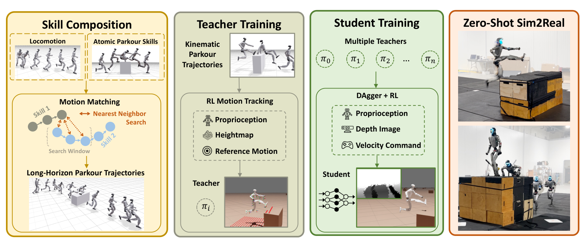

# PHP：基于运动匹配与多教师蒸馏的感知人形跑酷

高动态跑酷数据通常只有几秒：一个翻越、一次攀墙或一段翻滚。直接拿这些短片训练，策略只会在固定距离和固定步态相位触发动作，也没有从跑步进入技能再回到跑步的长时过渡。PHP先在运动层把短技能拼成长轨迹，再把这些轨迹变成可由深度策略实时执行的控制能力。

> **主要方法图：** Figure 2，PDF第3页。四个阶段依次是技能组合、特权跟踪专家、多教师感知学生和零样本真机部署。来源：[原论文](https://arxiv.org/abs/2602.15827)。

## 运动匹配怎样扩充稀缺技能

作者先用OmniRetarget把人类原子跑酷技能变成机器人兼容动作，并维护Locomotion库和各技能库。Motion Matching根据当前姿态、足端位置速度、根速度以及未来期望方向做最近邻检索，把“跑步—技能—跑步”拼成长时运动。通过随机接近距离、步态相位、速度、转向和障碍几何，一条短技能可以产生大量不同进入状态与过渡，而不必采集每一对技能之间的人工连接动作。

每个技能先训练一个拥有参考动作、全局骨盆信息和局部高度扫描的特权跟踪专家。专家按BeyondMimic式的跟踪奖励、失败片段自适应采样和PD目标动作学习。随后多个专家蒸馏成单一学生：学生只看本体状态、深度图和二维速度命令，不再接收逐帧参考；DAgger负责靠近专家动作，PPO则提供“是否真正越过障碍”的结果信号。作者逐步从DAgger过渡到RL，并放宽对镜像成功动作的终止，避免高动态技能因为逐步动作误差被错误判失败。

## 分类和工程边界

G1真机展示1.25米高墙、vault、滚落和长时间多障碍连续穿越，深度变化时能重新选择技能。它与纯奖励跑酷不同，核心训练资产是经重定向、运动匹配生成的参考轨迹和跟踪专家；但最终部署的学生策略只接收本体状态、深度图和速度指令，不再逐帧跟踪参考。因此本库按最终形成的感知跑酷与长时技能链能力，将PHP归入Locomotion的“感知与复杂地形”；Motion Matching、运动重定向和Mimic跟踪作为训练方法标签保留。它不使用AMP判别器，归入这条主线也不等于把它写成AMP方法。

方法仍需要人工标注原子技能的起止区间、为技能配套地形，并依赖高质量稀缺动作；学生能选择已有技能，但不能创造库外动作。截至核验日官方项目页提供交互演示和论文，代码仍标注Coming Soon，这一点与已经开源训练任务的Hiking in the Wild需要分开记录。

## 学生策略的观测与失败恢复边界

最终student只读取深度、本体状态和二维速度命令，输出关节位置目标；参考动作、全局骨盆和局部高度扫描只存在于特权专家训练阶段。DAgger给学生逐步动作监督，PPO任务回报纠正“动作略有不同但成功越障”的情况，运动匹配则在训练数据上补齐进入、退出和技能衔接。三者分别处理状态覆盖、结果目标和参考连续性，不能把最终能力简单归因于网络规模。

闭环部署需要同步深度、速度命令、本体估计和关节控制，并监控技能触发过早、障碍估计变化、过渡失配和落地冲击。论文的学生可在已知技能库内根据观测改变行为，但没有单独的可解释技能ID、显式失败检测或开放式重新规划器；遇到库外几何时，安全层仍需限速、碰撞保护和人工接管。代码尚未发布，控制频率、延迟缓冲和完整安全配置只能以论文披露为准，不能从视频补写。

[官方项目页与交互演示](https://php-parkour.github.io/) · [论文原文](https://arxiv.org/abs/2602.15827)
