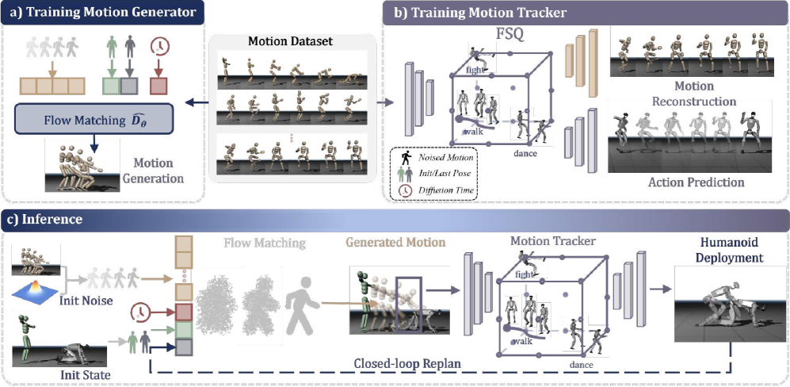

# Heracles：连接精确跟踪与生成式恢复的通用人形控制

普通动作跟踪器有一个固有矛盾：参考动作可以很精确，但一旦强扰动把机器人推离参考轨迹，继续最小化当前帧误差反而可能要求机器人立即回到一个已经不可达的姿态。Heracles没有把“更强的Tracker”当作唯一答案，而是在高层参考与低层物理Tracker之间插入一个状态条件生成中间层：状态与参考接近时尽量原样通过，严重失配时则先重写一段动力学可行的短时恢复轨迹。

> **主要方法图：** Figure 2，PDF第6页。上半部分分别展示运动生成器与物理Tracker的训练，下半部分展示状态条件Flow Matching、闭环重规划和真机执行。来源：[原论文](https://arxiv.org/abs/2603.27756)。

## 论文框架：在参考动作和物理跟踪器之间重写短时轨迹

Heracles把原始参考动作、机器人当前状态和最终电机控制分成三层。高层仍提供希望执行的参考动作，状态条件生成中间层判断以当前身体状态怎样继续，低层物理Tracker负责把生成结果变成关节目标。中间层输出的是未来0.2秒内的8个关键帧，不是力矩；关键帧经过插值形成稠密参考后，才交给Tracker执行。

这种分层针对的是Tracker在严重失配时的局限。正常情况下，当前状态与参考接近，最合理的结果就是继续原动作；被推倒或参考突然跳变后，强行追回当前帧可能要求身体瞬间回到不可达姿态。Heracles把短时轨迹表示为相对当前状态的残差：当前状态在整个规划窗口内形成静态基线，生成器只预测每个关键帧相对基线应怎样变化。接近参考时，残差还原原动作；偏离很大时，残差可以先生成跨步、手臂反摆和躯干重对齐，再逐步回到参考。

## 状态条件Flow Matching怎样生成恢复轨迹

图左上角是离线轨迹生成器训练。训练样本来自LAFAN1、100STYLE、SnapMoGen、AMASS和内部动作捕捉构成的运动语料。每个样本把起始身体状态与目标参考命令配成条件，并抽取固定0.2秒窗口内的8个关键帧作为残差监督。只给起始状态加通道独立噪声，参考命令保持干净，模拟真机中传感状态会累积误差、上层参考却仍是理想轨迹的情况。

Flow Matching从带噪残差序列出发，AdaLN调制的Transformer同时接收当前状态、目标参考和流时间，预测把噪声沿什么方向连续变成目标残差。当前状态与参考共同进入每个Transformer block，是为了让同一参考在直立、侧倒或关节已经滞后的情况下生成不同过渡。第一个残差token被固定在零残差锚点，保证生成轨迹从机器人真实当前状态开始，避免规划第一帧与身体之间出现位置跳变。

训练损失首先比较预测向量场和真实残差路径的速度方向；另一个按前向运动学Jacobian构造的权重，会放大对末端位置影响更大的关节误差。例如肩部在手臂伸展时的小角度偏差会造成很大手部位移，因此不能与对身体几何影响很小的同尺度误差等价处理。这里没有显式接触优化器、外力估计器或在线动力学模型；论文所说的可行恢复主要来自运动语料中的状态转移、噪声增强以及下层物理Tracker的闭环执行。

推理时不从纯高斯噪声盲目搜索。系统先构造一条从当前状态线性指向参考的方向性初值，再加入部分噪声，从流时间0.9开始用5个Euler步修正。它既保留“应该向目标靠近”的方向，又允许模型把直线插值改成自然的多关节过渡。8个关键帧随后用三次样条插值关节位置、用球面线性插值根旋转，写入Tracker的参考缓冲区。

## 离散动作表示和物理Tracker怎样执行参考

图右上角是Tracker训练。未来10帧参考运动先由motion encoder压缩成连续特征，再经改进的有限标量量化形成离散token。量化把连续动作划分成稳定代码，使行走、格斗、舞蹈等不同运动片段可以共享有限表示；重建decoder必须从token恢复完整10帧动作，防止离散化只保留当前控制有用、却丢掉动作时序的信息。

动作decoder把离散token与最近10步本体历史拼接，输出29维目标关节位置。本体信息包含投影重力、根角速度、相对默认姿态的关节位置、关节速度和上一动作；参考信息包含根线速度与角速度、根相对旋转和目标关节位置。PPO跟踪奖励约束根与身体的位置、方向和速度，控制正则惩罚动作突变、关节越界和不期望接触。重建损失与PPO共享encoder和量化路径，因此token既要能描述动作，也必须支持物理执行。

训练时还会随机化摩擦、质心、参考关节和根姿态，并对机器人施加外部速度扰动。非对称actor-critic中的价值网络、PPO回报和动作重建decoder用于训练；部署动作链只需要参考生成器、motion encoder与量化器、动作decoder和PD控制器。策略输出的29维位置目标由200 Hz PD环转换为力矩，执行后的真实本体状态成为下一次控制与重规划的输入。

## 三种频率怎样形成闭环

生成中间层每两个策略周期重规划一次，以25 Hz更新未来0.2秒轨迹；物理Tracker以50 Hz从稠密参考缓冲区读取当前目标并生成关节位置；PD控制器以200 Hz执行。分频让生成模型负责多步恢复，而不进入最敏感的高频力矩环，同时又比一次性离线生成更及时：每40毫秒，真实执行偏差都会重新进入生成器，旧计划尚未执行的部分可以被覆盖。

论文还提供38维和35维两种生成状态。38维包含29个关节角、三维根位置和六维根旋转，可修正全局位置漂移，但需要外部定位；35维去掉根位置，只依靠编码器与IMU即可运行，代价是把全局平移交给参考源。论文量化表主要使用38维配置，没有把所有真机视频逐项标明为哪一种状态表示，因此不应为具体演示自行补全定位来源。

训练在Isaac Lab的16,384个Unitree G1环境中进行，策略在MuJoCo的101段未见动作上测试。真机展示走跑、踢击、360度踢击、人物与物体交互以及多方向起身。完整系统在101段测试上的完成率为90.6%，高于不带生成中间层的iFSQ Tracker的87.2%；这说明短时参考重写带来额外恢复能力，但提升不是“所有扰动都能恢复”的证明。

## 当前边界

生成器仍受动作语料覆盖限制。执行器故障、持续外力、未知支撑几何或超出训练范围的物体接触，都可能让生成的运动学轨迹无法执行。系统没有正式的接触力限制、碰撞安全层和故障诊断，Flow Matching也不等同于安全规划。截至2026年7月26日，官方项目页仍标注`Code (Coming Soon)`，因此本库继续按未开源记录，不能用演示视频替代可复现证据。

[官方项目页](https://heracles-humanoid-control.github.io/) · [论文原文](https://arxiv.org/abs/2603.27756)
