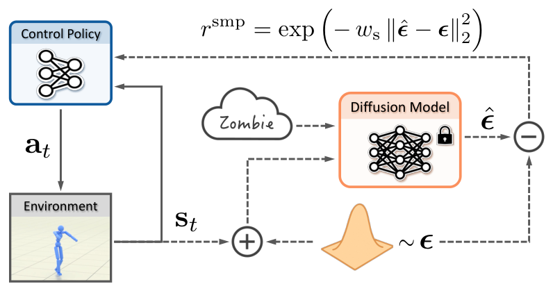

# SMP：把动作扩散模型变成可复用的运动奖励

AMP的判别器通常跟着每个控制任务重新训练：换任务、换策略甚至换一组动作数据，都要再次进行对抗博弈。SMP把运动分布学习与控制策略训练拆开。它先在动作数据上训练扩散模型，之后冻结模型，用Score Distillation Sampling产生奖励；同一先验可以被多个任务重复调用，也不必在下游训练时继续保存和读取原始动作库。

> **主要方法图：** Figure 2，PDF第4页。虚线表示不参与下游更新的冻结扩散先验，策略轨迹加噪后由预测噪声残差形成SDS运动奖励。来源：[原论文](https://arxiv.org/abs/2512.03028)。

## 从“判别真假”改成“沿score回到动作流形”

扩散模型学习在不同噪声时刻恢复动作样本。策略产生一段运动 \(x\) 后先加噪，冻结模型预测噪声 \(\epsilon_\theta(x_t,t,c)\)，预测值与真实噪声的差异给出动作应朝数据高密度区域移动的方向。SDS把这个方向转成策略奖励或梯度，使RL同时优化任务目标与动作先验。这里不要求生成器在运行时采样完整动作，扩散模型承担的是评分器而非高频控制器。

论文针对不同噪声尺度使用ensemble score matching和自适应归一化，避免某些时间步梯度过大；生成式状态初始化从先验采样合理起点，减少策略早期只看到摔倒状态。通用先验还可用classifier-free guidance调出特定风格，并在噪声预测空间按身体部位混合多个style，组合出训练集没有直接提供的新风格。

## 最值得复现的不是展示动作数量

算法开发者应先固定任务、PPO和动作数据，对比AMP与SMP的三项成本：先验预训练一次需要多少算力；换下游任务后是否真的无需重训；原始动作数据不再进入下游时，性能和稳定性损失多少。进一步可检查SDS奖励与任务奖励的尺度、score对速度区间外动作的响应，以及身体部位混合是否产生接触冲突。只有这些对照成立，“可复用”才不是把训练成本提前支付。

还应把先验覆盖率单独记录：若策略频繁访问扩散模型训练分布之外的跌倒、滑动或物体接触状态，score未必指向可恢复动作。此时增加在线状态覆盖或重做先验数据，比继续调SDS权重更有意义。

项目页展示了百余种风格、楼梯交互、少样本速度变化和Unitree G1真机。G1策略采用本体观测、非对称Actor-Critic和域随机化完成迁移，但SMP本身不提供状态估计、地形感知或安全层；不同任务若改变接触几何，冻结先验仍可能把策略拉向不适用的动作分布。

## 与AMP和Mimic的边界

SMP没有在运行时接收一条必须逐帧跟随的参考，因此不是Mimic Tracker。它与AMP一样用动作分布塑造策略，但用冻结score替代在线判别器，主分类归“对抗先验与行为模型”。官方代码已并入[MimicKit](https://github.com/xbpeng/MimicKit)，这使DeepMimic、AMP、ASE、ADD和SMP可以在同一环境中比较；复现时应利用这个共同基线，而不是分别从不同仓库得出结论。

[官方项目页](https://yxmu.foo/smp-page/) · [论文原文](https://arxiv.org/abs/2512.03028) · [官方代码](https://github.com/xbpeng/MimicKit)
