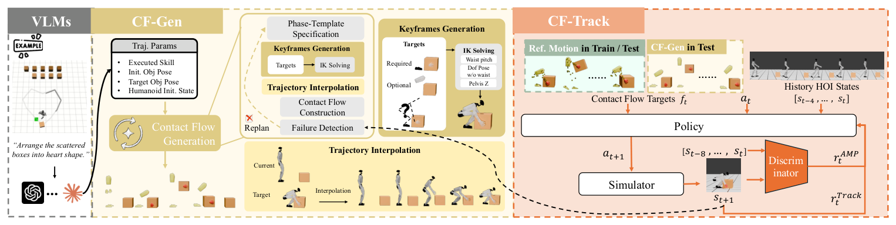

# OmniContact：用接触流组织可组合的人形物理技能

把一整段人体搬箱动作直接当作机器人参考，通常只能复现相近的箱体尺寸、初始位置和动作时序。OmniContact压缩掉与任务无关的全身细节，只保留“哪些关键身体要沿什么轨迹移动、何时与哪个物体发生接触”。这套Contact Flow成为生成层和低层控制器之间的接口，使搬运、推拉、滑动、踢球和物体重定位可以在统一表示下组合。

> **主要方法图：** Figure 2，PDF第5页。CF-Gen根据任务与物体状态生成Contact Flow，CF-Track在物理环境中跟踪关键体轨迹和时序接触，执行结果再反馈给闭环监测。来源：[原论文](https://arxiv.org/abs/2606.26201)。

## Contact Flow保留了什么

接触流由关键身体的任务空间轨迹和随时间变化的接触状态构成。它不像完整关节轨迹那样绑定人体比例，也不像单个“搬运”技能ID那样缺少几何信息。CF-Gen负责把任务条件转换成接触流片段，CF-Track则接收这些片段和当前机器人/物体状态，输出全身控制动作。技能串联时，高层不必重新生成每个关节，只需连接可执行的流片段并监测是否到达下一个接触阶段。

这个分层也解释了它为什么应归LocoManip，而不是世界模型或Mimic。VLM可以选择技能顺序，但论文的主要技术产物是可改变物体状态的Contact Flow和执行策略；低层确实跟踪参考，但验收量是箱体、行李箱或球是否被搬到、推到、滑到或踢到目标位置。

## 数据、恢复和长时执行

官方项目页汇总1274条有效序列、22.29小时配对采集和722万物体帧，频率为90 Hz；当前Hugging Face公开数据卡实际列出700条处理轨迹，覆盖箱体搬运/推拉/滑动与足球踢、抱、拾取后踢等子集。每个NPZ包含29维G1关节、39个body位姿、物体位姿和腕/踝接触标签。两组数字描述的范围不同，本库不把项目全集规模直接写成当前下载子集规模。

论文还训练恢复行为并以50 Hz闭环监测技能执行；项目页报告长时组合与物体形状、尺寸和初始位置变化。对开发者最直接的实验切口，是固定CF-Track，只替换CF-Gen或技能连接规则，再分别测接触时序误差、物体终态误差和恢复次数。这样能判断失败来自高层参考不可行，还是低层控制器没有执行出来。

若同一接触流换物体后失败，还应区分几何误差与动力学误差：前者看关键体到接触面的偏差，后者看负载、摩擦变化下的跟踪残差。两类问题需要修改的分别是流生成条件和低层适应机制。

## 当前开源边界

官方仓库提供ONNX策略、MuJoCo直接执行、NPZ/CF-Gen两类输入和Xbox摇杆热切换，能验证接口与Sim2Sim行为；它没有公开完整训练管线，也没有包含真实G1通信层。因此“代码开源”不能被写成完整复现或自包含实机部署。真实系统还需要物体状态估计、接触检测、安全控制和硬件接口，这些模块在演示视频中存在，并不等于都已进入仓库。

[官方项目页](https://omnicontact.github.io/) · [论文原文](https://arxiv.org/abs/2606.26201) · [执行代码](https://github.com/Ingrid789/OmniContact_sim2sim) · [公开数据](https://huggingface.co/datasets/lightcone02/OmniContact-Dataset)
