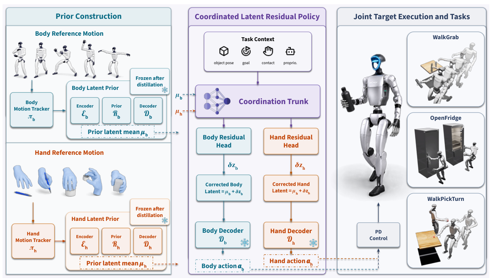

# CoorDex：用身体与手部先验降低连续灵巧移动操作难度

很多人形操作流程是“先走到物体前、停住、再用低自由度夹爪操作”。CoorDex研究的是更难的一种状态：Unitree G1在移动中还要控制20自由度WUJI手完成抓取、开冰箱和拿起后旋转。若直接让PPO输出身体与手的全部关节，稀疏任务奖励很难同时学会平衡、接近和指尖接触；把所有动作压进一个latent，又会让身体和手互相干扰。

> **主要方法图：** Figure 2，PDF第4页。身体和手分别由特权跟踪教师学习并蒸馏为潜在先验，下游协同残差策略在冻结先验之上完成移动操作。来源：[原论文](https://arxiv.org/abs/2606.23680)。

## 两套先验先解决“会动”，残差策略再解决“怎样配合”

训练首先从仿真的全身与手部示范出发，分别得到能访问特权状态的身体教师和手教师。教师并不直接部署，而是蒸馏成只依赖本体感知的latent prior。下游阶段冻结两个先验，把它们的latent当作低维动作空间；协同策略读取共享任务上下文，但用分开的身体残差头与手部残差头修正各自先验。

这种结构的价值不在于简单地“多用两个VAE”，而是明确了高自由度策略的分工：先验负责维持自然、可执行的局部动作分布，残差负责根据物体、任务阶段和另一部分身体的状态做协调。论文的消融显示，在相同奖励预算下，直接关节空间PPO、直接控制手部关节以及单体latent预测都无法达到同等训练效果，说明动作接口本身就是主要变量。

## 输入输出与公开实现

论文的最终策略面向G1与WUJI灵巧手，输出身体/手先验的latent和协调残差，再由冻结解码器还原控制动作。任务包括不停步抓瓶并搬运、移动中开冰箱门以及走近方块后拾取旋转。物体和任务上下文进入策略以决定接近与接触，但公开证据尚不足以把它描述为依赖纯视觉的真实闭环。

官方仓库注册了`CoorDex-WalkGrab-Wuji-v0`、`CoorDex-Fridge-Wuji-v0`和`CoorDex-WalkPickTurn-Wuji-v0`三项Isaac Lab任务，发布身体先验、手先验和协同残差策略权重。当前README提供的是rollout入口，代码树含环境、观测、奖励、动作和策略加载模块，却没有给出论文全部教师训练与蒸馏脚本。因此它适合研究动作接口和权重回放，不应被写成一键完整训练复现。

## 给算法开发的一个可验证方向

如果你的联合策略在仿真中一直学不会，不要首先增加网络层数。可以按CoorDex的思路做三组对照：完整关节动作、单一全身latent、身体与手分开的latent加协调残差；同时记录身体跌倒率、末端到物体误差、抓取成功率和手部动作幅度。若分先验只改善平衡却不改善接触，问题更可能在物体观测或手部数据，而不是全身策略容量。论文当前以仿真评测和定性真实轨迹回放为主，真实传感闭环与接触泛化仍是后续边界。

[官方项目页](https://skevinci.github.io/coordex/) · [论文原文](https://arxiv.org/abs/2606.23680) · [官方仓库](https://github.com/Skevinci/coordex)
