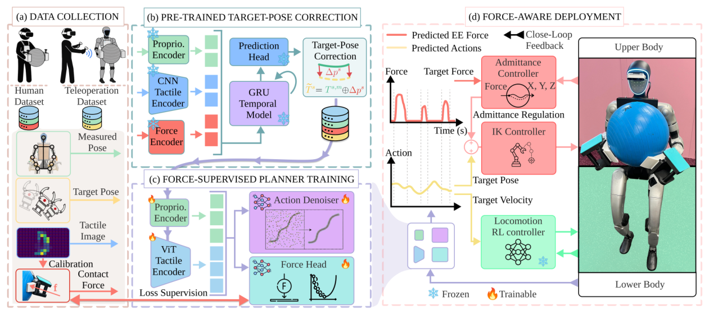

# WT-UMI：把接触力纳入全身示范、规划与柔顺执行

人体搬柔性物体、共抬大件或持续推压时，动作成功往往取决于接触力，而普通视频或末端位姿示范看不到这部分信息。机器人遥操作能记录可执行关节动作，却未必保留人类自然分配接触力的方式。WT-UMI用同一套全身触觉接口连接两类数据：它既可以穿在人体操作者身上，也可以安装到人形机器人上，同步获得触觉图像、接触力和末端位姿。

> **主要方法图：** Figure 2，PDF第4页。流程先用机器人遥操作数据学习人体目标位姿校正，再以人类接触力监督规划器，部署时由触觉导纳控制器跟踪力参考。来源：[原论文](https://arxiv.org/abs/2606.13232)。

## 两类示范各自补一块缺口

人体示范中的末端位姿不能直接当成机器人目标：身体尺寸、关节限制和接触位置都不同。论文先用机器人遥操作数据学习力条件的目标位姿修正，把人体测得的姿态转换为机器人更可能执行的目标。修正后的动作与人体自然接触力共同训练force-supervised planner，规划器一次输出一段末端位姿和对应接触力轨迹，而不是只预测下一帧几何位置。

部署时，触觉导纳控制器比较实测力与目标力，在线调整末端运动。这样，模型负责决定应该怎样接触，低层柔顺环负责吸收材料变形、人体协作和几何误差。它与只把力当训练标签的方法不同：预测出的力轨迹真正进入运行闭环；也与纯力控不同，高层仍由示范数据决定任务顺序和末端路径。

## 应怎样判断方法是否有用

论文在五类接触任务中覆盖柔性物体、大体积刚体和人机协作，并报告相对四类策略基线的成功率与接触位置误差改善。对算法研发而言，最有价值的复现顺序是逐步增加信息：仅位姿示范、位姿加离线力标签、力监督规划、最后加入触觉导纳闭环。每一步分别测物体终态、峰值接触力、接触位置误差和任务中断次数，才能区分收益来自更好的数据，还是来自运行时控制器。

该系统仍依赖触觉标定、人体与机器人接口对齐和稳定的全身控制器；规划器输出末端目标，并不直接解决脚步、平衡和自碰撞。传感器安装位置变化、触觉图像漂移或从未见材料都可能破坏力条件映射。截至2026年7月18日，官方项目页公开论文与演示，但未发现可核验代码或数据下载入口，所以本库不把它列为可复现项目。

## 在完整技术栈中的位置

WT-UMI横跨数据采集和物理交互，但核心产物不是一个通用数据集，而是能执行接触丰富全身任务的规划与柔顺控制系统，因此主分类归LocoManip。对视觉模仿已经遇到上限的团队，它给出的启发是先检查缺失模态：失败究竟因为看不清物体，还是因为策略根本不知道当前施加了多大力。只有后者成立时，增加触觉和力监督才是合理投入。

[官方项目页](https://wt-umi.github.io/WTUMI/) · [论文原文](https://arxiv.org/abs/2606.13232)
