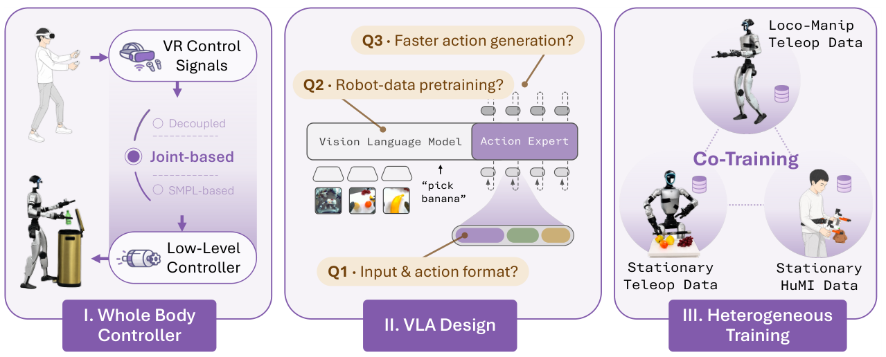

# OpenHLM：验证全身原生LocoManip的数据与训练配方

不少所谓人形VLA只控制上肢，移动由独立导航或行走模块完成；即使任务成功，也无法判断模型是否真正学会身体、脚步和双手之间的协同。OpenHLM选择把语言、相机像素和全部人形自由度放在同一策略接口，并用一组受控实验逐项检查遥操作方式、数据组成和共训练策略。它使用VLA方法，但最终验收的是全身移动操作，因此本库归入LocoManip。

> **主要方法图：** Figure 1，PDF第2页。图中三阶段分别比较全身控制/遥操作接口、数据配比，以及全身与异构操作数据的共同训练。来源：[原论文](https://arxiv.org/abs/2606.22174)。

## 先把“全身控制”定义清楚

OpenHLM采用关节级全身遥操作采集示范，策略输入包含语言和相机图像，输出直接覆盖人形全部自由度，而不是只给末端位姿或调用预定义行走技能。这个选择让脚步、躯干和手臂在同一动作序列中共同优化，但也显著增加数据维度和动作分布不平衡：手部细节变化多，腿部动作相对重复，简单地把所有轨迹混合可能让模型偏向静态操作。

论文为此引入异构共训练，把全身遥操作数据与更易获取的固定式/上肢操作数据共同使用。后者补充视觉场景和手部交互，前者保留移动、平衡与全身动作接口。关键不是“数据越多越好”，而是不同数据源共享哪些视觉和动作表示、哪些自由度需要掩码或对齐，以及混合比例是否破坏全身动作分布。

## HLM-12检查的不是单一成功率

论文设置HLM-12基准，把任务分到多类全身能力中，目的是分开观察移动、操作、身体协同和长程执行。对开发者更有用的做法，是在总成功率之外保留脚步距离、躯干姿态、手部接触和动作切换等指标。如果增加固定式操作数据只改善抓取，却降低边走边操作的稳定性，应先检查动作空间和采样比例，而不是直接扩大模型。

官方Hugging Face组织已经开放模型权重和OpenHLM-data，二者均标注MIT；数据仓库约298 GB。但截至核验日，数据卡README仍为空，公开页面没有给出足够的文件字段、轨迹数量和采样频率说明。现有公开材料只能确认上述规模与许可证，不足以根据演示推断具体下载数据结构。使用前应抽样检查相机时间戳、语言标注、关节顺序和不同数据源的动作掩码。

## 可复用结论与边界

OpenHLM的价值不是证明一个固定VLA架构已经解决人形操作，而是把“全身原生控制是否必要、数据如何混合”变成可做消融的问题。它下游仍需要可靠的本体接口、执行器控制和安全保护；模型直接输出全部自由度也不等于具备接触力约束或跌倒恢复。最值得延伸的实验，是固定模型规模，逐步改变全身数据比例、上肢异构数据和动作接口，再看真实物体终态与全身稳定指标是否同步改善。

[官方项目页](https://openhlm-project.github.io/) · [论文原文](https://arxiv.org/abs/2606.22174) · [数据与权重](https://huggingface.co/OpenHLM)
