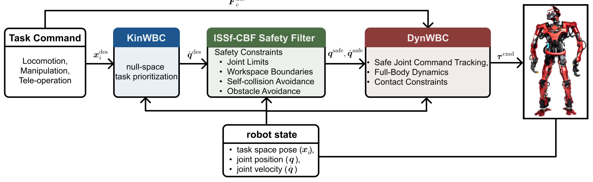

# SafeWBC：在运动学任务与动力学执行之间加入可证明安全过滤

全身控制器可以按优先级完成手部、质心和姿态任务，却不天然保证关节限位、自碰撞、障碍距离和工作空间约束在模型误差与外力下仍然成立。SafeWBC没有让一个更复杂的优化器同时承担所有目标，而是把名义任务、运动学安全和动力学可行性拆成三层：KinWBC给动作意图，ISSf-CBF只做必要安全修正，DynWBC负责接触稳定和力矩执行。

> **主要方法图：** Figure 1，PDF第4页。名义关节参考先经过ISSf-CBF安全过滤，再由动力学WBC在接触约束下跟踪，机器人状态反馈同时进入三层。来源：[原论文](https://arxiv.org/abs/2605.25546)。

## 三层各自解决一类矛盾

KinWBC根据优先级任务生成名义关节运动参考，它关注“希望机器人怎样动”；安全过滤器在运动学模型上建立关节边界、自碰撞、外部障碍和工作区的barrier function，并求最小修正，使参考保持在安全集合附近；DynWBC再把过滤后的参考转换为满足全身动力学、接触和执行器约束的控制量。

普通CBF依赖模型精确，跟踪误差或外力可能让真实系统越过边界。论文使用input-to-state safe CBF，把未知但有界的扰动显式映射为安全集合的保守扩张。直观地说，扰动越大，过滤器保留的安全余量越大；参数需要根据下层跟踪误差和模型不确定性调节，而不是只在运动学仿真中选一个好看的距离阈值。

## 它怎样接入学习策略

SafeWBC本身不是RL策略，也不负责生成行走或操作技能。对于已有Mimic、Locomotion或遥操作控制器，可以把其目标转换为KinWBC名义任务，再让安全层过滤。工程上最重要的接口是：上游输出何种关节/任务空间参考，安全QP运行频率是多少，下游DynWBC能以多大误差跟踪，以及扰动上界是否与真机日志一致。

论文在仿真和真实人形上覆盖移动、遥操作、单腿平衡与手部任务，展示多种安全约束在实时控制中的作用。但“满足barrier条件”不等于任何碰撞都不会发生：障碍几何、距离估计、扰动上界和执行器响应若建模错误，保证适用的集合也会改变。截至2026年7月18日，官方项目页未提供可核验代码，因此具体求解器、机器人接口和复现实参仍需按论文实现。

## 给算法团队的最小验证

在上真机前，可保持原策略不变，依次加入关节限位、自碰撞和外部障碍三类CBF，记录任务误差、安全最小距离、QP求解时间、过滤幅度和下层跟踪残差。若过滤器长期大幅改写策略输出，问题可能不是安全层太保守，而是上游策略经常提出不可执行目标。这个实验能把“策略能力不足”和“安全约束妨碍表现”分开，也是SafeWBC作为横向工程支撑而非某个技能论文的主要价值。

[官方项目页](https://kwlee365.github.io/SafeWBC-Website/) · [论文原文](https://arxiv.org/abs/2605.25546)
