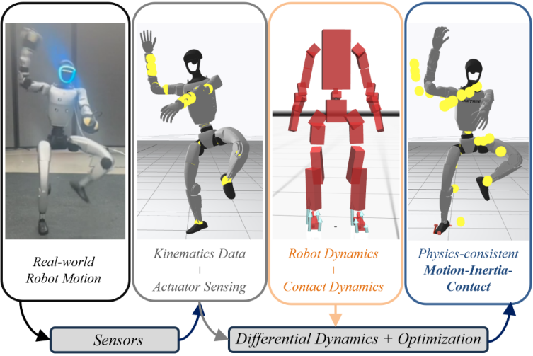

# PRIME：从机器人日志重建动力学一致的运动、接触与惯性

动作捕捉或板载状态估计常能给出看起来连续的姿态，却没有解释落脚冲击、摩擦和外部负载从何而来。若直接把这种运动学轨迹用于系统辨识、接触标注或学习，模型误差会被吸收到噪声，恢复出的加速度与执行器命令也可能不满足动力学。PRIME把状态、控制、接触力和惯性参数放进同一个离线优化问题，使重建结果同时解释传感器与机器人动力学。

> **主要方法图：** Figure 1，PDF第1页。输入为真实机器人运动学和执行器传感，优化中显式加入机器人与接触动力学，输出带接触和惯性解释的物理一致轨迹。底部图注已精确裁除。来源：[原论文](https://arxiv.org/abs/2605.17681)。

## 参数全信息估计不只修一条轨迹

PRIME把一段时间窗口内的广义状态、控制输入、接触力和待辨识惯性参数作为联合变量。代价项约束估计结果接近测得关节位置、速度和执行器命令，同时系统转移必须满足接触动力学。相比先平滑轨迹、再独立估计接触的串联方案，联合求解允许接触变化反过来修正身体运动，也允许惯性参数解释持续的载荷偏差。

接触采用平滑的Anitescu式摩擦模型与互补条件近似，使接触建立、滑动和脱离能够进入可微优化。求解器建立在Crocoddyl/FDDP上，通过解析导数进行前后向迭代。输出不仅有重建姿态，还包括控制、接触位置/力和物理一致惯性参数，可用于离线标注没有力传感器的真实日志。

## 输入输出决定了它不是板载状态估计器

仓库包含Unitree Go2和G1的仿真与真实数据实验、XML模型、结果和可视化。典型输入是测得的运动学与执行器感知，输出是一段优化后的完整轨迹。论文中的窗口可达数秒并进行批量优化；当前实现定位是离线重建，而不是每个控制周期给策略实时提供速度或接触状态。

这条边界对开发者很重要。如果问题是板载速度漂移，应先看实时估计器；如果问题是训练日志里足端接触、外载和惯性参数互相矛盾，PRIME才是合适工具。可做的最小实验是对同一段日志分别使用运动学平滑和PRIME重建，比较动力学残差、接触时序、力连续性以及用重建数据训练的模型在留出轨迹上的误差。

## 证据与局限

论文在Go2和G1上评估多种接触丰富运动，并展示附加载荷下的惯性估计。它依赖机器人模型、执行器传感质量、接触几何和初值；平滑接触近似提高可优化性，也会牺牲瞬时冲击的精确表达。大窗口计算成本和模型不匹配限制了直接在线使用。官方代码采用BSD-3-Clause并保留Crocoddyl归属，适合进一步检查代价权重、接触模型和参数化，而不是只读取最终可视化。

[官方项目页](https://jkangkjr.github.io/PRIME-project/) · [论文原文](https://arxiv.org/abs/2605.17681) · [官方代码](https://github.com/well-robotics/PRIME)
