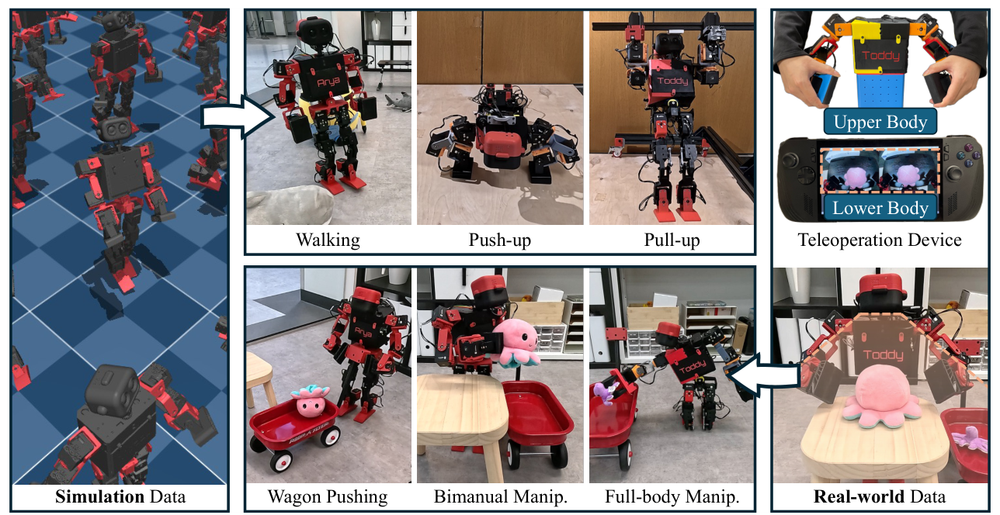

# ToddlerBot：把低成本人形硬件做成可重复的学习系统

开源一套CAD并不等于提供可复现的机器人学习平台。不同实例的零位、执行器响应和结构误差若无法校准，同一策略就难以迁移；只有硬件没有数据采集与部署接口，算法团队仍需从头补工程链。ToddlerBot围绕0.56米、3.4千克、30个主动自由度的人形，把机械设计、标定、执行器辨识、MuJoCo数字孪生、遥操作、训练和实机脚本放进同一项目。

> **主要方法图：** Figure 1，PDF第2页。图中同时展示仿真数据、真实遥操作数据以及行走、双臂和全身操作的训练路径，是平台方法而不是单一策略网络。来源：[原论文](https://arxiv.org/abs/2502.00893)。

## ML兼容性首先是实例一致性

平台提供即插式零点标定和可迁移电机系统辨识，用测得响应校正数字孪生。这样做的目标不是让仿真视觉更逼真，而是让相同关节命令在不同机器和MuJoCo模型上产生接近的动力学结果。30个主动自由度包括每臂7个、每腿6个、颈部2个和腰部2个；末端可使用柔顺手掌或平行夹爪，板载传感与计算用于策略执行和数据采集。

真实示范通过遥操作接口采集，仿真侧可并行生成行走数据。论文展示全向行走的RL零样本迁移，以及使用约60条示范训练的RGB扩散策略完成双臂和全身操作；技能串联时，扩散策略负责抓住推车把手，随后切换到行走策略推动。这个例子也暴露了当前架构：不同技能仍由显式切换连接，并非一个统一策略自动规划全部长程任务。

## 对算法开发者最有价值的检查表

若准备在新本体上复现论文算法，可以沿ToddlerBot代码树反向检查：关节零位是否有重复标定流程，执行器网络或参数是否来自实测，仿真模型和固件关节顺序是否一致，策略频率与PD频率怎样分层，遥操作数据能否直接回放，以及第二台机器是否可复用同一策略。缺少其中任何一项，训练成功都可能只是单机偶然结果。

一个可验证的扩展方向是固定策略与数据，在两台实例上分别使用通用电机参数和实例辨识参数，测量轨迹误差、跌倒率、温升与操作成功率。若辨识只改善空载行走而不改善持物操作，下一步应检查负载模型与末端柔顺，而不是增加策略参数。

## 开放范围与适用边界

官方仓库以MIT发布代码，项目页还提供文档、BOM和硬件资料；论文在CoRL 2025发表。低成本、小尺寸和可维修性降低了实验风险，但动力学、载荷和感知范围与全尺寸工业人形不同，算法迁移仍需重新处理执行器、尺度和接触。项目页的ToddlerBot 2.0后来增加翻滚、VR遥操作和板载深度等能力，这些更新不能反向写成2025论文已经验证的内容，本库在引用时将二者分开。

[官方项目页](https://toddlerbot.github.io/) · [论文原文](https://arxiv.org/abs/2502.00893) · [官方代码](https://github.com/hshi74/toddlerbot)
