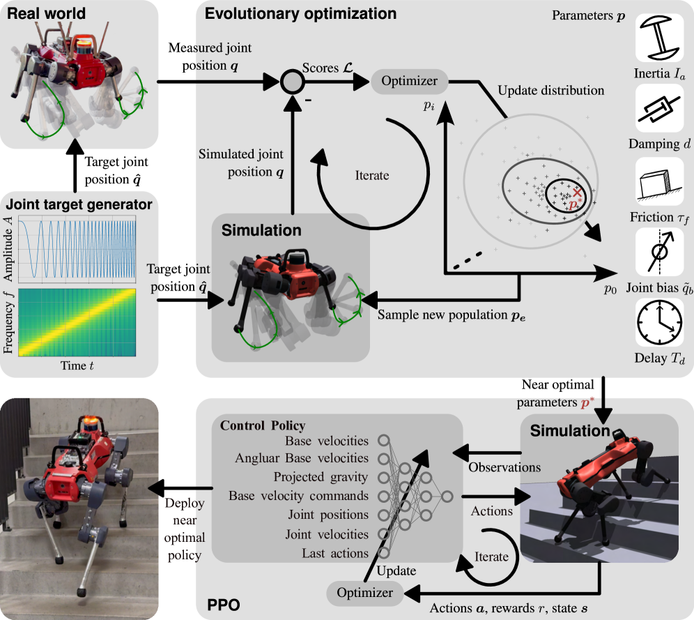

# PACE：用实机激励与进化搜索标定腿式机器人仿真

腿式策略从仿真迁移到真机时，常见做法是扩大动力学随机化范围，再用更多奖励项压住抖动、冲击和能耗。这种办法可能得到能走的策略，却没有回答模拟器究竟错在关节惯量、阻尼、摩擦、编码器偏置还是控制延迟，也容易让策略为了适应过宽的参数分布而牺牲运动效率。PACE把问题拆成两步：先用短时间实机激励标定关节动力学，再在校准后的模拟器中训练盲行策略。

> **主要方法图：** Figure 3，PDF第5页。上半部分从固定基座实机激励进入并行参数搜索，下半部分展示校准模拟器中的策略训练与零样本部署。来源：[原论文](https://arxiv.org/abs/2509.06342)。

## 固定基座悬空激励先把接触影响排除

流程首先把真实机器人固定在支架上，使腿部离开地面，再向各关节发送扫频的chirp位置目标。机器人记录目标关节轨迹和编码器反馈，得到电机、传动与控制链面对不同频率指令时的实际响应。作者选择悬空而不是让机器人行走采集，是为了避免足地接触力、地面摩擦和身体整体运动同时进入辨识。若直接用落脚数据拟合，关节跟不上命令究竟来自执行器模型错误还是接触模型错误，很难分开判断。

这一步只需要短时间、低风险的关节激励，不要求真机先有一套能稳定行走的策略。采集结果也不是训练动作数据，而是给下一阶段提供需要被模拟器复现的输入与输出轨迹。

## 并行模拟器把参数候选变成可比较的轨迹

同一组目标关节轨迹随后在Isaac Lab中由大量并行环境重复执行。每个环境采用不同的候选动力学参数，并将模拟关节反馈与真机测量轨迹比较。公开实现默认启动4096个环境，损失是两条关节轨迹之间的均方误差。

对具有十二个关节的ANYmal示例，搜索向量包含每个关节的转子等效惯量、黏性阻尼、库仑摩擦和关节偏置，以及全机共享的控制延迟，总维度为`4n+1=49`。惯量决定加减速时的响应，阻尼和摩擦解释持续运动及换向时的误差，偏置处理编码器零位与模型零位不一致，延迟则描述指令发出到执行器响应之间的整体错位。把这些因素分开搜索，才能避免用一个参数错误地补偿另一个参数。

PACE采用CMA-ES更新参数分布。每一轮先采样一批候选参数，在并行模拟器中回放，再根据轨迹误差提高表现较好区域的采样概率。这里不需要对接触丰富的整机仿真求梯度，也不要求执行器模型完全可微；代价是辨识结果仍受激励频段、参数边界和模型结构限制。

## 校准后的模拟器再训练运动策略

参数收敛后，策略训练使用这套经过实测校准的关节模型。Actor读取四十八维本体观测，包括任务命令、身体姿态与速度相关量、关节状态和上一时刻动作；Critic在训练时额外读取仿真中的无噪声本体状态和地形等特权信息，总输入为三百五十三维。Critic帮助判断当前状态的长期回报，但真机部署时不会保留。

Actor输出目标关节位置偏移。偏移经过关节安全范围限制后交给PD控制器，由PD误差计算实际力矩并驱动机器人；新的IMU和编码器反馈再形成下一控制周期的观测。训练仍会改变速度任务、地形、地面摩擦并施加外部推力，但不再用宽范围机器人动力学随机化掩盖执行器模型误差。奖励被压缩为速度跟踪、能耗、碰撞和足端触地速度四类，使每一项都对应可解释的行为目标。

部署时删除Critic和全部仿真特权信息，只保留本体观测、Actor、关节限位与PD执行链。论文报告该方法在多种腿式平台上完成零样本迁移，并在ANYmal实验中把包含执行器消耗的运输成本降低约32%至1.27。这个结果说明精确标定可能同时改善跟踪和能效，但不能外推为所有机器人、负载和接触模型都能由同一组参数解释。

## 开源范围与开发价值

官方仓库已经开放实机关节激励记录、ANYmal D环境、Isaac Lab并行回放、CMA-ES参数搜索和结果保存链路。它更适合作为“先校准模拟器，再训练策略”的Sim2Real工程基线，而不是新的Locomotion网络。论文中的全部机器人资产、完整策略训练配置与多平台数据没有在当前仓库中全部出现，使用时需要区分论文证据与实际开放范围。

仓库README注明论文已被IJRR接收、正式引文待上线；当前arXiv记录仍显示投稿状态。知识库据此保留两者差异，不把尚未上线的卷期信息补写成事实。

[项目文档](https://pace.filipbjelonic.com/) · [论文原文](https://arxiv.org/abs/2509.06342) · [官方代码](https://github.com/leggedrobotics/pace-sim2real)
