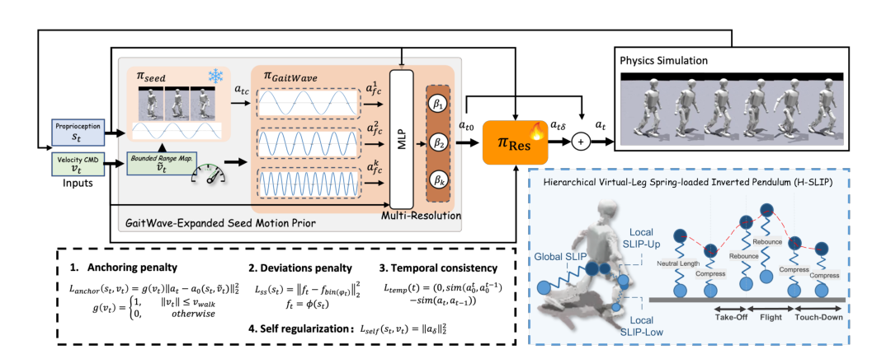

# GaitSpan：从冻结行走策略扩展连续走跑能力

一套已经稳定的行走策略通常只被当作最终控制器。需要跑步时，常见做法是重新准备高速动作、训练新的专家，再处理行走与跑步之间的切换。GaitSpan把旧策略视为可继续生长的技能种子：保留它已经学到的左右支撑、重心转移和平衡反馈，只为更快节奏、腾空和落地补充新的控制量。

> **主要方法图：** Figure 2，PDF第5页。图中从冻结的行走策略出发，经GaitWave、H-SLIP奖励和残差分支得到最终关节动作。来源：[原论文](https://arxiv.org/abs/2607.12114)。

## 冻结策略提供不会随新训练漂移的动作基线

每个控制周期，系统读取机器人本体状态、速度指令和步态相位。进入扩展训练后，已有行走策略的参数被冻结；超出行走范围的高速指令先映射回种子策略熟悉的速度区间，使该分支持续给出可站稳、可交替支撑的关节动作。这样，学习跑步时产生的失败梯度不会直接覆盖原有行走能力。

GaitWave对同一份当前状态使用不同的相位缩放重新查询冻结策略。论文采用`1.0`、`1.25`、`1.5`和`2.0`倍内部节奏，得到四组仍来自同一行走控制器、但支撑切换速度不同的动作波。命令条件化的分层记忆单元再按当前速度混合这些候选动作；粗粒度单元学习从走到跑的整体变化，细粒度单元补相邻速度区间的局部差异。软插值避免速度跨过某个边界时关节目标突然跳变。

这一步不是把关节轨迹机械加速。冻结策略仍会根据实时IMU和关节反馈闭环修正，GaitWave改变的是它产生动作的内部时间尺度及不同尺度之间的组合。

## H-SLIP把高频迈步塑造成真正的跑步接触过程

只提高相位频率容易得到更快的小碎步，不一定出现跨步、腾空和有控制的落地。论文把弹簧负载倒立摆的事件结构写成强化学习奖励，并在躯干到脚、躯干到膝、膝到脚三层虚拟腿上观察长度变化。压缩阶段对应吸收冲击，回弹阶段要求身体获得推进，腾空阶段允许双脚同时离地，落地阶段则抑制足端滑动和过大冲击。

这些奖励只规定动力学事件和接触顺序，没有提供一条人类跑步参考。残差策略同时读取本体状态、原始速度命令和种子动作，输出种子与GaitWave尚未覆盖的关节修正。最终动作由混合动作波与残差相加，形成目标关节位置，再交给PD控制器计算电机力矩。机器人执行后的IMU和编码器状态进入下一周期，完整链路仍是本体闭环。

低速靠近种子动作、残差幅度、相位一致性和动作变化率等约束限制扩展幅度。它们的作用不是让新策略逐帧模仿行走，而是避免高速探索无意中破坏原有平衡结构。

## 训练、部署与证据边界

论文使用FastSAC和4096个Isaac Gym并行环境训练，物理仿真为200 Hz，策略控制为50 Hz。训练逐步提高高速指令比例，并随机改变质量、摩擦、质心、关节增益、动作延迟和外部推力。部署时不存在Critic、特权地形信息或步态专家切换器，只保留本体观测、速度命令、冻结种子分支、GaitWave混合、残差策略和PD执行链。

实验覆盖Booster T1、Booster K1和Unitree G1，并在五种自由度配置上做仿真。项目页展示三类机器人实机走跑，以及草地、碎石、沙地、斜坡、负载和低摩擦鞋等条件。接触图表明同一策略会随速度改变支撑与腾空关系，而不是始终重放一种加速行走。

方法的边界同样明确：它需要一套质量足够好的行走种子，种子没有覆盖的平衡方式不会凭空出现；当前只验证从行走向慢跑和跑步扩展，尚未证明新跑步策略还能继续作为跳跃、急停或转向技能的下一层种子。官方项目页虽出现代码入口，但核验时目标仓库无法访问，因此本库不把它记为已开源。

[项目页](https://gaitspan2026.github.io/) · [论文原文](https://arxiv.org/abs/2607.12114)
