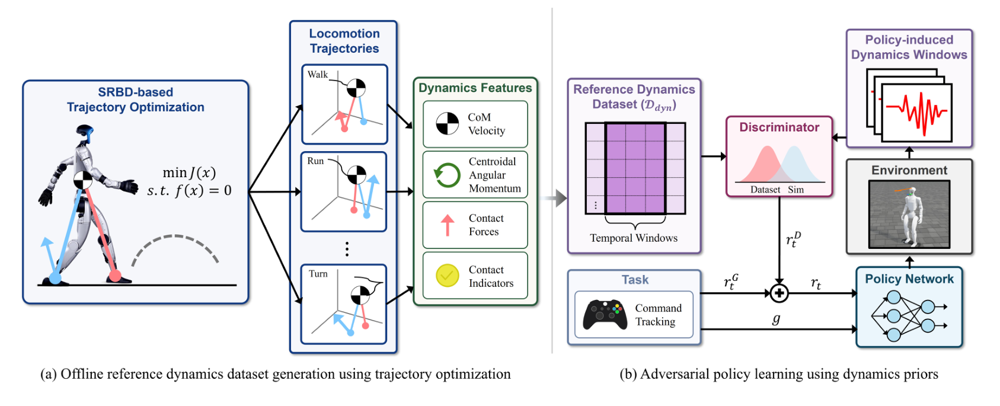

# ADP：以对抗动力学分布训练人形抗扰运动

AMP通常判断机器人当前动作在关节姿态和末端运动上是否像参考数据。这对动作外观有效，却没有直接约束受推后的质心怎样回到支撑区、全身角动量怎样重新分配、双脚何时换支撑以及接触力怎样吸收扰动。ADP保留“用判别器给策略提供先验奖励”的思路，但把判别对象从运动学外观换成动力学时间序列。

> **主要方法图：** Figure 2，PDF第3页。左侧生成动力学参考分布，右侧用参考窗口和策略窗口训练判别器，并把判别结果作为PPO奖励。来源：[原论文](https://arxiv.org/abs/2607.03454)。

## 轨迹优化只提供动力学分布，不提供逐帧动作

训练前，系统用单刚体动力学轨迹优化生成行走、跑步、转向、侧移和后退等参考。优化变量包括质心状态、质心动量和双脚接触力，约束包含质心动力学、接触启用和摩擦锥。它没有求出需要被机器人逐帧复制的完整关节轨迹，而是从结果中提取质心速度、质心角动量、平面角动量变化、按体重归一化的左右脚接触力和二值接触状态。

这些量再与当前速度命令和跟踪误差组合，并沿短时间窗口堆叠。窗口很关键：一次接触切换或受推恢复不是单帧状态，只有连续观察质心、动量和接触力的变化，才能区分正常换步与失衡后的错误补偿。轨迹优化数据与强化学习Rollout虽然来自不同模型，但都被转换到这套共同动力学特征中，形成可比较的参考分布和策略分布。

## 判别器把物理规律变成策略可用的奖励

Actor读取可在真机获得的速度命令、IMU、投影重力、关节位置与速度和上一时刻动作；机体线速度不进入Actor。Actor输出主动关节的目标位置偏移，经PD控制器变成力矩。训练期Critic可以读取真实机体线速度等仿真特权信息，只负责价值估计。

判别器同时接收轨迹优化窗口和策略Rollout窗口，学习将前者判为参考、后者判为策略样本。策略越能产生接近参考动力学分布的连续响应，得到的动力学先验奖励越高。PPO更新时使用任务奖励、ADP奖励和动作平滑等正则奖励；判别器损失不会穿过仿真器直接反传给Actor，Actor只经奖励信号受影响。

这解释了ADP与直接动力学误差的差别。直接距离必须预先规定某个命令对应哪条均值轨迹，容易把多种合理恢复压成单一目标；判别器学习的是窗口分布，允许策略在保持质心、动量和接触关系合理的前提下选择不同关节姿态。它也不同于关节级AMP：没有参考姿态、相位或末端轨迹跟踪。

## 真机部署保留什么，以及论文证明了多少

部署到29自由度Unitree G1后，轨迹优化器、参考数据、判别器、Critic和仿真接触力都退出运行。真机只执行速度命令、本体观测、Actor、目标关节偏移和PD闭环；训练期学到的动力学偏好已经进入Actor参数。

仿真采用统一PPO架构、观测、动作、随机化和扰动课程，对比无先验RL、运动学AMP和直接动力学奖励。论文报告ADP的可承受扰动指标J80提高约16.7%，恢复时间降低47.9%，速度误差降低35.4%。这些数字来自受控仿真。项目页和补充视频给出G1人工推扰对比，但论文明确将硬件结果定位为定性迁移验证，而不是具有统一推力、重复次数和统计置信区间的真机量化实验。

ADP因此适合研究“先验到底应约束动作长相还是闭环动力学”。它目前依赖简化单刚体模型和预设步态接触表构造参考分布，不能保证每个参考窗口都满足完整多刚体动力学，也没有公开代码供复现。后续使用时应单独核验特征选择、窗口长度和判别奖励是否真的带来受扰收益，而不是只比较正常行走视频。

[项目页](https://seokju-lee.github.io/adp/) · [论文原文](https://arxiv.org/abs/2607.03454)
