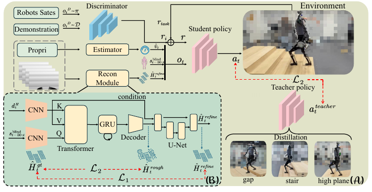

# DPL：以跨模态地形重建驱动深度感知人形运动

单目深度图可以提前看见楼梯和沟槽，却带有身体自遮挡、边缘孔洞和距离噪声；本体观测稳定，但只能在机器人已经踩到或撞到地形后反映变化。DPL没有让一张深度图直接回归关节动作，也没有依赖外部定位维护全局地图，而是先把近期视觉和身体运动重建成机器人局部坐标系下的高度图，再由学生策略调整盲走底座。

> **主要方法图：** Figure 1，PDF第3页。图中包含多地形教师、带真实噪声的深度生成、跨模态地形重建、盲走底座和统一学生策略。来源：[原论文](https://arxiv.org/abs/2510.07152)。

## 深度和本体历史先变成结构化局部地形

每次感知更新使用最近五帧深度图和50个控制步的本体历史。本体分支包含关节状态、基座角速度、投影重力、速度估计和步态信息，视觉分支用卷积网络提取多帧深度特征。跨模态注意力让本体表示作为查询，从视觉特征中选择与当前身体位置和运动阶段相关的区域；例如同一条台阶边缘，对正在抬左脚和刚完成右脚落地的机器人意义不同。

GRU继续保存跨周期状态。前视相机靠近障碍后，台阶边缘可能离开视野，腿部也会周期性挡住地面；若只处理当前窗口，系统无法判断一块缺失区域是沟槽、遮挡还是一帧掉点。GRU利用此前视觉和连续关节运动维持短时地形记忆。

解码器先回归粗高度图，再把粗结果和深度潜变量送入条件U-Net修正台阶边缘与平坦区域。局部图覆盖机器人前方约1米乘1米，分辨率5厘米。训练使用仿真真值高度图监督；真机没有这项真值，只保留重建网络的输出。

## 仿真深度必须包含机器人自己和传感器缺陷

仿真射线同时与地形和机器人动态网格求交，使腿、手和躯干随姿态变化产生真实自遮挡。其后再加入图像裁剪、距离相关轴向与横向噪声，以及根据深度不确定度和Sobel边缘随机丢点。没有这条合成链，网络只见过无孔洞的理想几何，到了真机会把身体遮挡和深度边缘误认为地形。

运动控制先为沟槽、楼梯和平地等地形训练使用真值环境信息的教师，再蒸馏给统一学生。学生读取盲走本体状态、重建高度图和20维盲走动作，输出20维关节调制动作，同时预测步态相位增量和前向速度残差。关节目标由盲走动作与调制动作加权融合；相位和速度残差则允许视觉在楼梯前改变节奏、在沟槽前增加跨步。目标关节动作以100 Hz交给1 kHz PD控制器，新的本体反馈再进入下一周期。

学生通过教师动作监督、PPO任务奖励、AMP运动先验和地形重建损失联合训练。教师、Critic、真值高度图和仿真接触信息只在训练中出现；端到端微调让视觉误差真正影响运动结果，而不是分别训练感知与控制后假定两者接口没有偏差。

## 天工Ultra部署与可确认边界

真机使用20自由度天工Ultra和一台Orbbec 335L深度相机。深度约30 Hz更新，整套感知延迟约20 ms；运动策略100 Hz、低层PD 1 kHz。部署只保留相机、本体历史、重建器、盲走动作底座、调制策略和PD，不保留多地形教师、真实地形、Critic及监督解码目标。

论文展示上下楼梯、连续沟槽、斜坡高台和可移动平台。真实深度重建实验中，完整方法的平均绝对误差从未处理模型的16.07厘米降至3.25厘米；楼梯实验也显示端到端微调减少绊碰。论文对楼梯统计分母的描述存在歧义，可移动平台没有公开重复次数和量化成功率，因此不能将视频外推为任意复杂地形成功率。

DPL补足的是“嘈杂单目深度怎样进入高频关节控制”的接口。它恢复局部几何，但不判断松软、湿滑或可承重性，也没有公开代码。遇到训练分布外形状时，条件解码器可能生成看似连续但错误的高度图，高频PD只能执行错误目标，不能替代上层地形核验。

[论文原文](https://arxiv.org/abs/2510.07152)
