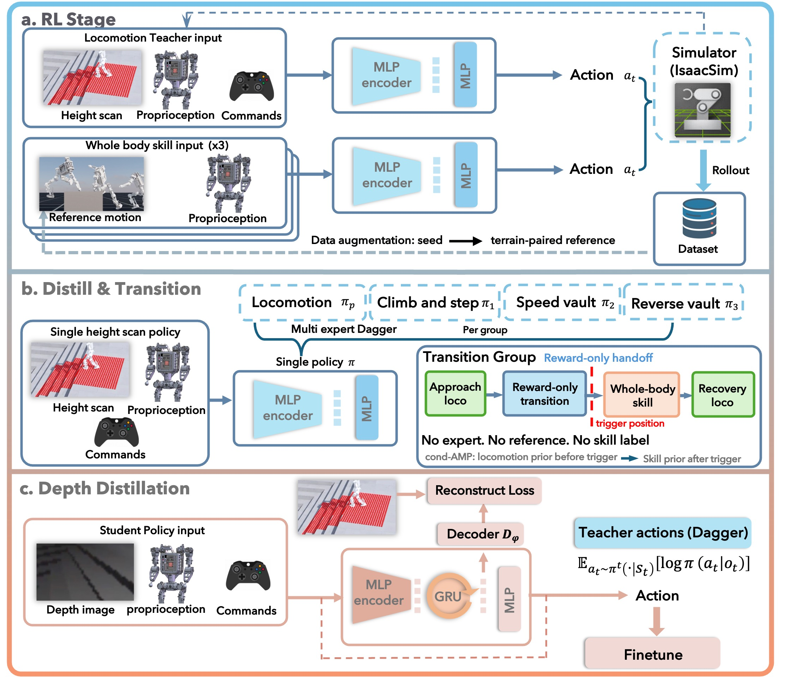

# Light-Loco-Parkour：多专家蒸馏与无标签切换的视觉全身跑酷

视觉Locomotion策略能够根据地形调整步态，动作跟踪专家也能在固定障碍上复现攀爬、撑越等全身动作，但两者并不会自然组成一套持续运行的控制器。Light-Loco-Parkour要解决的是：怎样从极少量人体视频得到可承受真实接触的动作参考，再把普通行走和多个专项技能合并为一套只依赖机载深度、本体观测和速度指令的策略，使机器人自己决定何时进入技能、何时退出并恢复行走。

> **主要方法图：** Figure 2，PDF第5页。图中依次展示感知行走与专项技能教师、多专家DAgger与过渡微调，以及从高度扫描到循环深度策略的部署蒸馏。来源：[原论文](https://arxiv.org/abs/2608.02653)。

## 从单段视频得到与障碍配对的物理参考

每种全身技能从一段互联网人体视频开始。GVHMR先恢复逐帧SMPL人体动作，GMR再把人体姿态映射到Lightbot 0。这一步仍需按照手、脚或骨盆暗示的接触位置手工放置一个初始虚拟障碍。此时得到的只是粗略动作—障碍对：人体恢复和几何重定向都不知道障碍表面在哪里，支撑手可能穿入台面，膝盖可能切入边缘，整条轨迹也可能超过目标机器人的力矩、速度或平衡能力。

作者把BeyondMimic式动作跟踪扩展到物体接触场景。专家除了参考动作，还读取障碍距离和尺寸；训练不只跟踪根节点相对姿态，而是在全局坐标中约束指定的手腕、肘部或骨盆真正到达接触位置。Reference State Initialization把环境重置到动作中的随机帧，使策略能够直接探索撑越腾空、攀爬发力等高动量阶段。这样，仿真接触力和执行器限制会把穿透或悬空的几何参考修正为机器人实际能执行的轨迹。

一次训练后，系统从多条并行Rollout中选出与当前参考最接近的轨迹，把它和障碍同时提高5至10厘米，再作为下一轮训练目标。成功轨迹已经经过目标本体动力学和接触约束，因此新一轮不是机械拉伸原动作，而是在更难障碍上继续寻找可执行解。论文以此把一条45厘米攀爬种子扩展到45至75厘米的动作—地形配对序列。这个阶段产出的是专项参考和跟踪专家，还不是最终运行策略。

## 固定动作还要变成地形条件技能

系统首先单独训练感知Locomotion教师。它根据速度指令、本体历史和干净高度扫描产生目标关节位置，Actor还使用接触标志，Critic额外读取脚下高度等仿真特权信息。速度跟踪奖励负责维持命令响应，宽松速度区间允许机器人在障碍前减速而不被当作失败；非法落脚惩罚利用足端下方射线避开孔洞和边缘，带时间衰减的足端加速度惩罚则约束落地冲击。最近五帧观测用于补足单帧无法表达的速度、接触和短时动力学变化。

每个物体交互专家最初仍然绑定一条参考和一个障碍。作者从扩增序列中选择最接近硬件极限的专家，用DAgger在学生自己访问的状态上查询专家动作，同时保留PPO任务奖励，把技能蒸馏到“本体观测、局部高度扫描、速度指令”这一可泛化接口。随后去掉专家监督，在不同尺寸和位置的配对障碍上继续训练；当前障碍对应的参考只负责保留动作形态，障碍后方的任务奖励和终止奖励要求机器人真正完成穿越。Reference State Initialization在这里被关闭，机器人从动作首帧开始，并用Locomotion策略产生的关节姿态初始化，使专项技能能够从正常行走状态接入。

这一层很关键：迭代扩增解决“参考是否物理可行”，专项蒸馏和继续强化学习解决“同一种技能能否根据障碍几何调整接触时机与身体姿态”。完成后，每个专家已经是地形条件技能，而不是固定动作播放器。

## 统一蒸馏不等于学会技能交接

多专家DAgger把感知行走策略和各专项技能压缩到一个高度扫描学生中。训练环境按Locomotion和不同技能分组，每组由对应专家提供动作监督。Actor不接收技能标签，必须从地形、速度命令和本体状态判断应该复现哪种行为；只有训练期Critic读取组别指示，以区分不同组的奖励分布。

这一步能够让同一网络保留多种能力，却没有提供任何“从普通步态进入撑越、完成后重新行走”的样本。作者因此增加过渡组：场景把开放地形和技能障碍放在同一条路线中，不再提供逐帧参考或专家动作，只保留速度与转向跟踪、障碍后方的稀疏完成奖励、接近目标的稠密奖励，以及条件AMP运动先验。到达预设触发位置前，AMP判别器约束动作接近Locomotion分布；越过触发位置后，它改为约束相应技能分布。触发位置只用于训练奖励切换，不是部署时输入给策略的技能命令。

机器人会被重置在障碍前、技能执行区和障碍后方，使部分回合可以分别探索接近、执行和完成后的不同阶段，并获得与当前阶段对应的学习信号。Locomotion组和专项技能组继续作为锚点，防止过渡微调破坏原有能力。Table VII在每种设置100次随机试验中报告：只有平地Locomotion和专项技能、没有过渡组时成功率为0%；加入复杂地形Locomotion但仍没有过渡组时为33%；保留过渡组但删除AMP时为51%；完整方法达到98%。这些结果说明，多专家蒸馏负责合并已有行为，过渡组才负责学习教师数据中不存在的连接段。

## 循环深度学生替换仿真特权几何

统一策略在这一阶段仍读取仿真高度扫描，真机只有胸前RealSense D435。作者再次使用DAgger和PPO，把高度扫描策略蒸馏成循环深度策略。深度编码与本体特征进入GRU，隐藏状态一方面根据连续本体变化估计真机不能直接测量的机体线速度，另一方面保留已经离开相机视野的台阶、踏石或障碍边缘。训练期Decoder从隐藏状态重建教师看到的高度扫描，迫使记忆保存周围几何；该Decoder在部署时删除。

仿真深度并非直接使用理想图像。训练会加入随距离增大的高斯噪声、正负5%的深度尺度扰动和持续数帧的块状缺失，并复现D435约27至33 Hz的帧率与30至60毫秒处理延迟。蒸馏结束后，学生还在这些噪声和延迟下继续强化学习微调。Table V中，踏石任务的完整策略成功率为99.9%，不做最终微调降至34.6%，删除GRU则为0%，直接说明循环记忆和学生观测下的最终微调都不是可省略的装饰模块。

部署时，每个控制周期由深度图、本体观测和速度命令进入循环策略，网络输出21维目标关节位置；PD控制器根据目标位置和当前关节状态驱动Lightbot 0，执行后的相机、IMU和编码器数据再形成下一周期观测。策略以50 Hz运行在Jetson Orin Nano上，不需要参考动作、技能ID、外部状态机、里程计、动捕或外部地图。

## 部署证据和可复用结论

Lightbot 0高90厘米、重18.9千克，具有21个驱动自由度，传感器只有胸前深度相机、骨盆六轴IMU和关节编码器。论文与项目页展示了室内外行走、踏石、窄桥、上下台阶、攀爬、速度撑越和反向翻越，并在连续路线中让同一策略自主连接Locomotion和全身技能。仿真表格给出了随机试验成功率与消融，实机部分主要提供零样本部署案例和视频，没有报告与仿真同等口径的逐任务重复成功率。

这项工作最值得复用的不是某个跑酷动作，而是把四个不同问题拆开：物理修正负责让动作和障碍接触可行，专项泛化负责把固定参考变成地形条件技能，多专家蒸馏负责把已有能力压进同一Actor，过渡组负责补上教师之间没有示范的连接段，最后再由深度蒸馏处理机载感知缺失、噪声和延迟。把这些阶段混成一次训练，很难判断失败来自参考不可执行、专项技能未学稳、教师边界不连续，还是深度观测不足。

证据目前只覆盖自研Lightbot 0，官方没有开放代码、权重和数据。初始视频与障碍仍需人工对齐；过渡策略只组合少量预定义技能，障碍重叠或间距过近时会退化；固定胸前深度相机在大幅俯身和撑越过程中还会被身体遮挡。统一策略不接收技能ID，并不等于它能处理任意新技能或任意障碍组合。

[项目页](https://light-loco-parkour.github.io/) · [论文原文](https://arxiv.org/abs/2608.02653)
