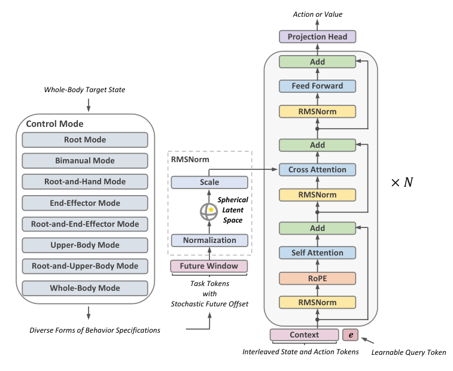

# ScaleBFM：用动作数据、训练并行度与模型容量共同扩展通用Tracker

人形行为基座经常只用动作库有多少小时来描述规模，但Tracker最终能否覆盖更多动作，还同时受在线强化学习采样量、网络容量、参考动作表示和控制接口影响。ScaleBFM把这几项放在同一套实验中扩展，并用目标掩码让一套策略接受全身、根节点加双手、末端或局部身体目标。它的核心仍是参考条件动作跟踪器，不是利用判别器学习动作分布的AMP策略。

> **主要方法图：** Figure 3，PDF第9页。图中展示历史状态与动作的时间Token、未来目标Token、交叉注意力、Transformer主干，以及Actor和Critic使用不同未来参考范围的训练结构。来源：[原论文](https://arxiv.org/abs/2607.15163)。

## 历史状态和未来参考先变成两组不同Token

每个控制周期，策略读取机器人最近一段时间的本体状态与已执行动作，并接收未来参考动作。历史状态说明身体刚才怎样运动、关节是否正偏离目标以及上一动作产生了什么结果；未来参考则说明接下来希望根节点、身体链接和末端到达哪里。两者不能简单拼成一个固定向量，因为历史长度、目标时间点和被启用的身体部位都会变化。

网络因此把历史状态与动作交错编码为时间Token，再把未来参考编码为目标Token。参考量在机器人朝向归一化的坐标系中表达，减少同一动作转向后被视为全新模式的问题。训练时随机遮蔽部分目标，使策略不能假定所有关节和链接都永远有完整参考。全身目标可以退化为根节点和双手目标、末端目标或其他局部约束，一套Tracker因而能够服务不同上层接口。

目标Token通过交叉注意力进入历史Token。这里的作用不是泛泛地“融合特征”，而是让每个身体状态选择与当前控制最相关的未来目标。例如双手目标被保留、腿部参考被遮蔽时，网络需要根据当前平衡状态决定怎样自行组织下肢，而不能照抄不存在的腿部轨迹。若直接把缺失目标补零并与状态平铺，零值可能同时表示真实目标和未提供目标，控制接口也难随任务变化。

随后，Transformer在整段状态、动作和目标Token之间建模。可学习查询从序列中提取当前控制所需的表示，RMSNorm和球面有界潜变量限制表征尺度，避免扩大模型与在线采样后隐藏状态幅值持续漂移。Actor读取较近的多个未来偏移，并在训练中随机加入更远目标；Critic可以看到更宽的未来范围和仿真特权状态。这样，Actor保持真机可获得的输入，Critic则利用更充分信息降低价值估计噪声。

## 策略输出仍要经过关节控制闭环

Actor最终输出Unitree G1的二十九维目标关节动作。目标经关节范围与动作缩放后交给低层PD控制器，PD根据目标角度与编码器反馈计算力矩。机器人执行后，IMU、关节位置、关节速度和上一动作进入下一周期，形成参考目标、Tracker、PD和机器人之间的闭环。策略以50 Hz更新，低层控制以200 Hz运行；上层可以每次提供完整动作，也可以只给部分身体目标。

训练使用PPO。动作跟踪奖励约束根节点、身体链接、关节和末端与参考的差异，能量、碰撞、关节范围和动作平滑等项限制不可执行行为。Critic、无噪声仿真状态和更远未来参考只在训练中使用；真机只保留目标编码、历史本体观测、Transformer Actor、TensorRT推理和关节接口。

论文把动作数据扩展到184,206段、约1.02亿帧，并分别扩大并行环境、网络规模和动作多样性。结果说明三者都影响最终跟踪，而“更多动作”不能替代足够的在线Rollout或模型容量。掩码控制实验还表明，一套策略可以在多种目标接口下工作，但这不等于对任意新任务都有规划能力：它仍需要上层给出可执行的身体或末端参考。

## 开放范围和分类边界

官方仓库将完整链路拆为ScaleRetarget、ScaleTrack和ScaleBridge。前者整理并重定向多源人体动作，第二部分在Isaac Lab训练掩码Humanoid Transformer并导出TensorRT，第三部分提供MuJoCo验证和G1底层接口。代码因此适合检查动作准备、训练、导出与部署怎样衔接。

仓库顶层未提供统一许可证，动作数据、机器人资产和内置依赖也可能适用各自条款，能运行不等于可以不受限制地再分发。论文的缩放结论来自G1与给定训练设置，不能直接推断到其他自由度、本体动力学和操作任务。

[项目页](https://scalebfm.github.io/) · [论文原文](https://arxiv.org/abs/2607.15163) · [官方代码](https://github.com/zengweishuai/ScaleBFM)
