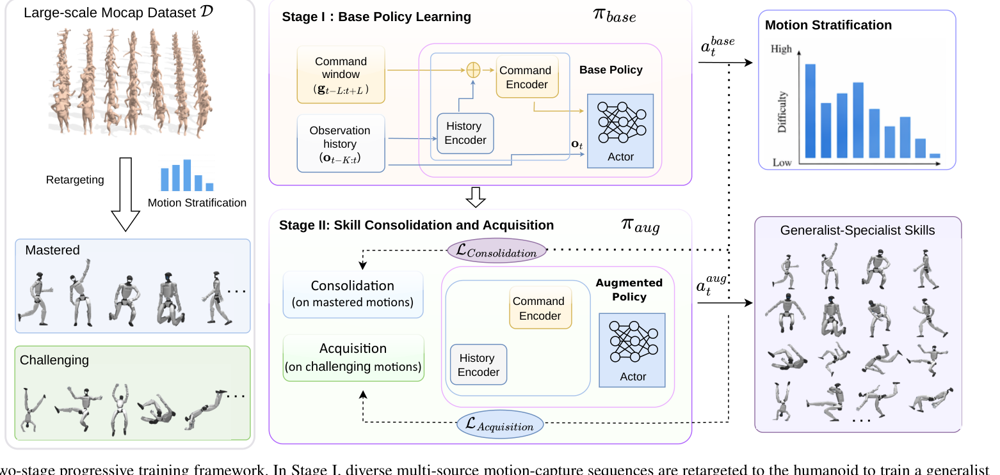

# Extreme-RGMT：持续增加高动态动作而不丢失已有Tracker能力

通用动作跟踪器继续加入空翻、快速转体和高冲击动作时会遇到两个冲突。新动作中真正困难的片段只占很少时间，普通PPO大多采到已经会的状态；若集中训练这些动作，原有行走、舞蹈和恢复能力又会退化。Extreme-RGMT用PACE负责新旧能力之间的训练分配，用STAR把更新集中到高难片段，目标是扩展同一Tracker，而不是为每个高动态技能保存独立策略。

> **主要方法图：** Figure 2，PDF第3页。图中从通用Tracker出发，将动作分为已掌握与挑战集合，再由PACE完成获取和巩固，并用STAR调整高难轨迹片段进入PPO更新的比例。来源：[原论文](https://arxiv.org/abs/2607.20110)。

## PACE把学习新动作和保持旧动作放在同一轮训练

系统先训练基础通用Tracker，再根据当前策略在动作库中的成功率，将动作划为已掌握集合和挑战集合。挑战动作进入Progressive Acquisition and Consolidation for Expansion，也就是PACE。获取阶段提高新动作和失败动作的采样权重，使策略真正接触高动态状态；巩固阶段继续混入已有动作，约束新参数不能只服务新增技能。

两部分权重根据有效样本比例调整。当挑战动作大多立即失败、几乎没有可用轨迹时，系统不能只靠增加采样次数解决，因为PPO仍得不到接近成功区域的状态；当新动作逐渐可执行后，获取权重下降，巩固权重上升，避免网络继续过拟合少量动态技能。这个机制回答的是动作集合怎样持续扩展，不是传统意义上的在线动力学适应。

Actor仍读取机器人本体状态、历史动作和未来参考。参考在根节点相对坐标中表达，减少全局位置与朝向变化带来的重复模式。策略输出目标关节动作，经PD控制器驱动G1；执行后的关节、IMU和身体状态进入下一周期。训练中的Critic可见更完整仿真状态，部署时只保留Actor和真机可用观测。

## STAR把更新从整段动作细化到失败片段

即使一个动作整体被标为困难，真正导致失败的可能只是落地前几帧或快速换支撑阶段。Segment-Aware Trajectory Advantage Resampling先根据跟踪误差和训练进度建立片段难度先验，再对不同难度组分别归一化优势。这样，高误差片段不会被大量普通步行样本的优势尺度淹没。

训练再将高难片段有控制地重新放回PPO小批次。论文设置中，难度最高约5%的片段占更新样本的25%。这不是简单复制失败轨迹，因为过度重采样会让策略忽略动作的进入和退出状态；STAR保留普通样本，同时让稀有关键帧获得足够梯度。缺少这一层时，训练可能表现为整段平均误差下降，但高动态动作仍在同一接触转换处反复失败。

奖励继续约束根节点、身体链接、关节和末端跟踪，并限制能耗、碰撞、关节范围和动作不连续。PACE改变“训练哪些动作”，STAR改变“动作中的哪些片段影响本轮更新”，两者处理的是不同粒度的问题。

## 证据覆盖持续扩展，但不等于无限学习

论文报告扩展后对旧动作保持、挑战动作成功率和高动态跟踪都有改善，并在Unitree G1上展示在线人体驱动。在线实机部分选取4类高动态动作、每类5次，完整方法合计成功率为85%；去掉STAR或使用固定采样权重时表现下降。这个实验支持片段重采样和自适应巩固的作用，但样本量很小，不能外推为任意动作连续加入都不会遗忘。

参考采用根节点相对表达也意味着系统更关心局部动作形状，长距离全局位置漂移仍需上层定位或额外约束。项目页没有公开训练代码、权重和动作数据，PACE与STAR的复现成本、超参数敏感性以及更长技能序列中的遗忘边界仍待核验。

[项目页](https://zeonsunlightyu.github.io/Extreme-RGMT.github.io/) · [论文原文](https://arxiv.org/abs/2607.20110)
