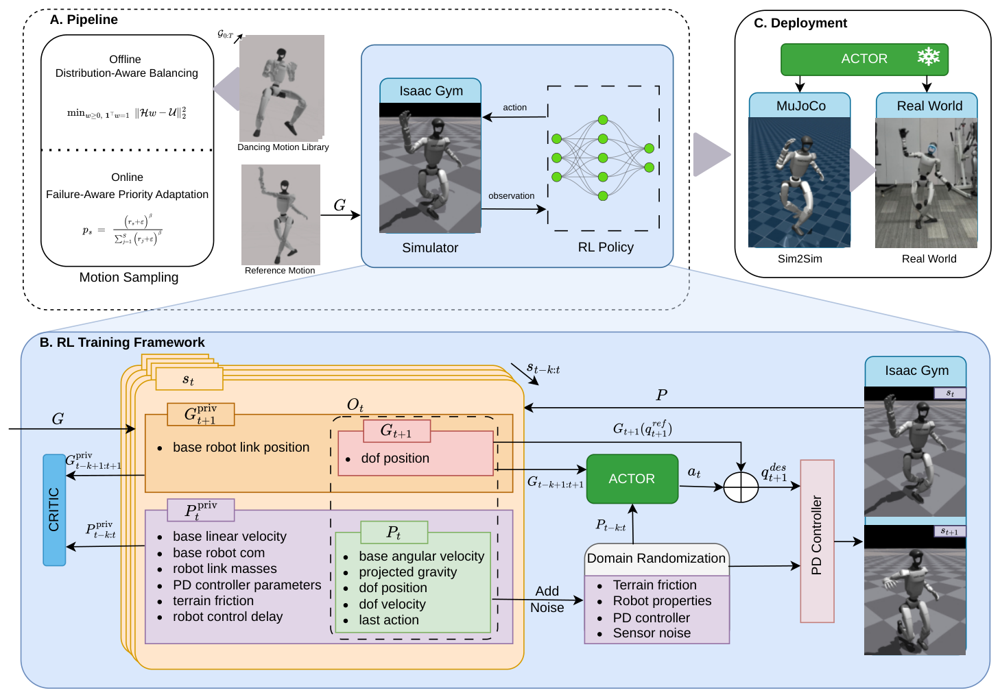

# RobotDancing：用选择性残差抑制长时舞蹈的累计跟踪误差

短动作跟踪中的小误差可能在几秒后自行消失，长舞蹈却会把重定向误差、执行器偏差和接触不一致持续积累，最终在某个转体或换支撑处失稳。若让强化学习重新生成所有关节动作，策略容易破坏已经较好的参考；若完全照搬参考，又没有空间修正本体差异。RobotDancing只开放少量关键关节学习残差，并把训练样本集中到动作分布边缘和实际失败片段。

> **主要方法图：** Figure 1，PDF第2页。图中展示人体舞蹈到机器人参考动作的重定向、残差强化学习策略、关节目标合成与多种人形平台执行。来源：[原论文](https://arxiv.org/abs/2509.20717)。

## 参考动作承担主体，残差只修正少数关键关节

人体舞蹈先重定向到Unitree G1、H1或H1-2，形成机器人关节参考和身体目标。每个控制周期，策略读取当前本体状态、参考动作和历史信息，预测参考关节目标上的修正量。最终目标等于参考动作加残差，再由PD控制器根据目标角度与编码器反馈计算力矩。

关键设计是残差并不覆盖所有关节。作者按本体选择少量容易影响平衡与动作表达的关节，例如G1使用索引`[0, 3, 6, 9]`对应的选择集，H1与H1-2采用各自的四关节集合。未开放关节继续遵循参考，开放关节负责吸收骨盆、腿部或平台动力学差异。这样减少了策略搜索维度，也降低网络为提高奖励而重写整段舞蹈的风险。

这项设计同时带来边界：关节集合是按平台人工指定的，不是由系统自动识别；如果误差来自手臂、脚踝或未开放关节，残差层无法直接补偿。论文因此证明的是“选择性残差对给定舞蹈与平台有效”，不是四个关节足以解决所有长时跟踪。

## 两种重采样分别处理分布不足和真实失败

长动作中普通帧数量远多于快速转体、低姿态和接触切换帧。Distribution-Aware Sampling提高动作分布稀疏区域的训练比例，避免网络只优化重复出现的中性姿态。Failure-Aware Sampling记录策略在哪些时间段跌倒或严重偏离参考，并在后续Rollout中更频繁从这些区域附近开始。

前者根据数据分布补足稀有动作，后者根据当前策略实际表现补足失败状态。两者若混成一个“困难采样”概念，就无法区分动作本身少见和策略尚未掌握。训练奖励约束身体、根节点、关节和末端跟踪，同时惩罚碰撞、能量、关节越界和不平滑动作；Critic可以读取仿真特权状态，最终Actor只使用本体与参考输入。

动作经PD作用于机器人后，新的IMU与编码器状态继续反馈给残差策略。闭环的目标不是逐帧播放动画，而是在实际偏差出现后调整后续关节目标。长时舞蹈因而成为检验累计误差和恢复能力的任务，而不只是展示动作外观。

## 跨平台证据与仍缺少的测量

论文在G1、H1和H1-2上展示长时舞蹈，并报告选择性残差与两类采样对跟踪和成功率的改善。跨平台结果说明方法可以在不同关节结构上重新选择残差集合，但每个平台仍需要自己的重定向、关节选择、PD参数和安全边界，不能直接共享同一个动作输出层。

实机结果主要依据跟踪和完成情况。论文没有同步公开关节力矩、足底接触、滑移与热状态日志，因此无法判断某个看起来稳定的长动作是否以更高峰值力矩或执行器负荷换取。官方也未开放代码、权重和舞蹈数据，失败重采样实现与平台适配成本仍待复核。

[论文原文](https://arxiv.org/abs/2509.20717)
