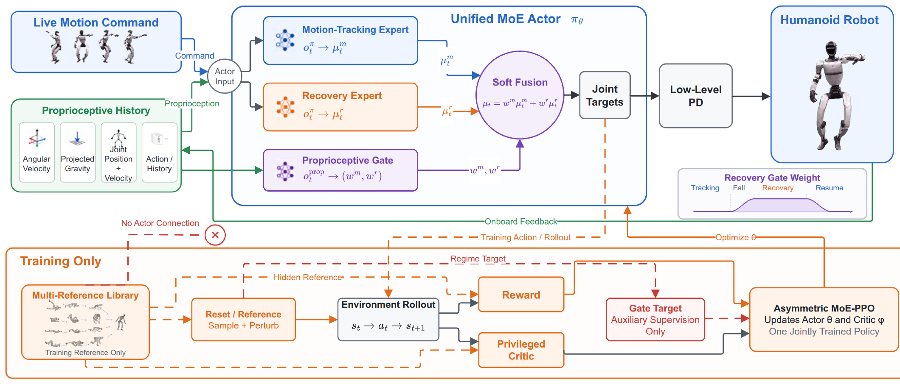

# StableMimic：在同一Actor中连接动作跟踪、跌倒恢复与命令重接

普通Tracker只在参考动作附近训练。机器人被推倒后，身体姿态、接触组合和视角都离开训练分布，此时继续追逐仍向前推进的参考会产生剧烈关节目标；单独调用固定起身策略又需要跌倒检测、状态机和切换时刻。StableMimic把跟踪专家、恢复专家和软门控放进同一个Actor，使策略先从异常接触中有序起身，再重新接回没有暂停的动作命令。

> **主要方法图：** Figure 2，PDF第3页。图中展示两个专家共享实时动作命令与本体输入，恢复参考和训练标签如何塑造恢复分支，以及门控怎样混合两组动作输出。来源：[原论文](https://arxiv.org/abs/2608.02385)。

## 两个专家面对同一条持续推进的动作命令

每个控制周期，Actor读取当前及历史本体观测，包括机体姿态、角速度、关节位置、关节速度和上一动作，同时接收当前时刻的参考动作。参考时间不会因为跌倒而暂停：机器人恢复完成后，目标可能已经推进到动作的后续阶段。跟踪专家学习正常分布内的参考执行，恢复专家则学习跌倒后怎样重建支撑、站起并靠近当前命令状态。

若恢复策略只追逐一条固定起身动画，它可能站起来却无法进入正在进行的动作。论文因此为恢复专家引入后继状态目标：恢复动作不仅要减少当前姿态误差，还要把机器人带到未来能够继续跟踪的状态区域。训练中的结构化恢复参考规定四肢和身体应怎样有序接触地面，避免仅以“最终站立”奖励产生翻滚、抽动或危险支撑。

跟踪专家与恢复专家各自产生一组关节目标，门控网络根据本体历史输出连续权重，再对两组动作软混合。门控读取身体是否失去支撑、当前姿态与速度怎样变化，而不是依赖人工设定的倾角阈值。软权重使控制从跟踪逐渐转向恢复，再逐渐返回跟踪，减少两个独立策略硬切换时的关节目标跳变。

混合后的目标交给PD控制器，由PD误差产生电机力矩。机器人执行后，IMU、编码器和上一动作回到Actor，形成动作命令、双专家、门控、PD和机器人之间的闭环。策略以50 Hz运行，恢复过程中不需要上层暂停或重新定位参考时钟。

## 起身参考、门控标签和Critic只服务训练

训练时，仿真器随机施加推力并生成不同倒地状态。结构化起身参考用于塑造恢复专家，门控监督标签告诉网络哪些状态更应依赖恢复分支，Critic还可读取无噪声姿态、接触和其他特权状态。跟踪奖励约束正常动作，恢复奖励约束接触顺序、身体高度、姿态、平滑和重新接近命令；PPO根据两类Rollout共同更新同一个Actor。

部署到G1后，起身参考、恢复命令、门控标签、Critic和仿真真实接触全部删除。真机只保留持续动作命令、本体历史、双专家Actor、门控和PD接口。这个区别很关键：论文不是要求实机提前知道“标准起身轨迹”，而是把参考用于训练恢复分支，最终由本体反馈决定如何恢复。

## 恢复证据有明确协议边界

在论文给定的仿真推倒协议中，完整方法100次均完成恢复，并比硬切换或无结构恢复基线得到更平滑的关节与接触行为。真机视频展示G1被推倒后起身并重新接入动作。结果支持双专家和软门控处理分布外跌倒，但不等于任意高度、碰撞方向、地面材质或机械损伤后都能恢复。

恢复专家仍依赖训练中覆盖的倒地状态和接触条件；若机器人被物体卡住、关节过热或传感器失效，策略没有故障诊断能力。官方未开放代码和权重，恢复参考生成、门控标注和真机安全限制的复现细节仍待核验。

[论文原文](https://arxiv.org/abs/2608.02385)
