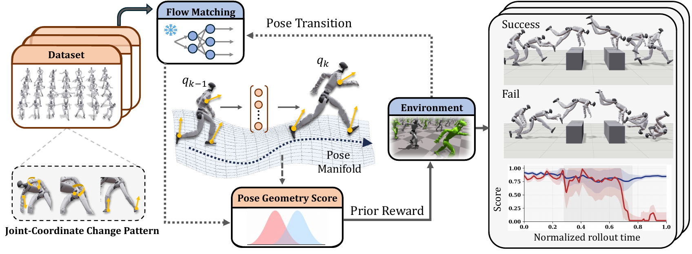

# PFM-HR：用无序姿态流先验塑造Tracker的强化学习奖励

动作先验通常依赖连续MoCap片段，数据必须有可靠时间顺序、速度和接触标注；生成模型若直接替代控制器，还要承担动力学稳定与实时推理。PFM-HR只用大量无序人体姿态预训练流匹配模型，再从冻结模型中计算局部姿态几何分数，用它调整Tracker的强化学习奖励。先验负责告诉策略当前姿态是否位于人体动作分布附近，关节控制仍由原有Tracker完成。

> **主要方法图：** Figure 1，PDF第2页。图中左侧是无序姿态上的流匹配预训练，右侧是冻结先验产生姿态几何分数并调制强化学习跟踪奖励的训练链。来源：[原论文](https://arxiv.org/abs/2608.03227)。

## 流匹配模型只学习姿态分布，不直接生成电机动作

预训练数据约包含六千万个无序姿态。每个姿态经过统一骨架与坐标处理后，与噪声状态之间建立连续流；网络学习在不同噪声时刻把样本推回真实人体姿态分布的速度方向。因为训练单位是单帧姿态，它不要求每条数据都有连续时间戳，也不需要由目标机器人执行过。

冻结后的去噪网络给出某个机器人姿态附近指向数据流形的局部方向。作者进一步利用网络对姿态的局部变化构造Pose Geometric Score。这个分数不是简单计算当前姿态离某一帧参考有多远，而是判断姿态在预训练分布的局部几何中是否合理，并相对于当前参考区域进行校准。这样，参考重定向存在小误差时，策略仍可选择附近更可执行的姿态，而不是被逐关节欧氏距离锁死。

若直接把流匹配模型当动作生成器，输出还要满足目标本体关节、接触和实时反馈；PFM-HR没有走这条路线。姿态分数只在PPO训练时调制跟踪奖励，使偏离人体姿态流形的动作受到更强惩罚，位于合理姿态邻域的修正获得更大空间。任务跟踪、平衡、能耗和关节约束仍由原奖励负责。

## Tracker控制链在部署时保持不变

每个控制周期，Tracker Actor读取参考动作、本体状态和历史观测，输出目标关节位置。PD控制器根据目标与编码器反馈计算力矩，机器人执行后的IMU和关节状态再进入下一周期。Critic在训练时可读取仿真特权状态，流匹配先验根据当前姿态计算额外奖励，PPO再更新Actor。

部署时，冻结的流匹配模型、Pose Geometric Score、Critic和仿真特权信息全部退出。真机只运行原Tracker Actor、参考输入、本体观测与PD控制链，因此方法不会增加在线生成延迟，也不要求机载设备运行大型姿态模型。它属于Tracker训练机制，而不是动作数据入口或在线动作生成器。

## 证据说明姿态先验有效，但不等于接触先验

论文比较常规跟踪奖励、其他姿态约束和PFM-HR，在未见动作、扰动和G1真机执行中报告更好的跟踪与稳定表现。结果支持无序姿态数据可以为强化学习提供有用的局部几何约束，也说明先验不一定要依赖完整动作序列。

但单帧姿态本身不包含脚何时接触地面、质心动量怎样变化或相邻帧是否动力学连续。接触、速度与力学仍由参考、仿真奖励和Tracker Rollout学习。若训练动作涉及新的接触拓扑或高速腾空，仅靠姿态分数不能保证物理可行。官方未开放代码、姿态数据处理和预训练权重，六千万姿态的组成、许可与复现成本需要进一步核验。

[项目页](https://gaoyukang33.github.io/PFM-HR.web/) · [论文原文](https://arxiv.org/abs/2608.03227)
