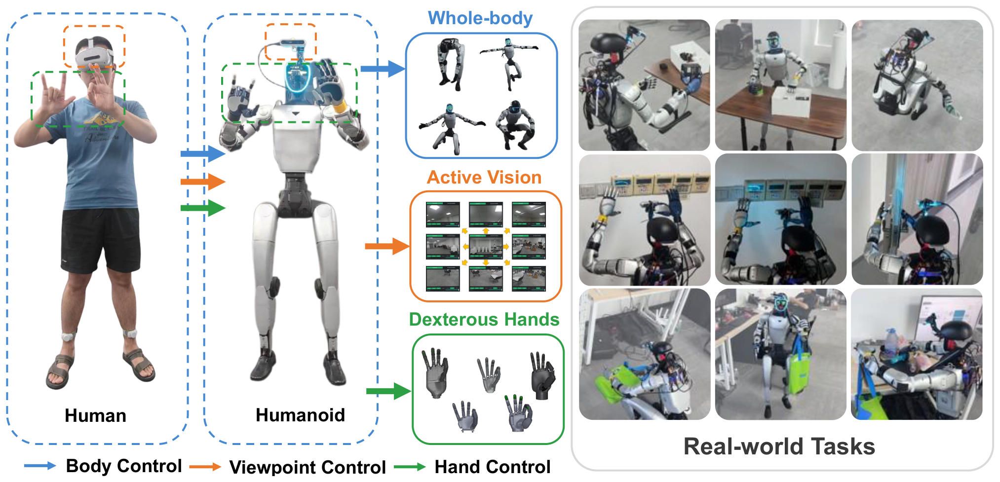

# Teleopit：把人体、灵巧手和主动视觉接入同一遥操作与训练数据闭环

人形遥操作常把身体跟踪、手指映射和相机视角做成三套接口，采集的数据也难直接变成自主策略动作。Teleopit用PICO设备获取人体骨架、手部和头部输入，分别驱动G1全身、灵巧手与两自由度主动视觉云台，并把同步观测和动作记录转换为ACT与GR00T N1.7训练数据。它的重点不只是实时跟随，而是遥操作结果能否继续进入模仿学习和VLA。

> **主要方法图：** Figure 1，PDF第1页。图中展示操作者身体、双手与头部输入，G1身体和灵巧手执行、主动视觉反馈，以及遥操作数据进入ACT和GR00T训练的完整链路。来源：[原论文](https://arxiv.org/abs/2608.01834)。

## 三类人体输入经过不同映射后在机器人端汇合

PICO以约60 Hz提供人体骨架、双手与头部状态。身体骨架先转换为机器人参考姿态，再交给全身Tracker。Actor读取当前及最近10帧本体观测和未来参考，输出G1二十九维目标关节动作。历史用于判断身体运动趋势、接触阶段和通信延迟；Critic在训练中可读取仿真特权状态，真机Actor不依赖这些信息。

手部输入不能直接复制到灵巧手，因为人手与机器人手指自由度、关节范围和耦合不同。系统对检测到的手部关键点求解受关节限位约束的映射，再生成灵巧手目标。头部朝向则转换为两自由度云台目标，使操作者改变视线时机器人相机同步转动。三条链最终在同一时间轴上汇合，身体平衡、手指操作和第一视角不会成为互不对齐的记录。

全身Actor以50 Hz输出身体关节目标，低层控制以200 Hz执行；目标经PD产生力矩，新的IMU和编码器状态回到Tracker。系统加入Failure-Aware Rewind：遥操作失稳时不必整段重来，而是回到失败前的安全状态继续采集。这个机制降低数据废弃量，但恢复点如何选取、是否适合所有接触任务仍取决于实际系统状态。

## 记录动作必须与相机和机器人状态同步

采集以30 Hz保存相机观测、机器人状态、身体关节目标、手部动作和主动视觉状态，并形成回合边界和任务结果。论文将自主策略动作统一为52维全本体参考，包含平面身体目标以及身体、双手与颈部相关命令，再由同一Tracker和手部接口执行。ACT或GR00T不是直接替代低层平衡控制，而是从图像和任务条件预测这组上层参考。

因此自主执行链是：视觉和任务输入进入ACT或GR00T，模型输出52维全本体参考，Tracker将身体参考变成G1关节目标，手部与云台接口执行其余部分，机器人反馈再形成下一时刻图像和状态。训练时可使用完整示范、成功标签和离线数据；部署时不再需要PICO操作者，但仍保留已训练任务策略、全身Tracker、手部映射、主动视觉控制和机器人低层接口。

## 小规模任务结果证明链路可用，不代表通用操作

论文记录96条成功示范，并在指定任务中报告ACT成功18/20、GR00T N1.7成功19/20。这个结果说明全身遥操作数据可以进入两类自主策略，而不只是回放人体动画；主动视觉和灵巧手动作也进入了同一数据格式。

样本量和任务集合仍很小，成功次数不能外推到开放场景或长时任务。PICO骨架精度、手指遮挡、网络延迟和机器人自碰撞都会影响数据质量；系统也没有证明不同本体之间可以直接复用52维动作。官方未开放代码、数据和硬件接口，时间同步、手部优化与安全回退的具体复现边界仍待核验。

[项目页](https://botrunner64.github.io/teleopit-page/) · [论文原文](https://arxiv.org/abs/2608.01834)
