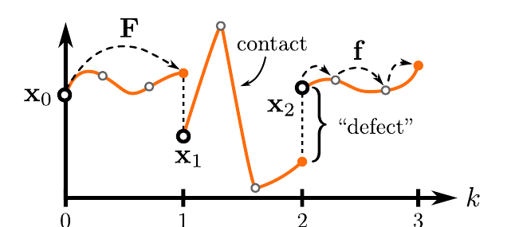

# Shooting for Contact：用可微接触多重打靶生成动力学可行参考

几何动作重定向能让目标机器人的关节和末端接近人体姿态，却不能保证爬行、翻转或跳跃中的接触时刻、冲量和腾空轨迹可执行。传统轨迹优化若预先指定接触序列，又会把错误的手脚落点写死。Shooting for Contact提出Differentiable Simulation Multiple Shooting，也就是DSMS，在目标本体的可微接触仿真中同时优化分段状态和控制，使接触由动力学自然出现，再用得到的轨迹训练真机Tracker。

> **主要方法图：** Figure 2，PDF第3页。图中展示粗粒度打靶节点、节点间可微刚体接触仿真、连续性缺陷约束和优化后的机器人参考怎样进入强化学习控制。来源：[原论文](https://arxiv.org/abs/2608.03116)。

## 多重打靶把长接触轨迹拆成可优化短段

输入是几何重定向后的机器人动作和目标本体模型。长轨迹先划分为多个粗节点，每个节点保存机器人状态和待优化控制；相邻节点之间再用更细仿真步推进刚体动力学与接触。若前一段末状态与后一节点初状态不一致，就形成连续性缺陷，优化器同时减小缺陷、参考偏差、控制代价和物理约束违反。

单次射击从起点把整段轨迹推到终点，早期控制的微小变化会穿过多次接触并放大，梯度容易不稳定。多重打靶允许各短段先局部接近参考，再用缺陷约束把它们接起来，因而更适合爬行、跳转等长接触序列。这里的“接触隐式”表示优化器不预先输入脚或手何时接触，也不建立固定接触模式；碰撞、摩擦和冲量由仿真器在每个细步中计算。

优化输出不是直接发送给电机的在线命令，而是一条满足目标机器人动力学、关节范围和接触响应的参考轨迹。它修正几何重定向中的穿透、错误腾空和不可实现加速度，为后续强化学习提供比原始动画更可靠的跟踪目标。

## 强化学习把离线参考变成可反馈的真机控制器

下游Actor读取重力投影、机体角速度、关节位置、关节速度、上一动作、任务命令和动作相位，输出相对默认姿态或参考中心的关节目标偏移。PD控制器根据目标和编码器反馈产生力矩，机器人执行后的本体观测进入下一周期。策略以50 Hz运行，仿真与低层控制以200 Hz推进。

Critic在训练时额外读取真实机体线速度、完整仿真状态和参考信息，帮助PPO判断当前偏差是否还能恢复。跟踪奖励约束身体、关节和末端接近DSMS轨迹，稳定、能量、碰撞与关节限制项保证策略不以危险动作换取几何误差。部署时删除Critic、可微仿真器、打靶节点和完整参考轨迹在线输入，只保留本体观测、任务命令、相位、Actor和PD控制器。

这一区别说明DSMS替代的是训练数据准备中的动力学轨迹生成，不是实时全身控制器。离线优化负责给出物理上更可信的动作，强化学习负责在噪声、模型误差和扰动下反馈跟踪。

## 动态接触证据与优化边界

论文在仿真四足和Unitree G1上覆盖动态动作，并展示G1零样本真机爬行与180度跳转。结果支持接触隐式多重打靶能把几何参考转成可用于强化学习的目标，也补足了传统重定向只检查姿态外观的缺口。

方法仍依赖可微仿真中的本体参数、摩擦与接触模型。若模型和真机差异过大，离线轨迹“在仿真可行”不等于硬件安全；优化时间、初值敏感性和更长复杂动作的收敛成本也需要评估。官方未开放代码和优化配置，论文展示的动作集合不能外推为任意接触序列都能自动求解。

[项目页](https://shooting-for-contact.github.io/) · [论文原文](https://arxiv.org/abs/2608.03116)
