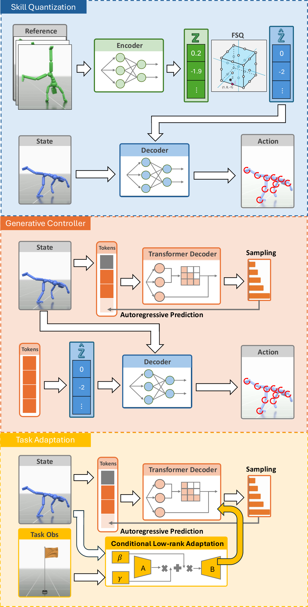

# GPC：以离散运动Token预训练可适配的生成式控制器

大规模动作跟踪器可以执行数十万条参考，但每个控制周期仍要有人告诉它未来姿态；连续技能潜空间虽然允许高层策略调用动作，却容易在未覆盖区域漂移或退化成少数模式。GPC把问题改写为运动Token预训练：先用物理跟踪学出能够被身体执行的离散技能词表，再让Transformer学习这些Token在当前身体状态下的分布，最后只增加少量任务参数，把同一运动先验接入目标、摇杆、轨迹和地形任务。

> **主要方法图：** Figure 3，PDF第4页。上层是参考动作到FSQ离散技能和低层动作的量化训练，中层是根据身体状态自回归预测技能Token的生成式控制器，下层是用任务观测调制冻结先验的CoLA适配器。来源：[原论文](https://arxiv.org/abs/2606.29148)。

## FSQ先把动作参考压成能够执行的技能Token

第一阶段仍是物理动作跟踪。每个仿真周期，策略读取角色当前本体状态，以及参考动作未来第1、2、5、7、12、18和25帧。当前状态包含根节点相对关节位置、相对地面的根高度、关节六维旋转表示以及线速度和角速度，全部转换到根节点朝向对齐的局部坐标，避免全局位置和朝向重复占用表示能力。

参考窗口先进入Encoder，得到连续潜变量；Finite Scalar Quantization对每个潜变量通道独立限幅、取整，把它变成固定等级的离散值。与VQ-VAE不同，FSQ没有需要学习和维护的显式码本，也不需要码本损失、承诺损失和失效码重置。量化不可导的位置使用直通估计器传递梯度，使Encoder、量化表示和动作Decoder能够跟随PPO的物理跟踪回报一起训练。

Decoder接收当前身体状态和离散技能表示，输出各关节的目标旋转；PD控制器根据目标与仿真关节反馈计算力矩，物理引擎推进到下一状态，下一状态与参考动作的偏差再形成跟踪奖励。这样学到的Token不只是对运动学姿态的压缩，而是在接触、惯性和PD执行闭环中验证过的控制条件。训练所需的参考未来帧、跟踪误差和PPO价值估计不会全部保留到后续无条件生成阶段。

当前公开SOMA配置使用23个刚体和66个驱动自由度。ProtoMotions模型卡记录了40个FSQ标量通道，每5个一组形成8个Token，每个分组Token有59049种可能值。分组减少了Transformer一次控制决策需要生成的序列长度，但词表变大，过度分组也会在动作多样性、跟踪精度与推理成本之间形成新的权衡。

## Transformer学习身体状态下的技能分布

第二阶段冻结FSQ跟踪器。动作库中的参考片段经过Encoder产生Token标签，跟踪器rollout同时提供角色实际到达的身体状态。GPT式Transformer Decoder读取当前状态，再以因果注意力逐个预测同一控制周期内的分组Token；训练时使用Teacher Forcing，把真实前序Token送回网络，并以交叉熵训练下一Token分布。

Transformer解决的不是把图像和本体特征做一次融合，而是建模“身体处于当前姿态和速度时，哪些离散技能组合仍属于动作数据支持的区域”。FSQ Decoder已经知道每组Token怎样变成低层动作，Transformer只需要学习技能组合的概率结构。若直接从整个离散空间均匀采样，很容易选到动作库未支持的组合；若始终取最大概率，又会压缩行为多样性。因此推理使用nucleus top-p采样，只在累计概率较高的Token集合中采样，排除低概率离群值，同时保留多种可能动作。

完整控制闭环是：当前身体状态进入Transformer，网络连续生成8个Token；冻结的FSQ Decoder把Token与当前状态转换成66维关节目标；PD控制器产生力矩并驱动物理角色；新的关节、根节点和速度状态再进入下一周期。此时参考动作Encoder已经退出，策略不再追逐一条逐帧轨迹，因此论文的最终产物属于生成式行为先验，而不是普通Mimic Tracker，也不是预测环境未来状态的世界模型。

## CoLA用少量参数把冻结先验接入任务

无条件先验只知道当前身体接下来可以怎样运动，不知道要去哪里。第三阶段把目标位置、摇杆方向、期望轨迹或场景条件写成任务观测，再由Conditional Low-rank Adaptation生成低秩空间中的缩放与偏置，调制冻结Transformer的权重更新。原始先验和FSQ Decoder保持冻结，每个任务增加的参数不到主模型的1%，从而避免为新目标重新训练整套运动词表。

只有任务奖励时，RLFT使用PPO更新CoLA，并让无条件先验提供top-p可选Token范围，减少任务探索跳到低概率怪异动作。若存在希望复用的示例动作，SFT先用交叉熵提高相应Token在任务条件下的概率，让探索从蹲走、翻滚等指定技能附近开始；随后RLFT再根据到达、沿轨迹运动或越障奖励调整技能组合。SFT训练需要示例参考和目标Token，RLFT训练需要任务奖励与PPO价值估计；推理只保留身体状态、任务观测、冻结Transformer、CoLA、FSQ Decoder和PD执行闭环。

论文主要验证目标到达、摇杆控制、轨迹跟随、障碍与平台等Locomotion型任务。CoLA能够重新组合预训练技能，但任务成功仍依赖奖励或示例定义，不能据此推断模型已经理解语言、物体状态或长程任务，也没有证据支持它直接承担真实机器人的导航与操作规划。

## 99.98%证明的是仿真跟踪覆盖而不是G1实机

Bones实验集约含343000条动作、总时长超过680小时，角色是1.85米高的SOMA仿真人体。论文把一段轨迹所有帧的平均关节位置误差低于0.5米定义为跟踪成功；在这一判据下，FSQ和无量化MLP都达到99.98%，VQ-VAE为99.94%。FSQ在Bones上的MPJPE是34.90毫米，仍高于MLP的25.56毫米，但优于VQ-VAE的37.92毫米。

这组结果说明FSQ在大动作库上没有出现严重码本退化，并提供了适合下一Token建模的离散接口；它没有证明量化后的跟踪精度超过普通连续策略。AMASS约11300条动作、40小时的消融也显示MLP跟踪更紧，GPC的收益应从离散技能结构、生成多样性和下游适配评估，而不能只引用99.98%作为控制精度结论。

GPC论文没有真实机器人实验。ProtoMotions 3仓库另有一条Unitree G1教程：BONES-SEED中已经重定向到G1的动作被用于训练参考Tracker，Actor输出29维PD目标，再导出ONNX进入MuJoCo和RoboJuDo实机接口。那条链路证明框架能够支持G1 Tracker部署，不等于当前SOMA GPC先验已迁移到G1。公开模型卡还明确限定GPC检查点面向训练仿真器，跨仿真器、跨关节拓扑和真实硬件都需要重新验证。

## 可复用价值与尚未解决的边界

GPC值得运动控制开发者关注的不是把Transformer加到Tracker后面，而是把“参考跟踪得到可执行Token、生成模型学习Token分布、任务适配只改变调用方式”拆成三个可独立检查的阶段。开发新行为基座时，可以分别测量量化是否损失跟踪精度、先验是否覆盖多种恢复动作、适配器是否真的复用旧技能，而不是把全部收益归给模型规模。

现有证据仍局限于仿真角色和以移动为主的任务。论文未解决人形机器人执行器带宽、状态估计误差、延迟、热约束和安全层，也未覆盖视觉物体交互、力触觉或语言任务。top-p采样保留多样性的同时会引入动作随机性，真实机器人部署还需要动作限幅、确定性回退、失效检测和经过本体验证的安全控制器。Bones、AMASS及机器人资产也有各自许可，ProtoMotions代码的Apache-2.0不能替代数据授权。

[官方项目页](https://yi-shi94.github.io/gpc-page/) · [论文原文](https://arxiv.org/abs/2606.29148) · [ProtoMotions实现](https://github.com/NVlabs/ProtoMotions) · [GPC代码说明](https://nvlabs.github.io/ProtoMotions/user_guide/gpc.html) · [G1独立部署教程](https://nvlabs.github.io/ProtoMotions/tutorials/workflows/g1_deployment.html)
