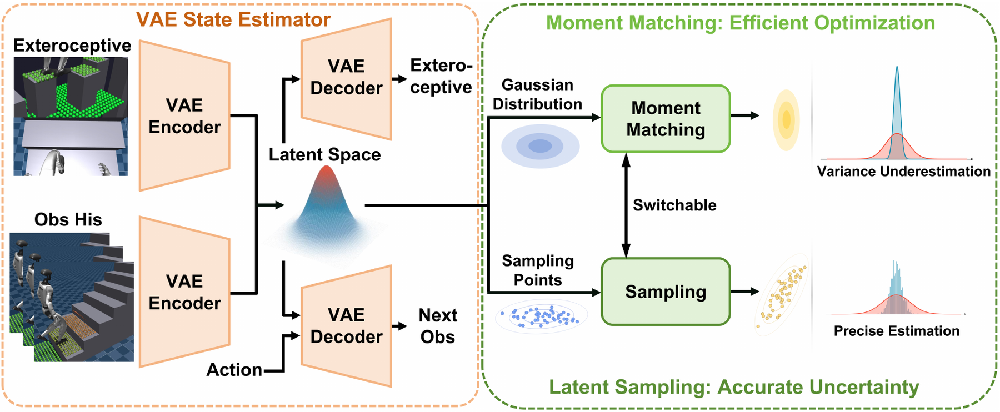

# P³：把边缘策略概率接回VAE与PPO之间

PPO更新前会冻结旧策略，网络参数没有变化时，同一动作的新旧概率比理应恒等于1。给策略加上随机VAE状态估计器后，这个自检会失效：rollout时旧策略按一个潜变量样本记录动作概率，更新时新策略又抽到另一个样本，即使两份参数逐位相同，ratio也会偏离1并越过裁剪区间。问题不在VAE结构，也不在PPO目标，而在于二者之间缺了一段概率接口——机器人真正执行的策略是把全部潜变量积分后的边缘策略π(a|o)=∫pψ(a|z)qφ(z|o)dz，单样本实现却拿某个条件分布代替它。P³保留原来的VAE、actor和critic，只替换动作似然的计算方式，让ratio的分子分母恢复同一种概率定义。

> **主要方法图：** Figure 2，PDF第4页。左侧是VAE状态估计器，右侧是共享同一actor的两种边缘策略估计：矩匹配提供低噪声优化，蒙特卡洛潜变量采样更完整地向actor暴露潜变量不确定性；二者不改动网络结构与参数即可互换。来源：[原论文](https://arxiv.org/abs/2607.25541)。

## 单样本潜变量怎样污染概率比

单个潜变量样本诱导的条件动作分布通常比边缘混合分布更窄，会把并不罕见的动作算成低概率动作，连带改写ratio、KL与裁剪范围；KL被估高后，自适应学习率还会进一步收小步长。论文把边缘策略的KL上界拆成编码器新旧潜分布变化与actor在整个旧潜分布上的条件策略变化两部分，VAE自身的KL正则只能压住前者。噪声分析给出一致的缩放关系：潜变量采样越少、动作维度越高、潜方差越大、actor对潜变量越敏感，额外噪声越强；训练后期探索标准差下降时，该项噪声按其负四次方放大，高维动作配置里后半程的波动未必只来自奖励。

## 同一套网络上的两种边缘估计器

矩匹配（MM）不做随机抽样：线性层中均值照常前向，方差在对角协方差近似下按权重平方传播，ELU激活使用解析的一阶、二阶矩公式，附录另给出ReLU与LeakyReLU版本。传播到动作端后叠加PPO自身的探索方差，得到近似边缘动作高斯。同一观测与参数每次得到同一似然，恰好切掉ratio漂移的采样来源；代价是不保留动作维度间协方差，可能把分布估窄。蒙特卡洛（MC）从qφ(z|o)抽N个样本分别经过actor并平均似然，随N增大一致收敛到边缘策略，非线性形状与相关结构得以保留，但计算量与激活内存按O(N)增长。无论选哪种，old policy与current policy必须使用同一估计器，否则分子分母又不是同一个概率。

## MM先训稳，LSFT补回分布宽度

P³不在两种估计器之间二选一：前7000个epoch用MM消除随机波动，策略进入平台后沿用同一checkpoint切换到N=15的MC再训1000个epoch，这段Latent Sample Fine-Tuning简称LSFT。作者的对照显示，MM训练后的checkpoint动作均值准确但分布明显偏窄；LSFT之后，MM传播分布与直接采样分布重合更多。MC不必从随机初始化承担整段训练，只在最后补回MM忽略的方差与相关结构。

## 从概率诊断到G1复杂地形

三组实验分别检查接口、训练与部署。相同策略诊断中，单样本VAE、MC50、MM留在PPO裁剪区间内的样本比例分别为64.6%、96.5%、100%。Isaac环境并行4096个G1、50 Hz、覆盖踏脚石、楼梯和沟槽的地形课程里，P³约8000 epoch达到停止条件，MC50约10000 epoch，单样本VAE与MC5到15000 epoch仍未过线；checkpoint转到MuJoCo后排序不变。29自由度G1真机由Livox Mid-360与FAST-LIO提供高程图，三类地形各10次测试中P³合计27/30，P³-MM为23/30，MC50为24/30，单样本VAE为20/30。

方法边界同样明确：贡献针对随机VAE、PPO-clip与连续高斯actor的组合；MM依赖对角协方差、高斯形状与局部线性近似，论文附录用Shapiro-Wilk检验与线性拟合给出本网络区间的支持，不能外推为任意actor成立；未验证离散动作与强多峰策略。真机只覆盖G1三类地形各10次，未报告置信区间与多种子真机拆分；“stable”指训练与概率估计稳定，不是形式化安全保证。官方仓库公开可读，但未声明许可证、未发布权重，README通用配置与论文7000+1000 epoch停止点不一致，复现需以论文口径为准。

[论文原文](https://arxiv.org/abs/2607.25541) · [代码](https://github.com/ylyem9x/P3_Open)
