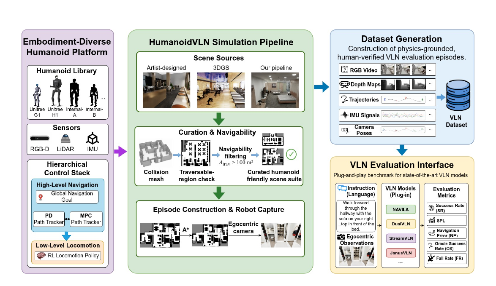

# HumanoidVLN：把人形身体放回视觉语言导航评测

经典视觉语言导航基准把移动抽象成固定步长的离散瞬移：模型输出“前进”，智能体就精确移动固定距离，不需要保持重心，也不会因急转弯摔倒。这种设置适合考察路线理解，却回答不了双足人形能否把路线真正走出来——同一个导航模型换一具身体，相机高度、可通过空间、步态稳定性和高层命令的执行误差全部改变。HumanoidVLN在NVIDIA Isaac Sim上搭建物理落地的仿真平台、场景数据集与评测基准，把过去被抽象掉的身体问题重新放回导航评测。

> **主要方法图：** Figure 1，PDF第1页。图中展示从多种人形本体与分层控制，到场景筛选、episode构建、多模态数据生成和即插即用VLN评测的完整基准链路。来源：[原论文](https://arxiv.org/abs/2608.12860)。

## 导航模型不直接控制关节

执行链是显式分层的：VLN模型读取语言指令与头部相机画面，输出离散动作或连续速度命令；PD或MPC路径跟踪器把高层命令转成速度与朝向参考；每种本体专属的强化学习行走策略再输出关节力矩、生成步态并维持平衡。它不是从语言和图像直接输出全部关节动作的端到端VLA，而是把导航推理与双足控制在物理仿真中真正连接起来。因此基准实际评测的组合是“VLN模型×动作空间×路径跟踪器×行走策略×机器人身体”，接入新模型或新身体都可以观察二者如何相互影响。目前支持四具本体：Unitree G1（下肢12自由度、身高1.32米、相机1.25米）、Unitree H1（10、1.80米、1.72米）与两款未公开细节的内部机器人（1.61米与1.17米）；身高从1.17米跨到1.80米，直接改变视角遮挡、可通过空间、步长与转弯半径。

## 可通行场景与真走一遍的数据

场景筛选以碰撞网格验证的可通行面积超过100平方米为门槛，最终收录87个室内场景、17种场景类型、6个应用领域，可通行面积中位数266平方米。场景来源分艺术家制作与3DGS真实重建两类；后者在gsplat管线中加入无偏深度渲染与深度—法线一致性约束，再经TSDF融合提取碰撞网格，3DGS负责视觉外观、碰撞网格负责物理交互，但这一部分目前只有表面法线的定性对比，还没有几何误差或穿模率指标。数据生成不是沿参考线渲染平滑视频：先按体积最大的本体膨胀占据地图、用A*采样路线，再让机器人经完整控制栈实际执行，无法稳定完成的路线被丢弃重采。最终933条episode记录第一视角RGB、深度、IMU、相机位姿与真实步态晃动下的轨迹，路径长度中位数约9.97米，指令长度中位数约50个英文单词。指令标注采用多智能体流程：两个不同家族的生成器各自把路线写成结构化动作序列，矛盾交给可查阅真实轨迹、A*路线与空间语义场景图的Reviewer裁决，再改写为Formal、Natural、Casual三种风格并回验关键导航属性，最后全部经人工审核、随机20%双人复核。

## 跨本体结果：跌倒率把身体差异摆上台面

NaVILA、StreamVLN、DualVLN、JanusVLN四个公开checkpoint以zero-shot方式测试，成功标准为停在距目标3米以内，并在传统指标外专门统计跌倒率。四本体平均下JanusVLN以43.55%成功率与48.38 nDTW领先，作者认为可能与其显式3D空间理解有关，但未做控制变量消融；即使最佳模型平均成功率也不到一半。NaVILA的Oracle Success与最终成功率差距最大，“到过目标附近却没停下”本身就是关键瓶颈。更尖锐的结果在本体维度：H1上四个模型的平均成功率只有20.84%，其余三本体约32%—37%；H1的跌倒率在NaVILA下高达70.95%、StreamVLN为64.52%，而其余本体多数只有2.7%—10.0%。DualVLN平均跌倒率最低，但它的连续速度输出与MPC跟踪器、模型结构同时与其他模型不同，不能据此断定连续动作必然比离散动作稳定——更准确的结论是，人形导航的最终性能由模型、动作接口、控制器、低层步态和身体共同决定。作者另用G1与DualVLN在两个真实房间做了20对仿真—现实episode的先导验证：导航误差Pearson相关0.935、Spearman相关0.911、终点误差平均绝对差0.68米、配对轨迹平均相似度约0.782 nDTW，说明该基准至少在这两个环境保留了一部分真实难度结构。

## 边界

本体效应未被完全隔离：四种机器人配不同RL行走策略，不同模型还绑定不同跟踪器，H1的差距来自身体结构、相机高度、步态策略还是控制参数，现有结果无法严格区分。3DGS重建几何质量只有定性展示；933条episode全部用作zero-shot评测集，没有训练、验证、测试划分，适合比较已有模型而非训练新模型；sim-to-real只有一款机器人、一个模型、两个房间、20条路线。论文写明代码、数据与benchmark计划在接收后发布，当前不可复现。

[论文原文](https://arxiv.org/abs/2608.12860)
