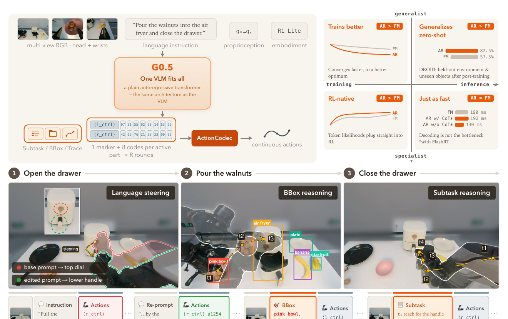

# G0.5：让推理与动作回到同一条自回归序列

早期VLA把连续控制离散成动作Token，让视觉语言模型像续写文字一样续写动作，理解与动作留在同一个模型里；但高频全身控制意味着很长的数值序列，逐个Token生成的延迟难以接受。于是近两年的主流改成VLM做条件编码、flow-matching动作头成段输出连续动作——动作变快了，语言、空间关系和任务顺序与电机命令之间却隔了另一套参数和另一种目标函数。星海图G0.5从动作表示入手：先用ActionCodec把异构本体动作压成短离散码，再让同一个自回归Decoder在可选推理之后直接写出动作Token，使动作重新成为语言模型自己要预测的内容。

> **主要方法图：** Figure 1，PDF第1页。左上：单个VLM以多视角图像、指令、本体状态与本体标识为条件，在同一next-token目标下生成可选CoT与紧凑动作码，跨本体ActionCodec把动作码还原为连续电机命令并跳过未参与部位；右上：与flow-matching策略在优化、强化学习兼容、DROID迁移和推理延迟上的对照；下方为开抽屉—倒核桃—关抽屉的闭环rollout。来源：[原论文](https://arxiv.org/abs/2608.11739)。

## 动作Token是语言模型直接预测的目标

G0.5从Qwen3.5-2B初始化，多视角RGB、自然语言指令、本体标识、连续状态和一小段视觉历史进入模型后，可以先输出一段CoT再写动作Token。CoT有子任务描述、物体框、二维末端轨迹和动作提示四种形式，训练时从八种组合（包括完全不输出）中抽样，全部在同一next-token目标下监督；预训练阶段没有单独的动作回归损失，也不从现成动作专家蒸馏答案。“单流”并不等于融掉所有模块：视觉编码器仍在，动作码仍需单独训练后冻结的ActionCodec还原为连续控制；论文还保留一个参照π0.5写法的可选flow-matching head，用同一checkpoint做对照与部署。

## ActionCodec：按部位压短异构动作

ActionCodec先把不同机器人的动作放进27维槽位：左右控制各9维、左右夹爪各1维、下半身7维，预训练覆盖14种真实与仿真本体；动作按部位分组后经残差向量量化压成离散码。每一轮量化先写一个部位标记、再写8个动作码，未参与动作的部位不发Token、控制端保持不动，序列长度于是取决于“此刻有几个部位在动”，不再完全与总自由度绑定。论文给出的延迟为flow matching 190 ms、开FlashRT的AR加CoT 192 ms、AR不加CoT 130 ms——动作压缩后自回归没有慢到失去部署价值。但这组数字未拆开测试硬件、视觉预处理、动作解码与低层控制各占多少；新本体接入仍需动作归一化、通道处理、本体映射和后训练，ActionCodec收拢的是动作描述方式，机器人的物理差异还在。

## 对齐条件下的真机与仿真证据

R1 Lite与R1 Pro真机微调在相同训练数据、观测与动作空间、推理设置和训练时长（16张H20）下比较：六个任务—本体设置各做15次，G0.5平均成功率76.7%，π0.5为53.3%，GR00T-N1.7为24.4%，G0.5赢下五组，搬箱堆叠例外（π0.5 93.3%、G0.5 80.0%）；每组仅15次试验，一次成败约6.7个百分点，论文未给置信区间。仿真侧需要分清前提：DROID的82.5%是三种模型均经DROID后训练、留出测试环境与实物实例的zero-shot；LIBERO的98.9%只超次优公开结果0.2个百分点；RoboTwin 2.0平均93.3%但仍有偏弱任务；SimplerEnv-Bridge为87.3%，部分基线来自他文未统一重跑；BEHAVIOR的0.3136是按目标谓词完成比例计算的Task Success Score，不等于31.36%的任务完整完成，容器、抽屉、家电等带状态变化的对象上波动明显。CoT在单步基准上变化很小，在两项五阶段任务中把平均阶段进度从2.4、1.5提升到3.8、3.4，但每设置仅5次且运行时会给出当前阶段指令，属探索性结果。动作Token与文字Token一样有明确log probability，可直接接GRPO等比率型强化学习：4个LIBERO任务各1条示范下AR约97.4%、FM约92.9%，种子数与评测次数未完整披露，只是小规模信号。

## 边界

DROID半透明抽屉任务早期无标记测试只有60%，主实验贴上高对比橙色标记后达到100%，前后条件已经改变，更适合用来观察模型对视觉线索的依赖。视觉历史只保留数秒；动作空间预留了下半身槽位，但真机是轮式底盘与躯干的R1 Lite/R1 Pro，没有双足下肢专项评测；14种本体的总数据规模与各来源比例未完整公开。代码已公开，多组权重经gated仓库发布，项目使用非商业社区许可证，商业使用需另行授权。

[项目页](https://opengalaxea.github.io/G05/) · [论文原文](https://arxiv.org/abs/2608.11739) · [代码](https://github.com/OpenGalaxea/GalaxeaVLA)
