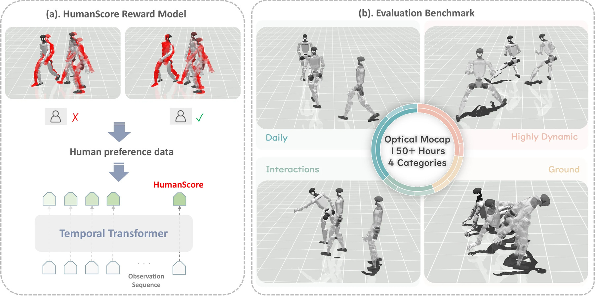

# HumanTracker：用人类偏好重建动作跟踪的考试标准

逐帧关节误差低，不代表动作看起来对：脚底可能一直在滑，支撑脚可能反复离地，身体可能持续抖动。脚滑要观察一段时间才能确认，漂移要前后对比才能发现，这些都是持续数秒的物理事件，而不是某一帧上的静态姿态差。与此同时，人形动作跟踪常用的AMASS测试集只有约140条序列，难以覆盖腾空、冲击、跪地起身和多点支撑等长尾动作；只报一个综合平均分，还会让日常动作的高分掩盖贴地动作的全军覆没。HumanTracker不提出新的Tracker，而是为整个领域建立更全面的考题和更符合人类判断的评分：一套大规模分类动作基准，加上从人类偏好学习的轨迹质量评分器HumanScore。

> **主要方法图：** Figure 1，PDF第1页。左：在跟踪rollout的成对偏好数据上训练对齐人类的奖励模型，经时间Transformer输出标量HumanScore；右：HumanTracker基准提供约153小时、四类动作轨迹。来源：[原论文](https://arxiv.org/abs/2608.13555)。

## 从光学动捕到四类动作基准

团队用光学动捕采集24名专业表演者（舞蹈老师、健身教练、网球教练和专业动捕演员）的动作，经GMR重定向到统一的29自由度人形，并清除存在悬浮、穿地、接触不连续等明显异常的片段。最终基准包含24,995段轨迹、约152.67小时、约2748万帧，采样率50 Hz；每段带类别标签、自然语言描述、SMPL人体动作和机器人qpos参考，按源动作9:1划分训练与测试集，防止同一动作的相似片段跨集泄漏。动作按控制难点分四类：Daily（89.29小时、9739段）考长期稳定与漂移；Highly Dynamic（11.01小时、2676段）考冲击与快速支撑切换；Interaction（47.78小时、10940段）考手臂与全身协调；Ground（4.59小时、1640段）考低重心与多点接触。评测统一MuJoCo环境、29自由度qpos表示、参考轨迹索引、终止条件和指标实现，各tracker保留原生观测与动作解码器，控制轨迹统一按50 Hz记录，尽量避免机器人模型、仿真器或后处理不同造成的不可比。

## HumanScore：学习人类判断的轨迹质检

四个现有tracker——GMT、TWIST2、SONIC、Humanoid-GPT——跟踪同一批参考动作，产生的轨迹按250帧（5秒）切窗。6名人形机器人方向的博士研究者观看成对同步播放的视频，按摔倒、抖动、脚滑错误接触、支撑一致性和全身自然度的顺序判断哪条更好，也可选相似或无法比较；人工共比较6000个原始轨迹对，镜像扩充为12,000条偏好记录，划分按motion_id进行。评分器不读视频，而读仿真记录的轨迹状态：当前参考、机器人姿态与速度、控制动作与电机目标、足部接触、接触力与足速、根部运动，以及14个身体关键点的位姿和空间速度，每帧539维。时间Transformer把整段5秒编码为一个标量，以成对偏好损失训练——人类选中的轨迹得分更高、判为相似的尽量接近——再经sigmoid映射并按窗口帧数加权，得到0—100的HumanScore。

## 比传统指标更接近人眼，但不替代它们

在测试集轨迹对上，HumanScore预测人类偏好的对齐率达90.83%（95%置信区间87.36%—93.83%），高于关键点位置误差84.05%、关节速度误差84.04%、MPJPE 80.49%、足部接触准确率78.82%、平均关节jerk 72.32%。消融支持两个判断：时间上下文从1秒增到5秒，对齐率由85.7%升至90.8%，说明很多失败要连续观察数秒才显现；删除足部接触、接触力等实测接触特征后，Ground类对齐率从87.9%跌至75.9%，而加入未来参考没有增益。对现有tracker的结论也随之分层：Humanoid-GPT整体最强，尤其日常与高动态动作；SONIC在Interaction完成率上略高，Ground类完成率更低（20.1%对32.9%）但HumanScore更高；GMT与TWIST2在Ground类完成率为0。“完成了且姿态接近”与“看起来稳定自然”不是同一回事——完成率回答能不能做完，运动学误差回答姿态多接近，HumanScore回答整段轨迹在人看来是否稳定自然，三者需联合报告。

## 边界

实验只使用单一29自由度人形与MuJoCo，HumanScore对未见动作的泛化不等于跨本体、跨仿真器或跨控制器家族泛化；539维输入含接触力等仿真特权信号，真机上没有直接对应观测，目前只是仿真评测工具。每个原始轨迹对主要只有一名标注者，无法衡量标注者间分歧；四类数据不均衡，最能暴露接触问题的Ground仅约4.59小时；论文只把HumanScore用作评价指标——若直接拿它当强化学习奖励，控制器可能钻评分模型的漏洞，产生分高却不自然的动作。论文首页给出官方代码与项目页链接，仓库内容、数据与评分器权重的开放范围尚未逐项核验。

[项目页](https://dairuliu.github.io/humantracker/) · [论文原文](https://arxiv.org/abs/2608.13555) · [代码](https://github.com/GalaxyGeneralRobotics/HumanTracker)
