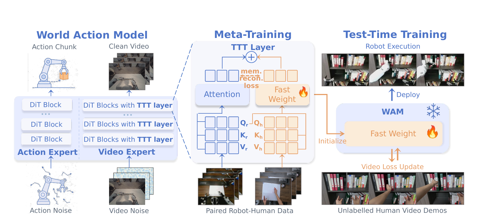

# WAM-TTT：用无标注人类视频在部署前调整世界动作模型

机器人可能已经有一个能够根据视觉和语言生成动作块的世界动作模型，但遇到训练数据没有覆盖的新任务时，它仍不知道哪些场景变化与当前动作目标最相关。WAM-TTT不把人类视频先恢复成机器人关节轨迹，而是让模型在执行任务前观看少量无标注人类示范，用视频中的状态变化更新一组轻量快速权重，再由原有世界动作模型生成机器人动作。

> **主要方法图：** Figure 2，PDF第3页。左侧是带视频专家和动作专家的世界动作模型，中间用配对的人类与机器人数据学习可快速更新的记忆，右侧在测试时只用无标注人类视频更新快速权重，再把适配后的模型用于机器人执行。来源：[原论文](https://arxiv.org/abs/2607.06988)。

## 为什么不能直接把人类视频当动作标签

人类视频只显示手和物体怎样变化，没有目标机器人的关节顺序、动作尺度和控制频率。若直接把人体轨迹映射成机器人动作，不同本体、相机视角和接触方式会造成很大的执行误差。WAM-TTT保留原世界动作模型的动作专家，让机器人动作仍由已经学习过本体控制分布的模块生成；人类视频只用于调整视频专家内部的快速记忆，告诉模型当前任务中哪些视觉变化值得关注。

基础世界动作模型包含视频专家和动作专家。视频专家接收当前观测和未来视觉片段，学习动作发生后环境会怎样变化；动作专家接收任务条件和机器人状态，生成短期动作块。两者在共享注意力中交换信息，使动作生成能够利用对未来变化的估计，而不是只按当前图像匹配训练样本。

## 配对数据怎样教会快速权重

元训练阶段使用配对的人类示范和机器人示范。两段数据描述相近任务，但外观、动作本体和执行方式不同。机器人片段进入原有注意力分支，人类片段进入快速权重分支；记忆重建任务要求人类视频中提取的变化能够找到与机器人执行相关的表示。这样训练的目的不是复制人的关节动作，而是建立“人类示范中的状态变化”与“机器人模型中可执行行为”之间的对应关系。

原有世界动作模型参数在这一步保持为稳定的慢速能力，快速权重只学习怎样吸收新视频中的任务线索。如果把全部模型都用少量测试视频更新，模型容易忘记原有机器人动作能力；只更新轻量分支，可以把新任务适配和已有动作生成分开。

## 测试时怎样形成机器人闭环

部署到新任务前，系统先读取几段无标注第一人称人类视频。视频专家尝试预测后续视觉变化，预测误差只更新快速权重，不更新动作专家和基础模型。适配结束后，这组快速权重固定下来，与冻结的世界动作模型一起处理机器人的实时观测和任务条件，动作专家输出动作块，低层控制器执行后产生下一时刻图像和本体状态，再进入下一轮推理。

因此这里的“测试时训练”发生在机器人任务执行前的短暂适配阶段，不等于机器人一边运行一边持续修改全部参数。论文也没有证明系统能够自动判断失败原因、长期积累记忆或完成无人监管的持续学习。

## 实验支持到什么程度

论文在Unitree G1、银河通用夹爪平台和Sharpa灵巧手平台上测试九项任务，每个任务与设置执行25次。新家庭任务的平均进度指标中，WAM-TTT报告46.2%，基础LDA为32.5%，上下文提示基线为7.1%。这说明测试时视频适配在论文设置中总体有效，但并非所有任务都提升；例如盖章任务中WAM-TTT低于基础LDA，说明人类视频与机器人执行不匹配时，快速记忆也可能引入错误引导。

当前公开材料包含论文方法与实验结果，未找到能够完整复现元训练、测试时适配和三种本体实验的官方代码与数据。它适合作为“无动作标签视频怎样影响机器人动作模型”的研究案例，不能写成已经开放的通用产品模块，也不能据此推断它就是银河通用AstraBrain内部的正式组件。

## 原文

[论文原文](https://arxiv.org/abs/2607.06988) · [论文HTML](https://arxiv.org/html/2607.06988)
