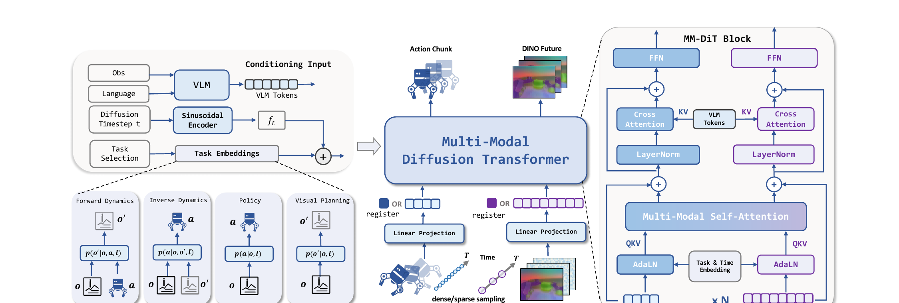

# LDA-1B：让不同质量的具身数据共同训练视觉预测与机器人动作

机器人示范包含可执行动作，但数量少、采集成本高；仿真轨迹规模大，却与真实视觉和接触存在差异；人类视频覆盖广，但没有目标机器人的动作标签。LDA-1B不要求所有数据都具备完整监督，而是根据每条数据实际包含的信息分配训练任务：高质量机器人示范训练动作策略，带动作的轨迹训练正向与逆向动力学，无动作视频继续训练未来视觉预测。

> **主要方法图：** Figure 2，PDF第3页。观测和语言先形成条件Token，任务标识决定当前样本训练策略、正向动力学、逆向动力学还是视觉预测；多模态扩散Transformer同时处理动作块与未来视觉潜变量。来源：[原论文](https://arxiv.org/abs/2602.12215)。

## 数据进入模型前怎样统一

不同数据先被整理成观测、语言、时间和可选动作。机器人和人类操作都尽量使用以手或末端为中心的表示：机器人记录末端位姿、夹爪或手指状态，人类视频则恢复腕部与手部运动。这个共享表示帮助模型学习“手怎样接近和改变物体”，但不会消除各机器人关节结构、控制尺度和动力学的差异，因此目标本体仍需要自己的动作接口和后训练数据。

视觉图像不直接以像素作为未来预测目标，而是经过DINO编码器变成视觉潜变量。像素预测会把大量容量用于纹理、光照和背景细节，潜变量更强调物体、手和场景结构的变化。视觉语言模型同时读取当前观测和任务指令，输出条件Token，使后续动作与视觉预测知道当前要完成什么，而不是只外推画面运动。

## 四种训练任务怎样共享同一主干

任务标识告诉模型当前样本能提供哪种监督。策略任务根据当前观测和语言生成未来动作块；正向动力学根据当前观测与动作预测后续视觉状态；逆向动力学根据前后视觉变化推断中间动作；视觉规划只根据当前观测和语言预测期望的未来视觉状态。没有动作标签的人类视频不能训练机器人动作头，但仍能训练视觉规划；动作不够稳定的低质量轨迹也可以帮助模型学习状态怎样随动作变化。

多模态扩散Transformer为动作和视觉设置相对独立的专家分支，再通过共享注意力交换信息。分开专家是因为动作序列和视觉潜变量的维度、噪声和预测目标不同；共享注意力则建立“哪段动作会造成哪种视觉变化”的对应关系。若只训练动作策略，模型难以利用无动作视频；若只预测未来画面，又没有接口把预测结果转成机器人可执行动作。

## 训练与真机部署分别保留什么

训练时，模型可在不同批次之间切换四种任务，并使用仿真、人类视频和多种机器人数据。动作噪声、视觉噪声、扩散时间步与任务标识只用于构造训练或迭代生成过程。部署时，真实相机、语言指令和机器人状态进入视觉语言条件分支，策略任务生成16步动作块；机器人客户端按自身动作定义解释末端、夹爪或灵巧手目标，低层控制器执行后返回新观测。

论文以3 Hz处理视觉观测、以10 Hz表示动作。这个频率描述模型和数据接口，不等于电机最底层控制频率；真实机器人仍需要更高频的关节控制、安全限制和通信链路。模型也不是对任意新本体直接零样本可用，论文中的各平台都需要数据格式、动作维度和控制接口适配。

## 证据与开源边界

论文使用超过3万小时的人类与机器人数据，在仿真和多种真实平台上评测。RoboCasa-GR1设置中报告55.4%的平均成功率，高于论文复现设置下的GR00T-EI10k和GR00T N1.6。该结果支持多任务动力学训练在指定数据与评测协议中的价值，但不能单独证明规模扩大后必然持续提升，也不能把跨平台训练等同于任意本体泛化。

官方仓库已经提供模型代码、部分训练与评测入口、检查点和许可证；项目页仍将数据标为后续开放，仓库待办中也保留预训练数据与预处理脚本。因此当前可以检查模型结构和部分运行链路，不能宣称EI-30K完整数据、全部清洗流程和1B规模预训练基础设施已经开源。

## 原文、项目与代码

[论文原文](https://arxiv.org/abs/2602.12215) · [官方项目页](https://pku-epic.github.io/LDA/) · [官方代码](https://github.com/jiangranlv/LDA-1B)
