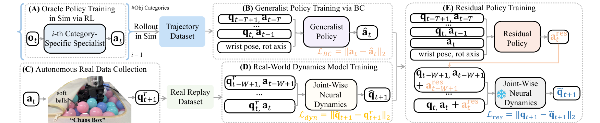

# DexNDM：用真实状态转移学习灵巧手的动力学残差

在手内旋转依赖连续接触、摩擦和物体惯性。仿真策略即使能稳定旋转多种物体，到了真机也会因电机响应、关节摩擦、软接触和未建模载荷而失败。DexNDM没有直接用少量真机数据重训整套策略，而是先在仿真中建立通用基础策略，再让真机自主采集状态转移，用逐关节神经动力学模型学习现实差异，最后训练一个残差策略修正基础动作。

> **主要方法图：** Figure 3，PDF第4页。仿真专家产生轨迹并蒸馏为通用策略，真机自主采集状态转移训练逐关节动力学模型，残差策略再借助该模型学习怎样修正基础动作。来源：[原论文](https://arxiv.org/abs/2510.08556)。

## 仿真专家怎样变成通用基础策略

第一阶段按物体类别训练多个强化学习专家。每个专家在仿真中针对一组物体学习旋转动作，可以利用对应物体的动力学和任务分布形成稳定策略。专家随后在仿真中运行，产生关节状态、历史动作、腕部姿态、旋转轴和下一步动作组成的轨迹数据。

这些轨迹通过行为克隆蒸馏进一个通用策略。通用策略不再绑定单一物体类别，而是根据近期关节状态、动作历史、腕部姿态和目标旋转轴输出当前关节动作。蒸馏先把多个专家的技能收进同一控制接口，避免直接在真机上从零探索；它也保留了仿真误差，所以还不能直接视为完成Sim-to-Real。

## 真机怎样自主产生可用数据

基础策略部署到真实灵巧手后，在装有软球的Chaos Box中反复执行随机负载动作。软球持续改变手指受到的阻力和接触状态，使系统在不频繁人工更换物体的情况下收集多样的真实状态转移。记录内容是动作执行前后的关节状态与实际动作，不需要为每一步人工标注成功动作。

论文为每种腕部朝向收集4000条轨迹，并覆盖六种腕部朝向；每条轨迹400个20 Hz控制步，约20秒。这里的数据用于学习真机动力学，不直接提供任务奖励或理想动作标签。自动采集降低了人工遥操作成本，但数据仍来自特定灵巧手、软球负载和安全范围，不能无条件迁移到其他执行器。

## 为什么使用逐关节动力学模型

逐关节模型接收某个关节最近的状态、动作以及反映全手和物体影响的压缩条件，预测下一时刻该关节状态。这样做把高维全手动力学拆成多个较小问题，在真机数据有限时更容易训练，也便于定位某个关节的误差来源。缺点是强耦合接触可能被拆散；论文也显示，在数据充分且分布内的条件下，整手模型有时可以表现更好。

训练好后，动力学模型被冻结，作为可微的真机近似环境。残差策略读取与基础策略相同的历史信息和基础动作，输出一个修正量；基础动作与修正量共同送入动力学模型，预测下一状态是否更接近可持续旋转。残差只负责补偿现实差异，不替代基础策略已经学到的旋转结构，因此需要的真实数据和探索范围都小于从头训练新策略。

## 部署闭环与能力边界

真机部署时保留通用基础策略和残差策略，两者共同生成关节目标；训练残差时使用的神经动力学模型不必参与实际接触控制，真实编码器反馈形成下一时刻观测。论文展示多种尺寸、形状和腕部姿态下的在手旋转，并给出遥操作应用，但研究对象是灵巧手局部接触操作，不是人形机器人全身LocoManip系统。

当前公开材料包含论文和项目展示，未找到官方完整代码、训练数据和可直接复现的硬件工程。DexNDM可以说明“仿真基础策略加少量真实动力学适配”怎样缩小接触任务的现实差距，但不能写成已经解决任意物体操作，也不能直接等同于银河通用产品体系中的Dex模块。触觉和更完整的手物状态仍是论文明确保留的后续方向。

## 原文与项目

[论文原文](https://arxiv.org/abs/2510.08556) · [官方项目页](https://meowuu7.github.io/DexNDM/)
