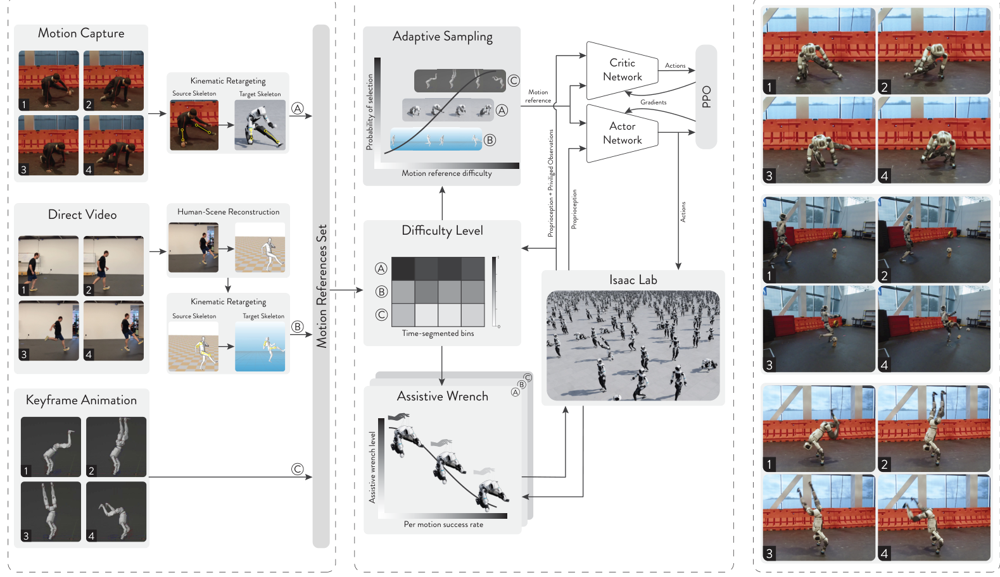

# ZEST：用难度采样与渐退辅助力训练高动态全身动作

参考状态初始化可以让策略从转体、倒立或空翻中间开始学习，但它只是把机器人放到一个状态，不能保证机器人能在下一瞬间承受基座旋转、冲击接触和关节极限。ZEST解决的是这个训练断点：它把长动作分段，反复采样容易失败的片段，再在训练早期用虚拟基座力和力矩补足策略尚未学会的稳定能力；片段跟踪成功后，辅助自动衰减为零，最终只部署本体观测策略和关节PD控制器。

> **主要方法图：** Figure 3，PDF第9页。左侧是MoCap、单目视频和关键帧动画的参考动作入口，中间是难度分段采样、辅助力课程和PPO跟踪训练，右侧是撤去训练特权信息后的真机执行。来源：[原论文](https://arxiv.org/abs/2602.00401)。

## 三种动作数据先变成目标本体参考

ZEST的入口不限于高精度动作捕捉。Xsens和Vicon提供的MoCap动作相对干净；手持单目相机拍摄的视频先由MegaSaM恢复相机和场景运动，再由TRAM恢复三维人体姿态；关键帧动画则用于人类做不出来的动作，或者Spot这类非人形本体。

人体动作通过时空联合优化映射到目标机器人。优化同时对齐根节点位姿和对应骨骼，惩罚过大的关节速度，并联合调整空间尺度与时间采样，使腾空动作与重力时标尽量一致。自碰撞和地面穿透作为约束被排除，但整条数据链不需要手工接触标签，也没有先做一轮完整的动力学轨迹优化。这意味着视频里的脚滑和轻微抖动仍会进入参考，后面的物理策略需要在跟踪风格与保持可执行之间自己取舍。

## Actor只看实机信息，Critic用仿真真值教它跟踪

每个控制周期，Actor读取躯干IMU角速度、重力方向、关节位置与速度、上一次动作，再加上参考动作的下一时刻目标。目标包括基座高度、基座线速度和角速度、重力方向以及参考关节位置。策略不读全局基座位置、真实根节点线速度或观测历史；作者让上一次动作提供最小时间上下文，希望策略从当前身体反应中隐式判断接触和基座运动。

Critic只在仿真训练中工作。它除了读取Actor的全部输入，还能看到真实基座线速度与高度、基座和关键部位接触力、关键部位相对位置与速度，以及当前辅助力大小。这些信息让价值估计更准，但不会进入最终Actor，因此部署时不需要另外运行基座线速度状态估计器。

Actor不直接重新生成全部关节命令，而是输出参考关节位置的残差。参考关节角加上按关节缩放的残差后，作为PD目标送入机器人。屁部和膝部等需要更强动力学补偿的关节允许较大残差，头部和手腕等PD本身就能跟住的关节使用较小残差。仿真时间步是0.004秒，每5步输出一次新动作，所以策略控制频率是50 Hz。

## 难度分段决定练哪里，辅助力决定先帮多少

普通的参考状态初始化从整条动作均匀抽样。这对短动作有效，但在长动作库里会反复抽到已经学会的片段，而空翻起跳、倒立换支撑和落地等薄弱片段反而训练不足。ZEST把轨迹切成最长4秒的时间段，用指数移动平均记录每段的跟踪失败程度，重置时优先从失败高的片段开始。同时为所有片段保留小概率，避免只练难点后忘掉已学会的动作。

对于仍然会立即失败的高动态片段，系统在机器人基座上施加虚拟力和力矩。它根据基座参考与实际的位姿、速度误差计算，并加入名义躯干动力学前馈，相当于教练在空翻初期帮机器人补一部分稳定力。辅助系数上限是0.60，不会把理想力完整代劳；当某个片段的跟踪相似度达到0.80，该片段辅助会归零。因此辅助力解决的是早期探索断掉问题，而不是实机永久依赖的控制器。

这里还要区分两种外力。辅助基座力会把机器人拉向参考，属于训练课程；域随机化中的随机冲量则故意把机器人推离参考，用于训练抗扰。两者方向和作用相反，不能都简化成“训练时加力”。

## 跟踪奖励与执行器建模共同决定Sim2Real

奖励只保留三类通用信号。跟踪奖励比较基座位置、姿态、线速度和角速度，以及关节和关键身体的位姿；正则项抑制动作突变、关节加速度和位置或力矩越界；生存奖励避免策略通过提前结束躲避难片段。不同动作共用这套奖励，不使用接触时序标签和动作专属奖励。

ZEST没有把真机迁移全部交给域随机化。Atlas的膝、踝和腰部使用闭链并联执行器，直接仿真完整连杆会让动力学计算过于昂贵。论文逐步把支撑连杆对主运动链的影响投影为关节等效转子惯量，再用标称姿态下的固定惯量设计PD增益。这样选出的PD参数同时用于仿真和真机，目的是让关节闭环响应先对齐，再用适度的摩擦、质量、传感器噪声和随机冲量覆盖剩余误差。Spot的高动态动作还需要额外建模供电限制、电机磁饱和传动摩擦导致的力矩损失。

## 实机只保留Actor、参考与PD闭环

训练检查点被导出为ONNX，连同观测定义、缩放和控制配置一起登记。同一份元数据先配置评测仿真器，再配置真机控制栈，减少手工复制参数带来的不一致。真机上保留当前本体观测、下一时刻参考、Actor、残差关节目标与PD控制器；Critic、真实接触力、根节点真值、难度统计和辅助力全部退出。

论文展示的实机范围很广：Atlas完成行走、慢跑、前滚翻、匍匐、侧手翻和霹雳舞等动作；G1执行侧手翻、乒乓球、芭蕾和跳箱、上箱、下箱；Spot执行前腿倒立、连续后空翻和滚翻。箱体任务在标称条件下连续5次都成功，训练范围内的x方向位置误差和航向误差测试也成功，还能承受2千克躯干负载。这些结果证明同一训练配方能跨数据源和本体使用，但不是一个策略在真机上完成所有动作。作者明确说明，为了在固定训练预算内获得稳定跟踪，真机展示使用按技能分别训练的专用策略；多技能策略只用于仿真消融。

## ZEST证明了什么，还没证明什么

每个专用策略在单张NVIDIA L4上训练约10小时，约7000次迭代，训练使用4096个并行环境。多技能Atlas策略的消融显示，去掉辅助力仍能收敛，但训练20小时后的表现大致只追平完整方法10小时的水平；去掉难度采样会长期忽略稀有难片段。在该网络和超参数下，加0.4秒观测历史或未来参考窗口反而会降低收敛速度；去掉Critic特权信息和把残差动作改成绝对关节目标也会明显降低稳定性。

因此，ZEST更适合被理解为“让高动态Tracker更容易训出来的统一配方”，而不是已经能被任意上层指令调用的行为基座。它仍然逐帧跟踪目标动作，没有验证训练集外动作的零样本泛化，也没有视觉地形、物体状态或力触觉闭环。当前实验假设平整、不湿滑的地面，并且仍要求合理的执行器模型。论文和官方视频已公开，但截至本次核验未找到训练代码、模型权重或动作数据。

[论文原文](https://arxiv.org/abs/2602.00401) · [官方视频](https://www.youtube.com/watch?v=I44_zbEwz_w) · [RAI Institute相关技术背景](https://rai-inst.com/resources/videos/reinforcement-learning-accelerates-humanoid-behavior-production/)
