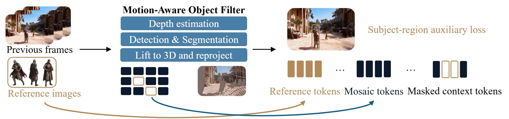

# Matrix-Game 3.5：用三维Patch记忆维持长时交互视频的一致性

相机可控视频模型可以根据前进、转向和视角变化持续生成画面，但自回归时间一长，离开视野的场景会被遗忘，重新转回来时墙面、物体位置和纹理可能发生漂移；动态人物又容易被错误写进静态记忆，产生残影和重影。Matrix-Game 3.5把问题拆成两部分：静态环境用可重投影的三维Patch记忆，动态主体用独立参考Token维持外观，再把两者送入流式视频生成器。

> **主要方法图：** 官方Figure 3。历史帧和主体参考图先经过运动主体过滤，静态Patch利用深度、相机内参与位姿回投三维并重投影到目标视角；动态主体以参考Token和区域辅助损失单独建模。来源：[官方项目页](https://matrix-game-v3-5.github.io/)。

## 输入是相机轨迹，输出是未来视频

系统读取文本描述、初始画面、可选的主体参考图，以及相机内参、外参和后续相机轨迹，连续生成第一人称或第三人称未来视频。Warped PRoPE把相机投影几何写入时空位置编码，使模型能够区分“画面中的像素运动”和“相机自身移动带来的视角变化”。

这里的控制量是虚拟相机位姿，不是机器人动作。模型没有输出关节目标、末端轨迹、夹爪开合、接触力或运动技能调用。因此它可以为长时几何记忆、交互场景生成和世界模型视频骨干提供参考，但不能直接归为机器人策略或机器人世界动作模型。

## Patch Memory怎样保存离开视野的场景

系统从历史帧提取图像Patch，并结合估计深度、相机内参和相机位姿，把Patch回投到度量三维空间。生成新视角前，这些三维Patch再投影到目标相机平面，通过可见性和深度缓冲筛选有效内容，形成Mosaic Memory。即使某个区域已经离开当前上下文窗口，只要其三维记录仍在，重新观察时就能提供过去的纹理与布局参考。

这种记忆存的是历史观测经过几何投影后的外观证据，不是完整场景网格，也不是能任意查询接触、质量和摩擦的物理状态。深度或相机位姿有误时，重投影同样会错；未被观察过的区域仍需要生成模型补全。

## 为什么要把动态主体从静态记忆中拿出来

如果人物或可动物体也被写入Mosaic Memory，它们会固定在旧位置，下一视角就可能同时出现旧影和新影。Matrix-Game 3.5先用运动主体过滤器分离静态场景与动态区域：静态内容进入三维Patch记忆，动态主体由多视角参考图编码成Reference Token，并通过主体区域掩码和辅助损失维持身份与外观。

这解决的是“场景可以回看，主体还在运动”的表示冲突。它并不自动提供可验证的物体动力学；主体动作是否满足接触、惯性和可执行约束，仍取决于训练数据和生成模型本身。

## 渐进蒸馏把双向生成器变成流式因果模型

高质量视频扩散模型通常需要多步采样和双向上下文，不适合实时交互。项目先训练高质量双向DiT，再用感知流匹配和基于模型自身滚动结果的分布匹配逐步蒸馏为少步因果生成器。训练课程逐渐增加自回归长度，使模型不仅拟合单个短片段，也接触自己生成误差累积后的上下文。

因此“实时”来自模型规模、因果缓存和少步蒸馏的共同作用，并不只由Patch Memory带来。官方报告720p、分钟级连续生成与实时交互，具体速度仍依赖硬件、分辨率和采样设置。

## 对机器人研究有什么价值，边界在哪里

值得借鉴的是三项机制：用显式相机几何保持长时视角一致性；把静态环境记忆与动态主体表征分离；训练时让因果模型看到自己的滚动误差。这些机制可以启发机器人世界模型的场景记忆、远程导航视觉预测或交互数据生成。

但视频连续不等于物理正确，相机轨迹控制也不等于机器人动作控制。没有机器人状态、动作表示、接触反馈和真机闭环时，Matrix-Game 3.5只能作为交互视频世界模型和邻接技术收录。官方已经开放Apache 2.0推理代码以及5B Base和Distilled权重，但完整训练数据与全训练流水线尚未全部公开。

[官方项目页](https://matrix-game-v3-5.github.io/) · [官方代码](https://github.com/Riemann-Dynamics/Matrix-Game-3.5) · [Base权重](https://huggingface.co/RiemannDynamics/Matrix-Game-3.5-Base) · [Distilled权重](https://huggingface.co/RiemannDynamics/Matrix-Game-3.5-Distilled)
