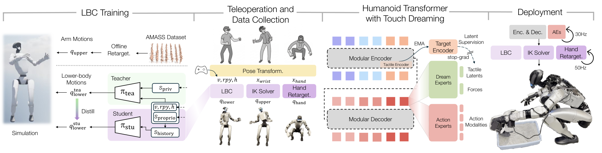

# HTD：从解耦身体控制、触觉示范到接触感知策略

HTD解决的是接触丰富的人形操作怎样同时获得身体稳定、灵巧执行和接触感知。只用视觉与本体状态训练模仿策略，机器人可以复现动作外形，却难以判断物体是否已经接触、受力或开始滑动；把高维触觉直接作为动作网络的输入，又容易让有限示范不足以训练出稳定表征。

作者没有用一个网络直接输出全身所有关节，而是把系统拆成运动基座、遥操作与数据采集、HTD策略和真机执行四层。触觉在训练阶段作为辅助预测目标约束策略表征，部署时不需要运行额外的触觉预测头。

## 完整实现链路

```text
AMASS上肢动作 + 基座速度、朝向和高度命令
                    ↓
特权Teacher：足端接触 + 机器人状态 → PPO训练
                    ↓
Student：本体观测与短历史 → BC预训练 → DAgger蒸馏
                    ↓
下肢与腰部控制基座 LBC
                    ↓
VR示教：头、腕、手指与摇杆输入
                    ↓
LBC控制躯干与移动 + IK控制双臂 + 手部重定向控制灵巧手
                    ↓
同步记录多视角图像、本体、关节力与分布式触觉
                    ↓
HTD编码器—解码器Transformer
      ├─ Action Experts：预测结构化动作块
      └─ Dream Experts：预测未来手部力与触觉潜变量
                    ↓
部署时删除Dream Experts，只保留动作策略
                    ↓
动作块 → LBC / IK / 手部重定向器 → Unitree G1真机
```



图2展示LBC训练、VR遥操作与数据采集、HTD Touch Dreaming训练和真机部署的完整关系。图源：[论文官方HTML](https://arxiv.org/html/2604.13015v3)。

## 运动基座怎样训练

论文把运动部分称为强化学习下肢控制器（Lower-Body Controller，LBC）。它接收基座线速度、角速度、躯干朝向和高度目标，输出12个腿部与3个腰部关节的位置目标。上肢不由LBC输出，但训练时会回放重定向后的AMASS手臂动作，让腿腰策略在上肢快速变化产生的扰动下继续保持稳定。

训练采用Teacher—Student链路。Teacher在仿真中能看到二值足端接触等特权信息，通过PPO先获得稳定控制；Student只使用真机可获得的本体观测和两个时间步历史，先行为克隆Teacher，再通过DAgger收集Student访问到的状态继续蒸馏。这样部署时不需要足端接触传感器，却能保留Teacher在仿真中学到的稳定性。

这套设计更准确地称为解耦身体控制，而不是单策略统一WBC：腿和腰由学习控制器负责，双臂通过IK执行腕部目标，灵巧手由手部重定向器执行手指目标。三个控制接口共同构成完整人形操作系统。

## 一次遥操作怎样变成训练样本

操作者通过VR提供头部、双腕和手指动作，摇杆提供基座移动命令。系统把这些输入拆到三个执行通道：躯干姿态和基座速度送入LBC，腕部位姿送入IK，手指姿态送入DexPilot式手部重定向器。

真机执行时同步记录头部和腕部相机图像、机器人与灵巧手本体状态、手部关节力以及分布式触觉。每只手的触觉观测由17个区域组成，共1062维。关键不是把传感器数据分别保存，而是让视觉、动作、机器人实际状态和接触结果处在同一条时间线上，形成可训练的操作回合。

## Touch Dreaming怎样进入策略训练

HTD先用不同Tokenizer处理多视角视觉、机器人本体、手部状态、关节力和触觉，再由编码器—解码器Transformer读取历史观测和任务条件。解码器中有两组输出头：Action Experts生成身体、双臂和双手的结构化动作块；Dream Experts只在训练时预测未来手部力与触觉潜变量。

触觉潜变量不是由策略自己同时生成目标和答案。论文使用指数滑动平均更新的目标编码器，把未来真实触觉编码成停止梯度的学习目标；在线编码器则根据当前上下文预测这些未来表征。这样策略必须在内部保留“动作执行后将发生什么接触”的信息，但不需要逐点复原1062维原始触觉。

这里的Touch Dreaming是一种训练期辅助预测机制，不等同于能够独立滚动未来场景、搜索动作或规划长任务的通用世界模型。它的作用范围是让行为克隆策略更好地表达接触结果。

## 训练与部署必须分开看

训练阶段可以读取未来力和触觉作为监督，也可以使用Dream Experts和目标编码器；这些模块都不会进入真机动作闭环。部署时只保留观测编码、共享Transformer和Action Experts，策略以30 Hz输出动作块，再由50 Hz运行的LBC、IK和手部重定向器转换成各执行器目标。

因此，触觉对部署仍然有两种作用：当前触觉可以作为策略观测帮助闭环决策；未来触觉只在训练中提供辅助监督。不能把“预测未来触觉”误写成真机运行时必须先生成完整未来再执行。

## 实验证明了什么

论文在插入T形物体、整理书籍、折叠毛巾、铲猫砂和端茶五项真机任务上评测，每项进行20次试验。作者报告HTD相对较强的逐任务ACT基线平均提高90.9%的成功率；消融中，预测触觉潜变量相对直接回归原始触觉取得30%的相对提升。

这些结果支持三个判断：解耦运动基座能够为上肢操作提供稳定身体接口；真实触觉可以通过辅助预测改善接触任务；用潜变量监督比直接回归高维原始触觉更适合当前数据规模。证据仍有边界：

- 五项任务都在同一类G1与灵巧手、触觉硬件组合上完成，尚不能证明跨本体泛化；
- 系统依赖LBC、IK、手部重定向和HTD之间的接口，不能把最终成功全部归因于一个策略网络；
- Touch Dreaming提高的是所测接触任务表现，不等于已经获得通用物理预测与长时规划能力；
- 成功率和相对提升均按作者实验协议记录，公开材料尚不足以独立复现整套HTD结果。

## 开源边界

[IsaacLab-Decoupled-WBC](https://github.com/chrisyrniu/IsaacLab-Decoupled-WBC)已经公开Isaac Lab训练环境、Teacher PPO训练、Student行为克隆与DAgger蒸馏、示例检查点、仿真回放以及Unitree G1部署说明，采用BSD-3-Clause许可证。当前部署说明明确Student控制腿部和腰部，上肢保持配置中的默认目标，因此不能仅凭仓库名把它描述为统一输出全身所有关节的WBC。

[humanoid-touch-dream](https://github.com/chrisyrniu/humanoid-touch-dream)是完整系统的项目入口，并以子模块连接上述控制器；但其发布清单仍把遥操作与数据采集、HTD策略训练和HTD策略部署标为待开放。当前适合复现运动基座并检查完整系统接口，尚不能据此完整复现论文的数据采集和Touch Dreaming训练。

## 对开发者的价值

这项工作值得借鉴的不是把触觉简单拼到视觉特征后面，而是把整个问题拆成三个可独立验收的闭环：先训练能够承受上肢扰动的腿腰运动基座；再用统一时钟记录操作者目标、机器人执行和接触结果；最后让动作策略在训练时预测未来接触表征，并在部署时删除辅助头。

若要复现，最小顺序应是先跑通LBC Teacher—Student与G1部署，再验证VR输入到LBC、IK和手部重定向的接口，随后检查视觉、本体、动作、力和触觉是否同步，最后才训练HTD。直接从Transformer结构开始，无法区分失败来自身体不稳、动作映射错误、数据错位还是接触表征不足。

## 原文、项目与代码

[论文](https://arxiv.org/abs/2604.13015) · [官方项目页](https://humanoid-touch-dream.github.io/) · [HTD项目仓库](https://github.com/chrisyrniu/humanoid-touch-dream) · [IsaacLab-Decoupled-WBC](https://github.com/chrisyrniu/IsaacLab-Decoupled-WBC)
