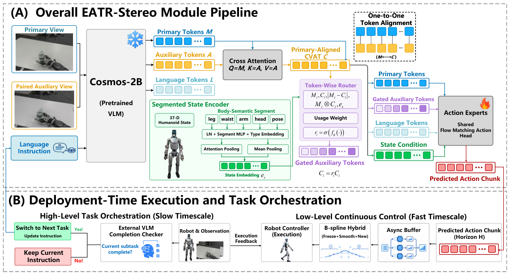

# EATR-Stereo：让人形VLA按身体状态使用双目辅助证据

头戴双目相机能在一侧被手臂、物体或机器人自身遮挡时提供另一个视角，但第二路图像并不会自动变成更好的动作。直接拼接两路视觉Token没有明确建立跨视角关系，把双目图拼成宽图会改变预训练视觉语言模型熟悉的输入分布，用新融合特征替换原始Token还可能破坏已经学到的语义表示。

EATR-Stereo解决的是怎样在不改写主视角表示的前提下，把同步辅助视角接入预训练VLA，并让机器人根据当前身体姿态决定哪些辅助视觉证据值得使用。它不是双目深度估计器，也没有显式恢复三维几何；核心是一个由本体历史调节的跨视图Token接口。

## 完整实现链路

```text
同步左/右头部相机 + 当前语言子任务 + 最近六帧本体状态
                              ↓
                 冻结Cosmos视觉语言主干
                    ┌─────────┴─────────┐
                    ↓                   ↓
              主视角Token          辅助视角Token
                    │                   │
                    └────跨视图注意力───┘
                              ↓
             与主视角序列对齐的辅助Token（CVAT）
                              ↑
       腿 / 腰 / 臂手 / 头 / 整体姿态的本体历史编码
                              ↓
              逐Token连续软门控，只缩放CVAT
                              ↓
语言Token + 未修改主视角Token + 门控CVAT + 原始机器人状态
                              ↓
                    GR00T动作专家
                              ↓
              30步连续动作块 + B-Spline衔接
                              ↓
                    全身控制与真机执行
                              ↓
               新双目观测与本体状态反馈
```



图2展示冻结视觉语言主干、主视角通道、跨视图辅助Token、本体分段编码、软门控和GR00T动作专家之间的关系。图源：[EATR-Stereo论文](https://arxiv.org/abs/2608.17453)。

## 为什么不能直接增加第二张图

EATR-Stereo把左相机固定为主视角，把右相机作为辅助视角。两路图像分别经过同一个冻结视觉语言主干编码，但主视角Token完整保留，不被后续融合模块覆盖。这使动作专家继续看到与预训练阶段相近的原生视觉通道，辅助视角只提供增量证据。

模型使用主视角Token作为查询，在整组辅助视角Token中检索相关信息，得到Cross-View Auxiliary Tokens（CVAT）。CVAT与主视角序列具有对应的Token位置，但这种对应来自学习式注意力，不是像素匹配、三角测量或相机标定。论文不使用相机内外参，因此不能把它写成显式深度恢复或几何重建。

## 身体状态为什么要进入视觉路由

头戴相机的可靠性与机器人姿态直接相关。头部决定相机朝向，臂手可能遮挡目标，腰腿运动会改变视角和画面稳定性。论文把最近六帧37维本体状态按腿、腰、臂手、头和整体姿态分组编码，再合成供视觉路由器使用的身体表示。其中37维由33维关节状态和四维基座姿态组成。

路由器同时读取主视角Token、对应CVAT、二者的关系和身体状态，为每个CVAT生成零到一之间的连续权重。这里的“Routing”不是删除Token、硬选择相机或专家路由，而是逐Token缩放辅助证据；主视角Token始终原样保留。

因此，这个设计真正表达的是：当身体姿态使主相机更可能被遮挡或偏离目标时，策略可以提高相关辅助Token的贡献；当辅助视角没有增量信息时，又不必让它覆盖原有视觉表示。

## 动作怎样进入真实机器人

门控后的CVAT与语言Token、主视角Token和机器人原始状态共同送入GR00T 1.7连续动作专家。策略在RTX 4090上以10 Hz运行，每次预测30步动作块；相邻动作块使用局部三次B-Spline衔接，减少连续关节命令之间的跳变。

训练时，Cosmos视觉语言主干保持冻结，CVAT模块、本体状态编码器、路由器和GR00T动作专家参与优化。部署时保留这些动作生成模块，通过真实双目图像和本体反馈反复更新动作块。论文没有说明EATR-Stereo取代了关节级执行器、平衡控制器或安全状态机，因此它应理解为VLA视觉接口和动作策略的一部分，而不是完整低层全身控制器。

超过100秒的完整任务还使用外部VLM判断子任务进度，并由有限状态机切换搜索、接近、抓取、放置和返回等语言子任务。EATR-Stereo负责在当前子任务中生成动作，高层编排负责决定何时进入下一阶段；这不是单个VLA只读取一条长指令后独立完成全部任务规划。

## 实验证明了什么

论文在33自由度HONOR Omega 1.0人形机器人上比较九种配置。每种方法进行20次超过100秒的长任务测试，其中包含训练位置和未见位置。作者报告：

- 单目GR00T完整任务成功率为35%，抓取成功率为55%；
- 宽图GR00T完整任务成功率为20%，抓取成功率为45%；
- 默认双图GR00T完整任务成功率为35%，抓取成功率为80%；
- StereoPolicy完整任务成功率为45%，抓取成功率为85%；
- EATR-Stereo完整任务成功率为60%，抓取成功率为100%，阶段成功率为80%。

这些结果支持“保留主视角通道，并根据本体状态选择性加入跨视图证据”优于几种直接双图输入方式。严重非对称遮挡实验中，完整路由方案的恢复率为80%，只使用CVAT而不做本体路由时为30%，进一步说明身体状态参与辅助证据选择具有作用。

证据仍有以下边界：

- 60%对应20次试验中的12次完整成功，StereoPolicy的45%对应9次，二者只相差三次成功；
- 安全辅助协议允许每次试验最多两次人工干预，不能写成完全无干预的长时自主执行；
- 高层VLM和有限状态机承担子任务切换，最终结果不能全部归因于双目路由模块；
- 实验集中在一个本体和一类长任务链，没有证明跨本体或开放场景泛化；
- 论文未公开独立的双目深度、三维重建或接触推理证据。

## 与现有路线的关系

EATR-Stereo建立在GR00T动作生成链上，新增的是双目视觉怎样进入预训练VLA，而不是重新提出一套全身运动基座。它与双目深度工具的差异在于输出：双目深度网络显式生成视差或深度，EATR-Stereo生成的是供动作专家使用的辅助视觉Token。

它也没有绕过身体控制。动作专家输出的连续动作块仍需由机器人执行系统落实到全身关节，并依赖稳定的控制频率、动作衔接、碰撞保护和反馈闭环。对知识库的新增价值正在于把“头戴双目与本体状态”连接到“VLA动作块与全身执行”这段接口单独解释清楚。

## 开放边界与开发价值

截至收录时，论文已经公开，但未检索到官方代码、训练数据、模型权重或独立项目仓库。因此它适合作为双目VLA接口设计和消融思路，不应被列为可直接复现的荣耀开源项目。

对已有单目VLA的开发者，最小可验证改动不是立即重训完整模型，而是保留当前主视角通道，增加一个独立辅助流，并依次比较直接双图输入、跨视图辅助Token和本体状态路由。评测需要固定任务、位置和遮挡条件，同时记录抓取、阶段完成、完整任务、人工干预次数与失败发生阶段，才能判断改进来自空间证据、任务编排还是动作平滑。

## 原文

[EATR-Stereo论文](https://arxiv.org/abs/2608.17453)
