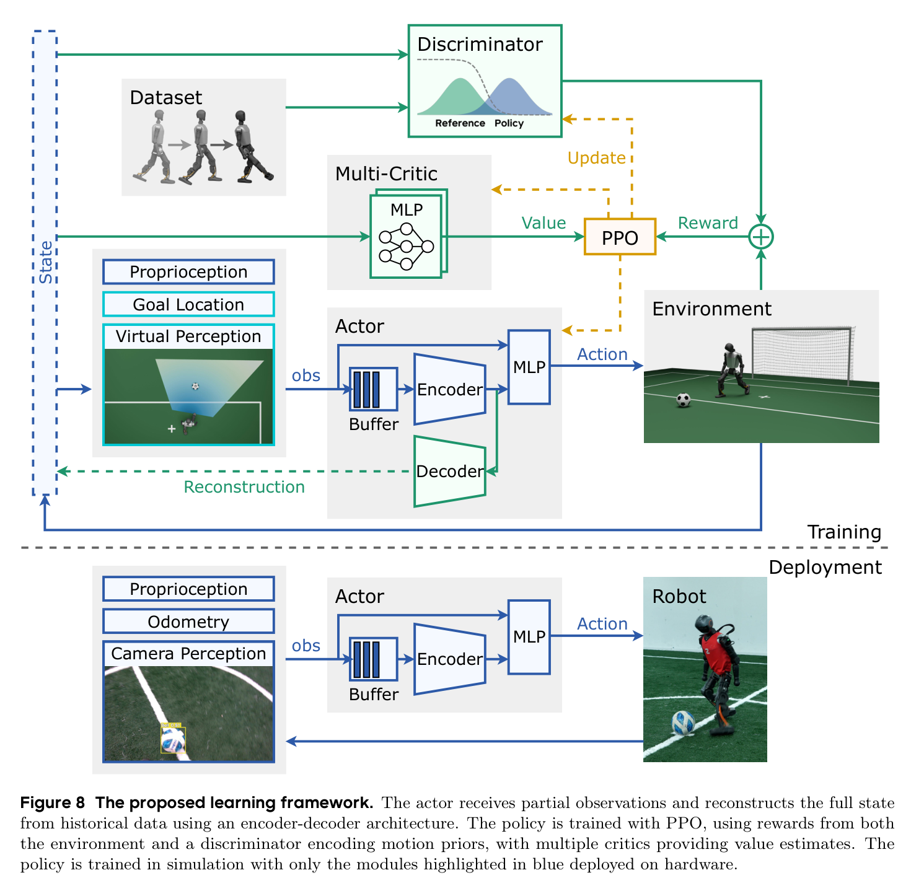

# Vision-Driven Soccer：把不可靠视觉接入人形机器人反应式全身控制

人形机器人踢球并不只是先识别足球、再调用一个固定踢球动作。机器人需要一边移动头部维持目标可见，一边根据球和球门的变化调整步态、接近方向、支撑脚与触球动作；相机同时存在延迟、掉检、运动模糊和距离相关误差。若检测、定位、行走与踢球由多个独立模块顺序执行，前一模块产生的过期结果会继续向后传播，机器人很难在动态场景中形成连贯反应。

这项工作把足球任务建模为部分可观测控制问题。它没有把原始RGB图像直接送入强化学习策略，而是先将机载视觉压缩为球与球门相关的结构化观测，再在仿真中复现真实视觉的噪声、视野、更新频率和延迟。策略从一秒历史观测中恢复被遮挡或不可直接测量的状态，并直接输出全身关节位置目标，由PD控制器在真机执行。

论文于2026年发表于 **Science Robotics，第11卷第117期，文章号eaed1152**。arXiv是同一工作的开放预印本，不作为第二篇论文重复统计。

## 完整实现链路

```text
头部D455i相机
      ↓
YOLO检测球、球门柱、罚球点与场地交点
      ↓
深度投影 + 几何投影 → 机器人坐标系BEV观测（25 Hz）
      ├── 球位置 + 是否检测到球
      └── 场地地标 → 粒子滤波修正本体里程计 → 球门位置与方向
                              ↓
本体状态 + 当前结构化视觉观测 + 最近50帧观测历史
                              ↓
                     历史观测编码器
                              ↓
          64维隐变量 + 当前观测 → Actor MLP
                   ↓                    ↓
       训练期Decoder重建特权状态       关节位置目标（50 Hz）
                                            ↓
                                      PD控制与真机执行
                                            ↓
                       新的身体状态、相机视角与球场变化
```

训练策略的另一条信号流是：

```text
任务奖励：进球、接近球、让球接近球门
运动先验：人类行走与足弓踢球动作 → AMP判别器风格奖励
正则与安全：关节限制、碰撞、动作变化、对称性
                              ↓
                    两组Critic分别估值
                              ↓
                         PPO更新Actor
```



图8把训练与部署的边界画得很清楚：特权状态、Decoder、判别器和多Critic只服务训练；真机只保留历史Buffer、Encoder与Actor。图源：[论文开放全文](https://arxiv.org/abs/2511.03996)。

## 视觉怎样变成策略观测

真机使用安装在头部两自由度云台上的Intel RealSense D455i。YOLOv8s在约3万张自采机载图像上微调，识别足球、球门柱、罚球点以及T/L/X形场地交点。检测结果结合深度和相机姿态投影到鸟瞰坐标系，因此Actor接收的是机器人坐标系中的球位置、球检测标记、球门中心和球门法向，而不是RGB像素或视觉特征Token。

这种对象中心表示主动舍弃纹理、颜色和背景，只保留足球任务需要的几何量，降低了合成图像到真实画面的视觉差距。代价是系统仍依赖外部检测器、相机标定、深度投影和场地地标定义；论文证明的是结构化视觉观测与运动策略的联合闭环，不是从原始图像端到端学习全部感知和控制。

球位置直接送入策略。球门位置则依赖混合里程计：一个MLP从最近一秒的关节、本体姿态、角速度、前一动作和前一里程计输出估计短时位移；场地地标检测再通过粒子滤波周期性修正累计漂移。视觉修正失败时，系统退回本体里程计继续运行。

## 为什么要在仿真中重建真实视觉缺陷

若训练时Actor始终读取球的真值位置，部署时突然换成带噪检测结果，策略会把误差当作真实运动并产生错误动作。作者先用默认步态控制机器人、由人工移动足球，结合动捕真值采集约一小时感知数据，再拟合四类虚拟感知特性：

- 球越远，位置噪声越大；
- 感知延迟约为116毫秒，并带有波动；
- 更新频率约为25 Hz，而控制策略运行在50 Hz；
- 检测概率受到距离以及头部姿态决定的视场范围影响，7米内视场中的标称检测概率约为90%。

训练时Actor看到的是经过这些退化后的球观测，而Critic和Decoder仍可以读取仿真真值。策略因此必须学会在检测间隔、短时遮挡和观测跳变中保持动作连续，并通过主动转头和身体调整让球重新进入视野。

## 历史编码与状态重建解决什么

Actor除当前观测外还读取最近50帧、约一秒的历史，并把它们压缩成64维隐变量。训练期Decoder从该隐变量重建球的真实位置、机器人动力学参数等部署时不可直接获得的信息。Decoder不是部署时运行的显式球滤波器，而是一项辅助监督：它迫使Encoder在历史中保留能够解释当前带噪观测的状态信息。

论文的消融显示，把Decoder从联合训练中移除、事后再从冻结隐变量预测球位置时，估计误差基本停留在感知噪声水平。这说明更有效的状态估计不是自然附带结果，而来自辅助重建目标与策略学习的共同塑形。

## AMP怎样进入足球策略

任务奖励可以鼓励机器人靠近球并把球送入球门，却不能保证动作自然、触球位置稳定或左右脚都能使用。作者使用76.28秒全方向行走动作和30秒足弓踢球动作，经优化式重定向得到机器人参考数据，再用Wasserstein GAN形式的AMP判别器比较参考动作与策略动作的相邻状态转移。

判别器输出形成风格奖励，与进球、接近球、球门推进等奖励共同训练PPO。镜像对称损失进一步约束左右状态与动作的一致性，避免策略只学会单脚踢球。AMP在这里不是独立技能播放器，也不逐帧跟踪某条踢球轨迹；它为自由探索的足球策略提供动作分布约束，让策略自行组合搜球、接近、转向、调整支撑和触球。

## 多Critic为什么必要

进球奖励稀疏且不连续，动作风格、正则和安全奖励却每一步都存在。若所有奖励共享一个Critic，进球事件造成的高方差会干扰其他价值估计。论文把进球、接近球和球门推进放入目标Critic，把风格与正则项放入辅助Critic，分别估计并归一化优势后再合并更新Actor。

这项设计解决的是异质奖励之间的估值干扰，而不是把足球拆成多个专家策略。部署时仍然只有一个Actor，输出统一的全身关节位置目标。

## 训练与真机部署

策略在Isaac Gym中使用16384个并行环境和8张V100训练约一天。训练随机化覆盖关节控制延迟、电机偏置、刚度与阻尼、身体质量和质心、足地摩擦与恢复系数，以及足球质量、摩擦和碰撞恢复；球还会被随机施加速度或传送，机器人会受到外力和额外速度扰动，以模拟比赛中的动态变化。

真机为约1.2米、30千克的Booster T1，硬件本体没有为论文做专门改造。Jetson AGX Orin以约25 Hz运行视觉检测与BEV投影，Actor以50 Hz输出期望关节位置，底层PD控制器跟踪这些目标。策略完全在仿真训练并零样本部署，论文没有进行真机在线强化学习。

## 实验证明了什么

作者报告的主要结果包括：

- 前场不同初始球位的真机射门成功率约为90%，后场约为60%至70%；
- 踢球前一秒的球位置估计均方根误差从0.344米降至0.186米，约降低46%；
- 相比规则式足球状态机，不同接近方向的触球时间缩短至约1.5秒，最高缩短64%；
- 机器人转向时最大角速度达到约3至4 rad/s，并形成搜球、追球、左右脚多方向踢球和短时遮挡后的恢复行为；
- 策略在草地、石板、土壤、沥青和橡胶等环境中完成零样本实机测试，并作为清华火神队系统模块参加真实RoboCup比赛。

这些证据支持的核心结论是：把真实感知的不确定性放进运动策略训练，比使用理想球位或固定规则串联感知与动作更适合动态足球闭环。

## 不能从比赛结果直接推出什么

RoboCup中的完整比赛系统并不是单个策略包办全部决策。高层行为树负责比赛规则、角色分配、多机器人协同和策略启停；机器人离球较远或不满足触发条件时，系统使用独立的速度跟踪行走控制器，只有主要进攻机器人在合适空间范围内才切入学习策略。因此：

- 76个进球和冠军成绩是完整团队系统的结果，不能全部归因于这一个Actor；
- 论文没有让策略观察其他机器人，不能据此声称已经学会多机器人战术；
- 策略依赖预定义球场地标与外部YOLO检测，不是开放世界原始视觉通用策略；
- 所谓“视觉驱动”是结构化视觉观测直接参与运动控制，不等于RGB到关节动作的端到端VLA；
- 真机结果来自单一Booster T1平台，不能直接推出跨本体泛化。

## 开源与复现边界

作者通过Dryad和Zenodo公开了论文代码包、预训练权重、绘图脚本及主要实验数据，覆盖成功率、遮挡、头部朝向、球位置估计、关节轨迹、触球时间、角速度和滚动球实验。该入口比只有视频和论文更接近可核查复现，但数据页没有清晰显示代码与权重的独立许可证，因此“可以下载”不能自动解释为允许商用或任意再分发。

开发者复现时应分别核对四条链路：对象检测与BEV投影、混合里程计、虚拟感知参数、PPO与AMP训练。只运行预训练权重能够验证部署效果，却不能证明从动作数据、视觉噪声拟合到策略训练的完整过程已经复现。

## 原始来源

- [Science Robotics正式期刊版本](https://www.science.org/doi/10.1126/scirobotics.aed1152)
- [arXiv开放全文](https://arxiv.org/abs/2511.03996)
- [官方项目页](https://humanoid-kick.github.io/)
- [Dryad实验数据与复现说明](https://doi.org/10.5061/dryad.jwstqjqps)
- [Zenodo代码与预训练权重](https://doi.org/10.5281/zenodo.21620490)
- [清华大学自动化系团队介绍](https://www.au.tsinghua.edu.cn/info/1062/4568.htm)
