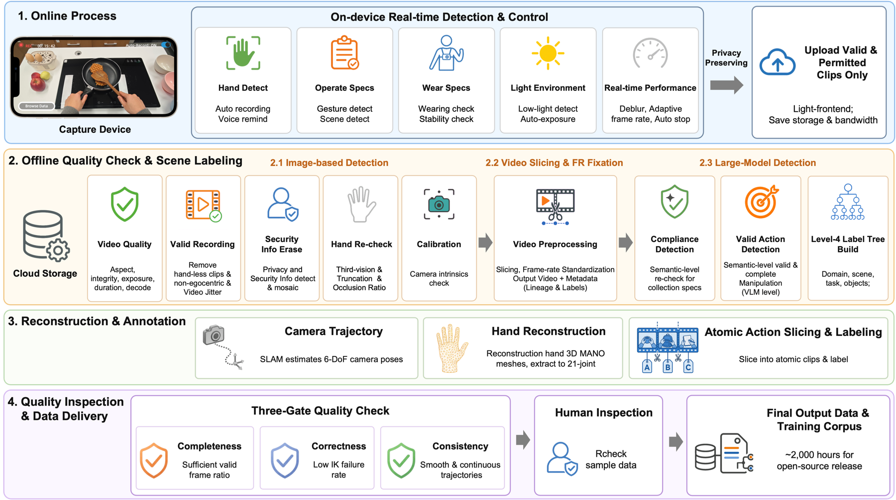

# Open-AoE：把普通手机视频接到机器人训练的数据工具链

第一视角人类操作视频容易获得真实场景、物体变化和长时任务语义，但一段手机视频本身没有机器人关节状态、低层动作和控制反馈。若只扩大视频时长而不补相机运动、手部状态、片段边界和目标本体映射，数据仍然很难直接进入VLA或机器人控制训练。

Open-AoE解决的是这段中间链路。它使用消费级智能手机采集第一视角操作视频，再经过质量控制、相机轨迹估计、MANO手部恢复和原子动作切分，形成带结构化运动和语义的信息。独立工具链继续负责可视化、跨本体重定向、机器人回放、模型格式转换和训练配方，使开发者能够检查每一步产生了什么，而不是把“视频下载完成”当作“训练数据已经可用”。

## 完整实现链路

```text
采集者在自然环境中使用普通智能手机记录第一视角操作
                          ↓
端侧检查手部可见性、佩戴状态、光照、运动质量和设备状态
                          ↓
离线隐私与质量过滤、帧率标准化、长视频切片、场景和任务标注
                          ↓
       相机轨迹恢复 + MANO手部重建 + 有效性掩码
                          ↓
          中英文动作描述 + 带起止时间的原子动作
                          ↓
              Open-AoE结构化数据片段
        ┌─────────────────┼─────────────────┐
        ↓                 ↓                 ↓
同步可视化与质检     人到机器人重定向      模型专用数据转换
        ↓                 ↓                 ↓
手部/相机/动作回放   IK、手部映射、仿真     LeRobot、GR00T、
                    与机器人回放          H-RDT、VITRA等配方
        └─────────────────┼─────────────────┘
                          ↓
              VLA / WAM / 世界模型训练
                          ↓
             目标机器人评测与闭环验证
```

第一版数据报告约包含2000小时操作视频，由500多名采集者使用400多部智能手机产生。这里的关键不只是时长，而是每个片段继续保留视频信息、相机与手部恢复结果、有效性标记和原子动作时间范围，使后续模块有机会判断哪些帧可用、动作从哪里开始以及怎样映射到目标机器人。



图中把端侧采集检查、离线质量与隐私过滤、帧率统一、相机和手部重建、原子动作标注、三道质量门及人工复核放在同一条链路中。它说明2000小时不是手机原始视频的简单汇总，而是经过多级处理后的公开训练语料。图源：[Open-AoE官方仓库](https://github.com/ant-research/Open-AoE/blob/main/docs/fig2-data-pipline.png)。

## 原始视频怎样变成结构化片段

采集阶段首先降低硬件门槛。用户不需要机械臂、动作捕捉场地或专用遥操作器，只需使用支持采集应用的消费级智能手机，在自然工作流中记录第一视角操作。端侧检查用于尽早发现手部离开画面、佩戴不正确、光照不足、快速晃动或设备异常，避免所有问题都等到上传后才处理。

离线处理随后完成四类工作：

1. 过滤无效或敏感内容，统一视频帧率并把长记录切成可管理片段；
2. 估计相机在世界坐标中的运动，避免把镜头移动误当成手或物体运动；
3. 用MANO参数恢复左右手姿态，并为跟踪不可靠的帧提供有效性信息；
4. 把连续操作切成带起止时间的原子动作，并给出中英文动作描述。

这些结果把原始像素变成了可以进一步处理的中间表示，但仍没有产生目标机器人的真实动力学响应。MANO描述的是人手，相机轨迹描述的是采集设备运动，原子动作描述的是语义片段；三者都不能不经转换直接送给机器人电机。

## 为什么同时开放可视化工具

数据处理链中最容易被忽略的是同步检查。相机轨迹漂移、手部重建翻转、左右手关联错误、动作边界偏移或某段跟踪失效，都可能让一段看起来正常的视频变成错误监督。

AoE-Visualization把第一视角视频、重建手部、手腕轨迹、原子动作、世界坐标运动和时间轴放到同一输出中。它的作用不是生成更好看的演示，而是让开发者在训练前检查：视频与动作是否同步，恢复结果是否连续，动作标注是否覆盖正确时间范围，以及有效性掩码是否真的排除了失败片段。

## 人到机器人重定向怎样发生

AoE-Reconstruct-Retarget提供多种外部方法和机器人适配入口。公开仓库列出的示例覆盖Unitree G1配合Dex3或Inspire手、Galbot与Galaxea双臂平台，以及其他手部或末端重定向路线。不同适配器可能使用：

- 人手腕或手掌到机器人TCP的逆运动学；
- MANO手指到灵巧手关节的映射；
- 夹爪开合或离散抓取状态转换；
- MuJoCo等仿真环境中的碰撞、可达性和动作回放；
- 机器人视角重建、视频叠加或LeRobot格式导出。

这说明仓库已经提供从人类中间表示到若干目标机器人轨迹的实现入口，但不同本体仍需要各自的运动学模型、关节限位、手部结构、坐标定义和安全约束。一个适配器在仿真中能够回放，不代表同一轨迹已经在所有真机上形成稳定闭环。

## 训练配方解决什么

AoE-Training-Ready没有规定一种全库统一的动作表示，而是为不同上游模型保留独立转换和训练说明。公开入口包括：

- ACT、Diffusion Policy、pi0.5与SmolVLA等LeRobot兼容策略；
- GR00T N1.7、H-RDT与VITRA等VLA或人体数据预训练路线；
- DreamZero、LingBot-VA、Ctrl-World和iVideoGPT等视频动作模型；
- GenieRedux、LAOM、AdaWorld和DreamDojo等潜在动作或世界模型路线。

每个配方分别说明兼容的上游版本、所需数据、转换步骤、训练命令和输出，避免把一个模型的状态或动作定义误用到另一个模型。Open-AoE开放的是数据接入和适配方法，并没有把所有模型改造成共享同一种动作空间。

## 与RealOmni-Open的关系

Open-AoE和RealOmni-Open都属于非目标本体的人类操作数据，但采集位置不同：

| 维度 | Open-AoE | RealOmni-Open |
|---|---|---|
| 采集入口 | 普通智能手机第一视角视频 | GenDAS双手专用采集设备 |
| 直接信号 | RGB、相机轨迹、MANO手部、有效性掩码和原子动作 | 鱼眼RGB、IMU、末端位姿、夹爪状态，部分批次含深度或触觉 |
| 主要优势 | 设备普及、分布式扩展和完整数据到模型工具链 | 多模态同步和更接近机器人操作接口的末端动作记录 |
| 仍然缺少 | 目标机器人关节、力矩、控制器状态和真实执行后果 | 目标机器人关节、低层控制闭环和跨本体动力学适配 |

Open-AoE更适合扩大自然环境中的人类操作覆盖，并从视频恢复共享中间表示；RealOmni-Open更适合保留明确的双手末端轨迹和采集设备状态。两者都还需要目标本体数据、动作映射和真机验证，不能只比较总小时数判断哪一套数据更接近部署。

## 证据与开放边界

Open-AoE能够支持的结论是：普通智能手机可以形成大规模第一视角操作数据入口，公开工具链已经覆盖结构化处理、可视化、若干跨本体适配和多类模型训练配方。它不能直接证明：

- 2000小时原始视频全部都具有同等质量或能进入同一个训练任务；
- MANO手部和相机轨迹已经等价于目标机器人可执行动作；
- 所列每一种模型配方都在相同数据规模和真机任务上完成统一评测；
- 视频中的接触力、触觉、执行器状态和失败恢复可以由视觉恢复完整补回；
- 某个机器人适配器能够自动迁移到自由度、末端结构和控制接口不同的其他机器人。

仓库原创代码采用Apache-2.0。数据分发条款、MANO模型文件、模型权重、机器人资产和第三方组件可能使用不同许可，使用或再分发前必须分别核对，不能用代码许可证替代数据授权。

## 与前序AoE工作的关系

前序论文《AoE: Always-on Egocentric Human Video Collection for Embodied AI》重点解释颈部手机支架、跨平台采集应用、云边协同处理和自动过滤标注怎样降低持续采集成本。Open-AoE在这套采集系统之上进一步公开2000小时数据、字段说明、重建与重定向工具以及模型训练配方。因此前者主要回答“怎样持续采”，后者主要回答“采完以后怎样检查、转换和用于训练”，本库不把两者当作两份互不相关的数据集重复统计。

## 原始来源

- [Open-AoE官方仓库](https://github.com/ant-research/Open-AoE)
- [Open-AoE技术报告](https://arxiv.org/abs/2607.14183)
- [AoE采集系统论文](https://arxiv.org/abs/2602.23893)
- [数据到模型训练配方](https://github.com/ant-research/Open-AoE/tree/main/aoe-training-ready)
- [重建与跨本体重定向工具](https://github.com/ant-research/Open-AoE/tree/main/aoe-reconstruct-retarget)
- [许可证与第三方组件说明](https://github.com/ant-research/Open-AoE/blob/main/LEGAL.md)
