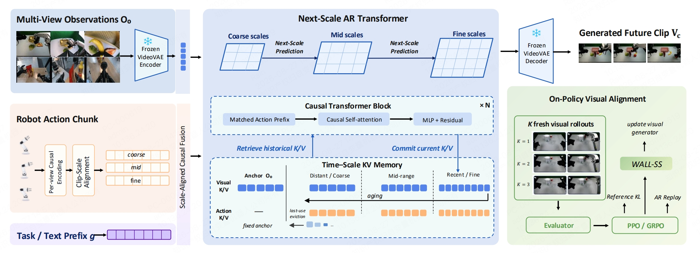

# WALL-SS：让动作条件世界模型持续推演，并用于筛选机器人策略

机器人世界模型不仅要生成视觉上合理的未来，还要忠实响应给定动作。若模型看到夹爪靠近物体后总是生成成功抓取，它虽然能产生自然视频，却无法区分正确动作、偏离动作和失败动作，也不能可靠评估哪个机器人策略更值得部署。WALL-SS把动作条件视觉预测、长时记忆和奖励对齐放进同一套下一尺度自回归模型，目标是让生成结果同时保留动作响应和跨片段状态。

[](论文原图/P187_figure.png)

> **主要方法图：** Figure 3。多视角图像、任务文本和机器人动作块进入下一尺度自回归Transformer；动作按视角、时间和视觉尺度对齐，历史视觉与动作状态进入固定预算的时间-尺度KV记忆；生成的多个未来再由冻结评分器评价，用于更新视觉生成器。来源：[官方论文](https://x2robot-open.oss-cn-shenzhen.aliyuncs.com/ARWM%20OPEN/WALL-SS.pdf)。

## 模型怎样根据动作生成未来

WALL-SS从视频生成模型InfinityStar初始化，在视频潜空间中从粗尺度到细尺度逐步补全一个未来片段。片段生成完成后，模型提交其中的因果状态，再继续预测下一个片段，因此同时存在两种推进顺序：片段内部从粗到细，片段之间从当前状态持续滚动到更远未来。

不同机器人和UMI采集设备的动作先统一为末端执行器轨迹，再利用机器人运动学与相机标定投影到对应视角。系统把末端位置、方向、夹爪状态和相对深度渲染成与RGB同步的动作表示，并为不同视觉尺度准备对应的动作特征。

```text
多视角当前观察 + 任务文本 + 末端动作块
                         ↓
动作按时间、相机视角和视觉尺度对齐
                         ↓
下一尺度自回归：粗结构 → 中尺度 → 细节
                         ↓
提交当前视觉与动作因果状态
                         ↓
生成下一个未来片段并持续滚动
```

因果掩码限制每个视觉片段只能读取当前与历史动作，不能偷看未来遥测或目标视频。这个约束使“给定动作会造成什么变化”成为训练目标，而不是让模型依靠任务先验猜一个常见成功结局。

## 长时记忆怎样保持固定预算

只保留最近片段会忘记早期物体状态，保留全部高分辨率历史又会让缓存随时间增长。WALL-SS利用生成器已有的多尺度因果状态组织时间-尺度记忆：

- 初始观察永久保留，作为场景、机器人和物体身份锚点；
- 最近历史保留细尺度状态；
- 中期历史只保留中尺度状态；
- 更久远历史进一步压缩为粗尺度状态；
- 每段视觉记忆同时绑定造成该状态的动作历史。

历史片段变老时，调度器改读其更粗尺度版本，并在超过使用范围后清除记录。这样推演长度可以继续增长，而在线缓存维持在预设上限。代价是久远历史的细粒度接触和局部几何仍会被逐渐丢弃。

## 训练时怎样适应自身生成误差

常规教师强制训练只向模型提供真实历史，递归推理时却只能读取自己生成的历史。WALL-SS的尺度级Dream Forcing通过两类输入扰动缩小这种差距：一类按记忆年龄扰动历史状态，另一类使用滞后模型先生成带误差的历史，再要求当前模型从该历史预测真实下一段未来。

这仍然是监督训练，目标仍是真实视频。它改变的是模型在训练时读到的历史质量，让模型提前接触漂移、模糊和状态偏差，而不是直接用奖励优化任务成功率。

## 奖励怎样用于视觉动力学对齐

监督训练完成后，系统从相同初始状态和动作序列采样多个视觉未来，由冻结评分器分别检查动作跟随和长时一致性。高分未来的生成概率被提高，动作漂移或跨片段不一致的未来被抑制，同时通过参考模型约束和真实轨迹回放限制分布偏移。

这一步更新的是视觉生成器，外部机器人策略保持冻结。奖励也没有直接包含最终任务成功，因此后面的虚实成功率对照属于独立评测，不能写成模型通过成功率奖励记住了测试结果。

论文还训练了一个Flow Matching动作专家。它读取已经提交的世界模型因果状态、机器人本体状态和任务指令，预测下一段动作块。系统因此包含两个方向：视觉分支根据动作预测未来，动作分支根据当前状态生成动作。论文没有加入显式候选动作搜索或模型预测控制，所以WALL-SS首先是世界模型与动作专家的联合架构，不应直接等同于通用规划器。

## 为什么训练数据保留失败和接管

训练语料除公开机器人数据、双臂数据和UMI数据外，还保留策略失败、即时人工接管、回滚重试、重新对齐与恢复过程。失败分支让模型看到同一任务并不总会走向成功，接管与恢复分支则补充从偏离状态返回可执行区域的变化。

只有时间同步、相机标定和运动学可靠的数据进入动作条件训练。视频有效但动作对齐不可靠的样本只用于视觉训练，不附加动作监督。物体滑落、碰撞或重抓属于有效物理转移，时间戳损坏、状态缺失和标定漂移则属于采集故障，两者不能混为一种“失败数据”。

## 实验证明了什么

在200个分布内任务和100个分布外任务组成的具身视频基准上，论文报告WALL-SS的轨迹准确度为0.539，初始化模型InfinityStar为0.251；动作跟随得分为0.290，Cosmos3-Nano为0.044。强化学习式对齐使动作跟随从0.264提升至0.290、轨迹准确度从0.512提升至0.539，并降低跨片段边界误差。这些结果支持动作对齐和奖励后训练能够修正残余漂移，但不代表通用视频模型的未报告项目等于零分。

闭环评测使用5个不同水平的外部策略、6项任务和20组匹配初始状态，共形成600对生成与真机rollout。30个任务-策略组合的虚实成功率相关系数为0.926，平均绝对误差为0.062；逐回合平衡准确率为0.88。在332次真实失败中，45次被生成环境判断为成功，假阳性率为13.6%，偏差主要集中在接触和精细插入阶段。

相关系数约0.93表示不同策略的总体成功率变化较一致，不是“世界模型有93%的单次预测准确率”。13.6%的乐观误判也说明它目前适合做策略预筛选和相对排序，不能替代真机验收或高精度接触仿真。

## 对开发者的价值

WALL-SS最值得借鉴的是把世界模型的三个常见断点放进一条实现链：动作必须和视觉在时间与空间上对齐，长时推演必须管理历史状态预算，训练还必须让模型接触自身生成误差。若要把它用于策略评测，还需要单独检查假阳性、接触阶段偏差和不同策略排序，而不能只看视频清晰度。

当前官方仓库采用MIT许可证，但README明确写明仓库目前只有项目页，训练和推理代码仍待发布。论文、图片和项目说明已经可以用于理解方法；在实际代码、配置、权重与数据出现前，不能把WALL-SS记为可直接复现的开源训练框架。

## 原始来源

[官方论文](https://x2robot-open.oss-cn-shenzhen.aliyuncs.com/ARWM%20OPEN/WALL-SS.pdf) · [官方项目页](https://x2robot.com/pages/ss) · [官方仓库](https://github.com/X-Square-Robot/wall-ss)
