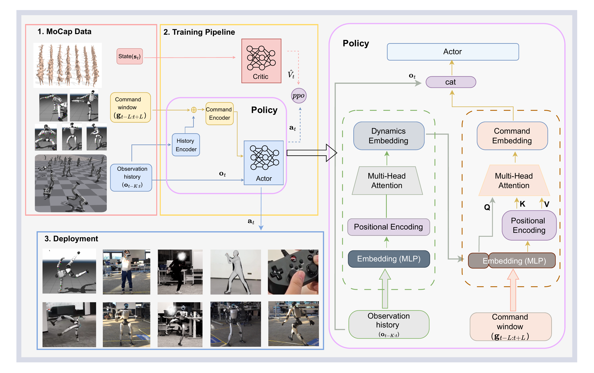

# RGMT：根据机器人当前动力学状态选择可执行参考

动作跟踪器通常把未来若干帧参考直接交给策略，但重定向后的参考并不总是连续、准确或符合目标机器人的动力学。高速转身、倒地起身、拳击和接触动作中，一小段脚滑、根节点漂移或关节突变就可能被闭环执行放大，最终让机器人偏离参考甚至跌倒。RGMT的关键变化不是增加动作库，而是让策略先判断机器人现在处于什么动力学状态，再从参考窗口中选择当前真正有用的命令。

> **主要方法图：** 官方项目页Training Method。左侧展示动作数据、PPO训练和真机部署，右侧展开策略内部的历史编码与命令聚合。来源：[官方项目页](https://zeonsunlightyu.github.io/RGMT.github.io/)。

## 本体历史先形成当前动力学摘要

每个控制周期，机器人读取近期一段关节位置、关节速度、基座姿态和上一动作等本体历史。因果历史编码器只使用当前与过去信息，把这段序列压成动力学嵌入。这个嵌入要回答的不是“目标动作是什么”，而是机器人正在向哪个方向运动、是否仍在支撑、上一条命令产生了什么响应，以及当前状态与参考之间的偏差怎样发展。

这样处理后，相同参考帧在不同身体状态下不会得到完全相同的响应。例如，机器人已经因碰撞向后倾时，策略可以结合历史趋势提前减小继续后仰的命令；机器人处于腾空或落地阶段时，也可以根据真实身体响应而不是单帧姿态决定下一步跟踪重点。历史编码器因此承担的是状态估计和短时动力学概括，不是离线动作生成器。

## 动力学摘要再从参考窗口中聚合命令

系统同时读取目标时刻前后的一段参考窗口。命令编码器使用多头跨注意力：当前动力学嵌入作为查询，窗口内各参考帧经过位置编码后作为候选信息。策略不再机械使用某个固定未来帧，而是根据当前身体状态给不同时间位置和身体变化分配权重，形成聚合后的命令嵌入。

这一步适合处理两类失配。第一类是时间失配，例如真实机器人落地比参考晚半拍，固定索引会继续推进动作，而聚合窗口可以保留更相关的落地命令。第二类是局部参考缺陷，例如某帧重定向结果突变，窗口内相邻帧仍可提供连续趋势。方法并不会自动修复整段错误动作；如果窗口中的参考整体不可执行，注意力仍没有正确目标可选。

当前观测、动力学嵌入和命令嵌入最后拼接给Actor，输出全身关节动作。训练期Critic读取更完整的动作状态并通过PPO更新策略；部署时保留历史编码器、命令编码器和Actor，持续用真实本体反馈闭环修正。论文采用单阶段端到端训练，没有先训练教师再蒸馏学生。

## 跌倒恢复课程补足参考跟踪之外的状态

普通动作数据很少覆盖已经明显失稳或倒地后的状态，只从正常参考初始化时，策略即使平均跟踪误差很低，也可能在一次碰撞后完全不知道怎样恢复。RGMT在训练中随机生成不稳定初始姿态，并在课程早期施加向上的辅助力，让策略先学会从较容易的失稳状态重新站稳；随着训练推进，辅助力逐渐减弱，恢复动作必须更多依赖策略自身完成。

恢复课程与命令聚合解决不同问题。命令聚合降低噪声参考和时序偏差造成的持续漂移，恢复课程扩大策略见过的失败状态范围。机器人恢复后仍要重新接回参考，因此两者共同构成“跟踪、失配、恢复、继续跟踪”的闭环，而不是单独训练一个起身技能再手工切换控制器。

## 证据支持鲁棒跟踪，但开源边界有限

作者报告使用约3.5小时动作数据完成训练，并展示动作回放、未见动作、体育与地面接触动作、VR遥操作、手柄移动、外力扰动和跌倒恢复。公开结果说明这种方法不依赖超大动作库也能改善复杂参考下的闭环稳定性，但“数据少”不等于数据准备简单：原始人体动作仍要经过恢复、重定向、接触处理和质量筛选。

官方项目页目前没有训练代码、配置、模型权重或动作数据。因而可以核验算法结构和演示范围，不能判断注意力窗口、恢复课程、奖励设计和Sim2Real参数是否能按公开材料完整复现。项目也没有证明任意噪声参考都可被吸收；系统仍需要目标本体可行的动作分布和稳定的底层执行接口。

## 与Extreme-RGMT的关系

RGMT处理的是一个Tracker怎样面对噪声、时序失配、扰动和跌倒状态。后续[Extreme-RGMT](P153.md)处理的是同一个通用Tracker继续加入空翻等高动态技能时，怎样把训练集中到稀有困难片段并避免旧技能退化。前者侧重单次执行中的鲁棒性，后者侧重动作集合持续扩展时的学习分配，两者不能互相替代。

[论文原文](https://arxiv.org/abs/2601.23080) · [项目页](https://zeonsunlightyu.github.io/RGMT.github.io/)
