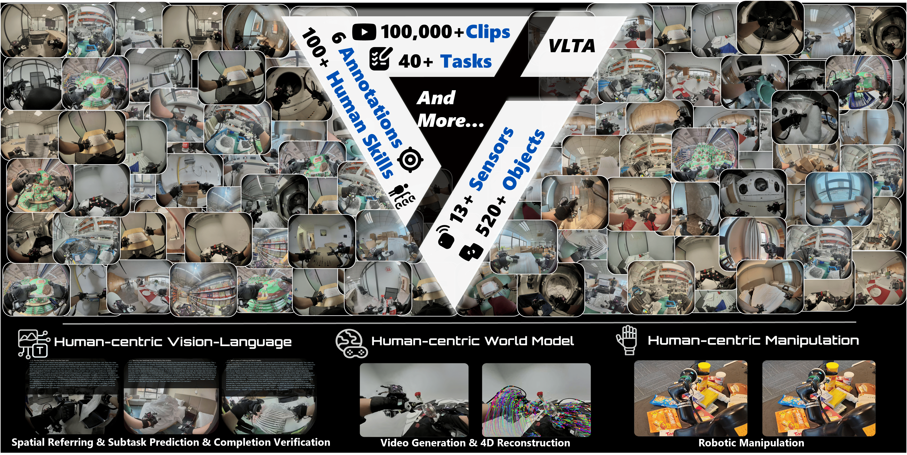

# World In Your Hands：把自然工作流中的人类操作变成具身训练数据

World In Your Hands不是一套直接控制机器人的策略，而是一条从人类真实操作到机器人训练数据的基础设施链。它想解决的问题是：遥操作数据与机器人本体强绑定、采集成本高，普通第一视角视频又缺少精确手部动作、触觉、标定和任务阶段。系统用可穿戴Oracle Suite记录人类在真实工作环境中的操作，再通过定位、质量验证和多层标注把原始传感器流加工成可用于感知、世界建模和跨本体策略训练的数据。

> **主要方法图：** Figure 1。图中展示真实场景操作片段、多模态标注，以及视觉语言理解、世界模型和机器人操作三类下游用途。来源：[原论文](https://arxiv.org/abs/2512.24310)。

## 从采集设备到同步原始数据

采集者在办公室、物流、洗衣、餐饮、酒店、公寓、超市和工业等真实环境中完成自然任务。Oracle Suite由三部分组成：胸前的H-FPVHive负责多视角第一视角视觉和环境记录；H-Glove记录手指、手腕、IMU和压力触觉；H-Backpack提供电源、存储和机载计算。各传感器使用统一时间轴，避免视频、手部动作和触觉在后处理时无法对齐。

采集阶段的直接产物不是机器人关节动作，而是人类双手运动、视觉、标定和接触信息。系统融合红外、RGB和IMU估计手腕六自由度轨迹，并报告在受控动作捕捉环境中平均平移误差低于5毫米。这一精度用于说明采集与自动定位能力，不能直接外推到所有遮挡、光照和快速运动场景。

## 质量验证怎样阻止错误动作进入训练集

系统使用两类检查。第一类把Oracle Suite恢复的手腕轨迹与动作捕捉系统真值比较，检查整体定位偏差。第二类把恢复的手部骨架投影到相机图像，与手部分割掩码计算重合程度；低于阈值的片段进入人工复核和过滤。

这一步很重要，因为视觉画面看起来正常，不代表动作、相机和触觉在同一时刻，也不代表手部轨迹没有漂移。只有通过定位误差、投影一致性和人工检查的数据，才进入后续标注链。

## 原始记录怎样变成多层训练监督

数据标注分成三个阶段：

1. **原子动作标注**：先用视觉语言模型把长任务切成语义片段，人类定义技能和目标物体，再人工修正边界，最后扩写为完整指令；
2. **感知标注**：利用视觉基础模型生成物体掩码和深度等预标注，再由人工选择与修正；
3. **视觉语言标注**：补充任务进度、下一子任务、空间指代和经过复核的推理描述，用于训练或评测任务理解。

最终数据可以包含多视角RGB、相机标定、深度、左右手轨迹、手部骨架、压力触觉、掩码、原子指令、任务状态和推理标注。但这些模态不是每个回合全部齐全：项目页面给出的统计约为1045小时RGB与标定、800小时深度、500小时动作、400小时指令、320小时推理、240小时掩码和10小时触觉。因此“1000小时数据”不能写成“1000小时完整触觉状态动作轨迹”。

## 人类数据怎样进入机器人训练

论文验证了两种数据用法。第一种是跨本体预训练：先用WiYH视觉、语言和人类动作数据训练VLM或VLA，再用少量目标机器人遥操作样本完成具体任务后训练。人类数据主要扩大场景、物体和动作分布，目标机器人数据负责对齐最终执行接口。

第二种是动作重定向共训练：把人类手部轨迹转换到机器人灵巧手动作空间，再与机器人数据共同训练。这里仍需目标灵巧手的运动学、关节限制、接触约束和控制频率，不能把人手骨架直接当作电机命令。论文报告在杂乱场景操作实验中加入WiYH数据后成功率由8%提高到60%，但这一结果对应作者指定模型、任务、数据配比和评测条件，不能外推为任意机器人都会获得同样提升。

## 开放内容与AWE 3.0的边界

官方仓库提供样例数据读取、HDF5结构检查、可视化、WiYH到LeRobot转换和教程；代码与仓库内数据声明采用CC BY-NC-SA 4.0。使用完整数据、硬件设计或第三方基础模型时，仍需核对具体下载页面和上游条款。

WiYH与它石智航AWE 3.0属于同一家公司技术生态，但不是同一个交付物。WiYH公开的是数据、论文和工具链；AWE 3.0公开材料描述视觉、语言、触觉和动作统一输入，以及OSD、HTS和LAS等模块，但截至本次核验没有发现AWE 3.0独立训练代码、模型权重或完整训练配方。不能因为WiYH和RTR已经开源，就写成AWE 3.0已经完整开源。

[论文原文](https://arxiv.org/abs/2512.24310) · [项目页](https://wiyh.tars-ai.com/) · [代码与数据工具](https://github.com/tars-robotics/World-In-Your-Hands)
