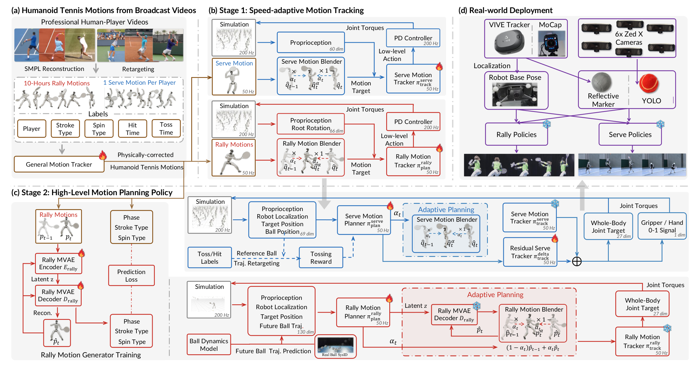

# AdaPT：让职业网球动作风格跨过规划、跟踪与真机失配

AdaPT研究的不是“机器人能否碰到网球”这一单点任务，而是怎样在高速交互中同时保留职业运动员的挥拍、转体、步法和发球节奏。它把运动风格交给高层运动规划器，把动力学执行交给低层Tracker，再引入显式速度适配，处理分层系统从仿真进入真机后出现的跟踪迟滞、规划漂移和击球时序误差。



> **主要方法图：** Figure 2。图中蓝色链路对应发球，红色链路对应回合；火焰表示训练模块，雪花表示部署时冻结模块。来源：[原论文](https://arxiv.org/abs/2608.20087)。

## 为什么要把规划与跟踪分开

直接用任务奖励训练端到端网球策略，容易学会“把球打过去”，却牺牲职业运动员特有的准备、转体、挥拍和随挥动作。AdaPT采用解耦结构：规划器只生成或选择运动学参考，Tracker负责把参考变成PD控制器的关节目标。这样能减少任务动力学对运动风格表示的污染，但也形成新的真机问题：Tracker一旦跟不上，规划器仍按理想参考自回归推进，误差会持续累积。

AdaPT的核心修正是把执行速度变成上下层共同理解的接口：

```text
职业比赛视频 / 专业运动员MoCap
              ↓
人体运动恢复 → 机器人重定向 → 通用Tracker物理修正
              ↓
      回合动作集 / 发球动作集
              ↓
随机参考速度训练低层Tracker
              ↓
高层规划器同时决定动作内容和执行速度
              ↓
Tracker → 关节目标 → PD控制 → 真机
              ↑
机器人状态、球状态与未来球轨迹
```

## 动作数据怎样进入机器人

团队从公开赛事视频中截取纳达尔、费德勒和德约科维奇的完整击球片段，用GVHMR恢复SMPL人体运动，再用GMR重定向到人形机器人。由于单目视频中的手腕容易受遮挡影响，系统按选手风格修正球拍相关关节，并对手腕加入随机扰动；每个片段还标注选手、正反手、旋转类型、触球时刻，发球片段另标球的释放时刻。

重定向结果不一定满足机器人接触和关节约束，因此系统先用一个通用动作Tracker跑出更可执行的物理动作，再进入正式训练。这个“视频恢复 → 本体重定向 → 物理修正”的链路比直接把人体姿态当作控制命令更可靠。

项目页写明动作总量为21.5小时、6种运动员风格、7类击球或发球、30/120 Hz；论文表1列出的三位公开视频选手与一位MoCap选手合计约14.2小时。两者可能采用不同数据版本或统计口径，但公开材料没有解释差额，且仓库只提供两位选手的发球样例。因此本库暂不把它登记成已经完整开放的数据集。

## 低层Tracker怎样学习速度适配

低层策略观察参考姿态、当前机器人状态、关节速度和基座角速度，并输出PD关节目标。训练时，系统不总以原始时间推进参考，而是在相邻参考帧之间插值或外推，随机减慢或加快动作。Tracker因此学到的是一段速度范围内的动作执行能力，而不是只会按单一时间表追踪。

这个设计针对真机执行误差：执行器、通信和接触建模不准确时，动作可能自然变慢或局部滞后。让Tracker在训练阶段见过不同时间尺度，可以降低固定节奏策略对误差的敏感性，但它本身不能决定应该在何时加速迎球，这需要高层规划器处理。

## 回合与发球为什么采用不同规划器

回合需要覆盖未知来球、连续移动和多种击球，因此先在修正后的回合动作上训练MVAE运动生成器。高层策略读取机器人位姿和未来球轨迹，输出运动潜变量与速度适配量；MVAE生成风格一致的下一段参考，速度量再决定参考推进速度。

发球是自启动、低多样性的阶段性动作，不再训练额外运动生成器。高层策略依据机器人和球状态调整参考速度，残差Tracker在基础跟踪动作上增加小幅修正，以吸收抛球偏差。团队还对最深后摆关键帧强化球拍和手腕跟踪，并用抛物线轨迹奖励约束抛球；释放时刻与释放后球速也参与随机化。

这意味着AdaPT不是一套完全共享的“通用网球策略”。回合与发球共享规划和跟踪解耦、速度适配这一原则，但动作生成、状态输入与训练目标不同。

## 论文证明了什么

论文使用4096个并行环境和4张RTX 4090，以PPO训练各阶段策略。仿真中AdaPT在三位选手回合任务上分别报告91.5%、96.3%和92.3%的成功率，同时保持接近Vid2Player3D的动作风格指标；真机消融显示，仅保留自适应Tracker或自适应Planner都不能得到完整增益，两者分别处理执行误差和时序误差。

真机实验覆盖Unitree G1和约1.7米的Dobot Atom P3。受控回合实验主要依赖动作捕捉获得机器人根节点与球位置；发球另展示YOLO检测加双目三角化，以及VIVE Tracker辅助定位的场外部署。论文同时指出，相机球定位仍有较大噪声和时间抖动，回合系统对未来球轨迹误差尤其敏感。

这些结果支持的结论是：显式建模Tracker可执行速度，能缓解分层规划和真机执行之间的时序失配。它没有证明系统已经在标准球场、无外部定位、任意来球和长期对打条件下达到通用网球能力。

## 与LATENT的区别

LATENT更关注高速视觉闭环下的击球、移动与平衡，把通用运动先验接入实时网球任务；AdaPT则把“职业选手动作风格”放在核心位置，并针对Planner与Tracker解耦后产生的真机时序失配设计速度适配。论文评测中由于LATENT完整实现未公开，作者使用其基础运动先验PULSE作为代理基线，因此两者不能只凭演示或不同表格数字做直接排名。

从知识库路线看，LATENT适合作为高速任务调用运动基座的案例；AdaPT更适合研究“风格动作生成 → 速度可调参考 → Tracker → 真机”的分层接口和失配恢复。

## 代码开放到哪一步

官方仓库采用Apache-2.0许可证，当前明确开放的是Unitree G1发球第一阶段速度自适应Tracker：包括mjlab环境、PPO训练与回放命令、左右手球拍配置、击球臂关键帧设置、两位选手样例动作和一个预训练检查点。

论文中的回合MVAE、高层回合与发球规划器、发球残差Tracker完整训练、相机感知、Atom P3部署和完整21.5小时动作数据尚未随仓库开放。因此它是有实际训练价值的部分开放项目，但不是论文全链路复现包。

[论文原文](https://arxiv.org/abs/2608.20087) · [项目页](https://humanoidtennis.github.io/AdaPT/) · [训练代码](https://github.com/noitom-robotics/AdaPT) · [LATENT代码](https://github.com/GalaxyGeneralRobotics/LATENT)
