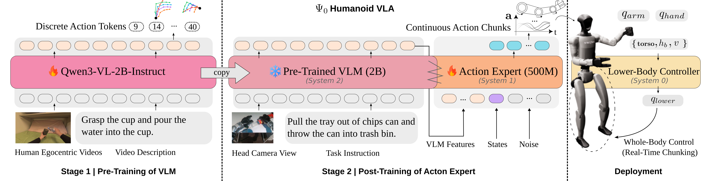

# Psi0：分阶段学习人形移动操作并接入全身控制

> 这一页回答：人类操作数据怎样帮助人形VLA学习，以及视觉语言策略怎样通过已有运动基座完成真实任务。

Psi0（Psi-Zero）的核心不是把跟踪器做大，而是把人类数据中的任务表征与机器人动作分布分阶段学习。它属于上层视觉语言动作策略，底层仍需要稳定的运动控制器。官方项目标注RSS 2026；原论文配置和后续SONIC工程接入需要分开阅读。

[](论文原图/P192_figure.png)

> **主要方法图：** 官方项目页架构图，对应原论文Figure 2的训练与部署关系。先预训练视觉语言主干，再训练动作专家，最后经实时动作块机制与低层控制执行。来源：[官方图源](https://psi-lab.ai/Psi0/figures/architecture.png)。这张图不是后续SONIC集成的架构图。

## 数据与训练分工

人类与机器人的运动学、控制频率和动作分布不同。论文先用第一视角数据进行自回归动作预测，学习可迁移表征，再用真机数据训练流匹配动作专家，最后用任务示范微调。论文报告约800小时人类视频与30小时机器人数据；这不是每个新任务都必须重新采集的量，也不保证同等数据量能复现所有任务。[原文摘要](https://arxiv.org/abs/2603.12263)

## 原论文的执行接口

视觉语言主干采用Qwen3-VL-2B-Instruct，动作专家为约500M参数的MM-DiT。模型接收图像、指令和本体状态，预测动作块。原论文的36维动作包括双手14维、双臂14维、躯干姿态3维、基座高度，以及平移速度、偏航速度和目标偏航；它不是直接预测全部电机力矩，也不是只输出夹爪开合。腿部与躯干执行依赖AMO类RL控制器，实时动作块机制处理推理延迟与动作衔接。[方法与接口定义](https://arxiv.org/html/2603.12263v1)

## 后续SONIC接入

官方仓库另提供SONIC链路：PICO遥操作与相机记录示范，转换成Psi0使用的LeRobot数据并计算统计量，再进行任务微调。仓库明确要求使用配套fork，不能假设任意SONIC版本都兼容。[采集说明](https://github.com/physical-superintelligence-lab/Psi0/blob/main/real/SONIC/README.md)

```text
PICO输入 → 遥操作映射 → SONIC + 手部驱动 → 真机示范
                                 ↓
图像 / 状态 / 控制命令 → 数据转换和对齐 → Psi0微调
                                 ↓
图像 + 语言 + 本体状态 → Psi0动作块 → SONIC接口 + 手部驱动
                                 ↓
                             真机反馈
```

部署文档将相机服务、策略服务、机器人全身控制器和策略客户端分开启动。不要把动作块长度、推理刷新率、记录帧率与底层控制频率当成同一个参数；实际配置以所固定版本为准。[部署说明](https://github.com/physical-superintelligence-lab/Psi0/blob/main/real/SONIC/DEPLOYMENT.md)

<details>
<summary>官方训练与部署入口</summary>

- 数据转换：`scripts/data/raw_sonic_to_psi_lerobot.py`
- 统计量：`scripts/data/calc_modality_stats.py`
- 微调：`scripts/train/psi0/finetune-real-sonic-psi0.sh`
- 策略服务：`scripts/deploy/serve_psi0-rtc-sonic.sh`
- 机器人与客户端：`real/scripts/deploy_psi0-sonic-rtc-{robot,client}.sh`

这是入口定位，不是脱离依赖环境即可执行的一键脚本。完整步骤及模型、数据入口见[官方README](https://github.com/physical-superintelligence-lab/Psi0)。

</details>

## 面向最小闭环的工程建议

以下是本库的实现建议，不是Psi0或宇树的官方架构声明。若目标是尽快验证拿取、移动和放置，可先把每只手约束成低维开合协同，由PICO扳机控制并映射到各手指关节。这样减少的是控制空间和采集难度，不能据此宣称掌内调整、独立手指协调或通用灵巧操作。

第一步应先检查遥操作记录：图像与命令是否同步，手部字段是否非零，左右手及单位是否正确。第二步确认训练标签与部署接口一致：实际关节状态不必然等于应预测的上层命令，原论文36维动作也不能直接套进SONIC表示。第三步在固定任务、有限物体位置变化下做闭环测试，保存成功率、失败视频、模型版本和延迟记录；先通过关节限位、速度限制、急停与安全状态机验证，再逐步放开移动和接触范围。

## 实验证明了什么

官方项目页列出八项真机长程任务，每项10次试验，Psi0完整任务成功次数介于5到9次，包括倒水、搬运、推车和抽取托盘等。消融比较预训练数据、真机后训练、动作头和RTC设置。这支持分阶段训练与执行接口在所测任务中的价值，不是任意场景可靠性或纯手部开合策略的实验结论。[官方实验表](https://psi-lab.ai/Psi0/#experiments)

## 证据与下一步

项目展示真机移动操作，但有限任务结果不等于任意家庭任务泛化；开源入口存在也不代表本库已经完成实机复现。代码使用[Apache-2.0](https://github.com/physical-superintelligence-lab/Psi0/blob/main/LICENSE)，数据、预训练权重和子模块仍需分别核验许可。

- 对照[SONIC](P035.md)：区分任务动作生成与低层全身跟踪。
- 对照[SIMPLE](P048.md)：先检查高层策略的仿真闭环与接口。
- 对照[Humanoid Everyday](P120.md)和[EgoVLA](P168.md)：比较数据来源与训练目标。
- 查找实现：[开源项目主表](../开源项目主表.md#r588)。

[官方项目页](https://psi-lab.ai/Psi0/) · [代码与训练文档](https://github.com/physical-superintelligence-lab/Psi0) · [论文](https://arxiv.org/abs/2603.12263)
