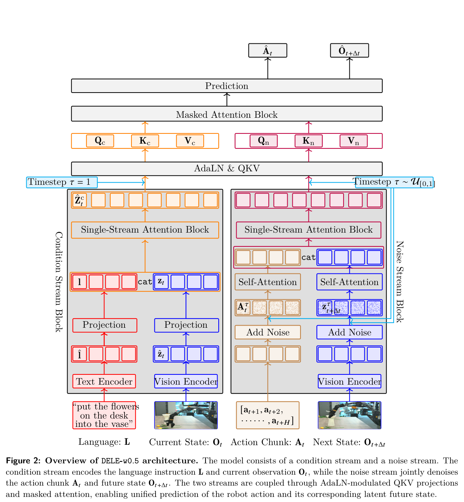

# DELE-w0.5：用未来状态辅助训练，部署时直接生成动作

> 这一页回答：世界动作模型是否必须在每次执行前生成未来画面，以及怎样区分训练监督与部署所需的输入。

这是深度跃迁（DeepLeap）发布的公司技术报告，不是已确认提供训练代码和权重的开源框架。本库将它放在“世界模型、VLA与Agent”的动作生成路线，同时关联公司主表，不把官网演示计作开源项目。

## 核心图与训练分工

[](论文原图/P193_figure.png)

> **主要方法图：** 官方研究页Figure 2，展示语言与当前观察组成的条件流，以及动作和未来视觉潜变量组成的噪声流。来源：[官方图源](https://deepleap-x.com/images/research/dele-w0.5/figures/figure-2-architecture-v4.png)。这是联合训练结构，不能直接当作部署结构。

方法把未来状态预测作为训练目标，与动作生成共同优化；注意力掩码不允许动作读取未来目标。部署时删除未来视觉token，保留当前观察到动作的生成路径。因此，“从未来潜在状态推断动作”的标题不能被简化为在线先生成未来、再根据未来规划。[官方方法说明](https://deepleap-x.com/research/dele-w0.5)

```text
训练：
语言 + 当前多视角观察 → 条件表示
动作示范 + 噪声 → 动作预测目标
未来观察编码 + 噪声 → 未来潜变量预测目标
共同训练；动作侧禁止读取未来目标

推理：
语言 + 当前多视角观察 → 动作块生成
                                      ↓
                              本体控制接口 → 执行反馈
未来视觉分支移除，不生成未来视频
```

## 它解决哪个问题

本库的理解是：这项工作首先改变了策略学习的监督结构，而不是增加一个部署时的在线规划器。比较相关方法时，需要分别询问“训练预测了什么”和“测试真正使用了什么”。只看到方法图存在两个输出头，不能推出运行时两个输出都必需；只看到模型能够恢复任务，也不能推出它在后台进行参数更新。

这个区分与开发决策直接相关。若目标是在既有策略上研究未来监督，应先检查训练数据能否稳定对应同一动作窗口前后的观察，再判断新增分支是否只在训练中引入成本。若目标是用模型比较候选动作，则还需要独立检查动作条件输入、候选评分和决策接口，不能把辅助监督天然当作可用的规划服务。

## 真机结果怎样读

以下采用论文v4，不混用早期摘要数字。实验在固定场景的Astribot S1上进行，包含开门、取饮料、加冰和微波炉任务。8种策略各做4项任务、每项20次，共640次；DELE自身为80次，其中50次成功，即62.5%，宏平均有序阶段进度81.3%。RTX 4090上的87.5毫秒是核心模型推理中位数，不包含网络、图像解码、IK及机器人执行。[论文v4实验与测时口径](https://arxiv.org/html/2608.22067v4)

官网的微波炉取物演示与论文正式评测中的放入食物并启动加热不是同一个任务定义，阅读时应分别保留来源，不合并为同一成功率。[官方演示](https://deepleap-x.com/research/dele-w0.5)

## 没有证明什么

固定平台的受控比较不能证明任意本体迁移、任意家庭泛化或全身动态平衡能力。训练使用未来观察不代表部署拥有未来真值；模型一次推理的速度也不等于闭环机器人控制频率。不同基线的预训练基础和有限微调协议会影响比较，不能从任务榜单推出所有应用场景下的模型排名。

本轮核验到的是论文、方法图和演示，尚未找到可核验的官方训练仓库或权重。后续若开放代码，应优先核对注意力掩码、动作标签、训练损失与推理裁剪是否和论文一致，再更新开放状态。报告中的代码链接指向研究网站，不足以独立证明代码已经发布。

## 对开发者的价值

下面是本库提出的受控实验建议，不是作者已完成的消融。先固定训练数据、动作表示、模型容量和评测重置条件，比较仅动作监督与增加未来潜变量监督；再检查未来采样间隔、损失权重和掩码规则。评测同时保留完整成功率、第一处失败阶段和端到端延迟，避免只用平均进度掩盖任务无法完成的问题。

对于接入人形机器人的需求，还应单独设计末端目标、手部控制与低层运动基座之间的接口。这个策略的双臂实验不能替代Tracker或WBC，也不能据此推断已经兼容SONIC。先完成静止基座下的受控操作，再逐步加入移动与接触扰动，才能定位失败来自任务策略还是身体执行。

## 下一步与原始来源

- 对照[Psi0](P192.md)：比较上层策略训练与低层运动基座的接口边界。
- 返回[世界模型、VLA与Agent路线](../../技术路线/05_世界模型VLA与Agent.md)，按训练预测与部署用途继续检索。
- 查看[公司与产品主表](../../公司与产业/公司与产品主表.md#c177)中的深度跃迁。
- [公司官网](https://deepleap-x.com/) · [官方研究页](https://deepleap-x.com/research/dele-w0.5) · [论文及版本历史](https://arxiv.org/abs/2608.22067)
